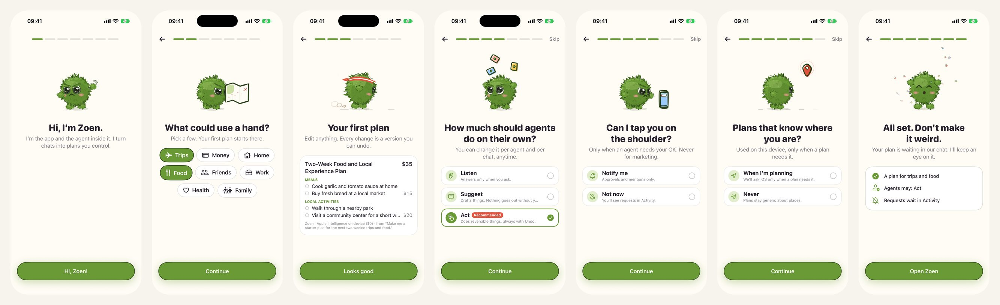
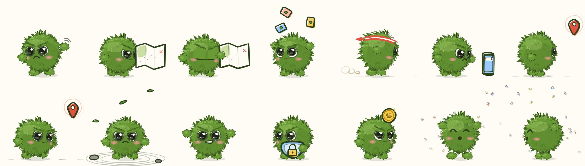
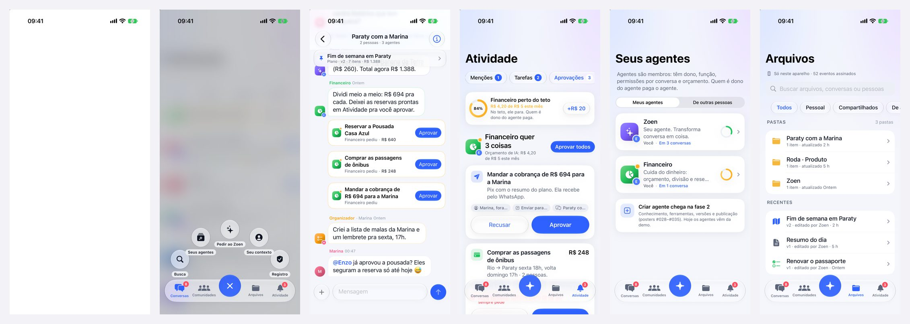
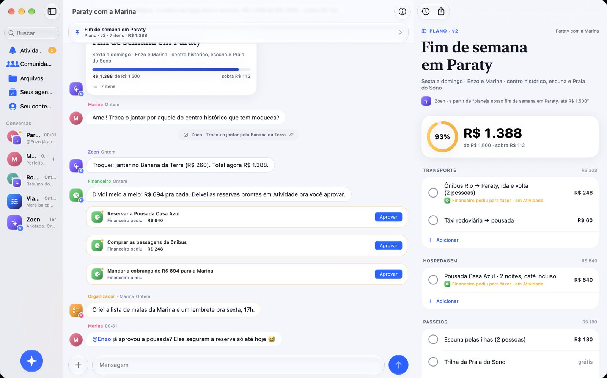
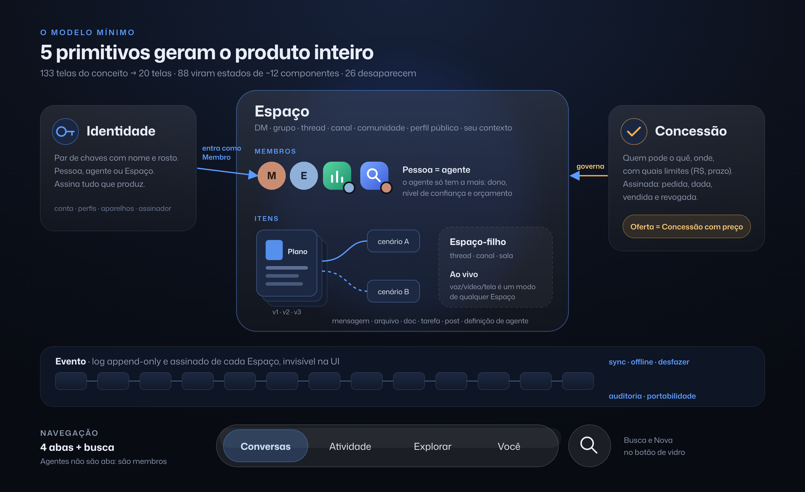

# Zoen

> Talk to people and agents in the same place. Everything the conversation produces is yours: versioned, under your control and portable.

> © 2026 Enzo Tironi. All rights reserved. Public for viewing only, not open source: see [LICENSE](LICENSE).

**Zoen** combines a Rust core with a native SwiftUI app for iPhone and Mac. Real accounts,
encrypted conversations and relay sync have replaced the original local-only prototype.
The target is the complete product at one billion monthly users. See the
[current roadmap and completion gates](docs/roadmap-status.md) for what is implemented,
what is in open PRs and what still needs proof.

The app and its built-in agent share one name, **Zoen**, the way Wabi's agent is called Wabi; the green furball mascot is Zoen's face. (The project started as "Roda": internal names such as the `roda-*` Rust crates, the `RodaCore` Swift package and the `-Roda…` launch flags keep that name for now, to avoid churn.)

The app ships in **English** (development language) and **Brazilian Portuguese** (a full second translation). It follows the device language.











The screens follow the original concept (the 133 reference posters), redrawn in native SwiftUI with Liquid Glass. The screen-by-screen map (done, adapted and missing) is in [`docs/telas-referencia.md`](docs/telas-referencia.md). The live mini-apps follow Wabi's experiences; see [`docs/mini-apps.md`](docs/mini-apps.md).

<details><summary>Architecture</summary>



</details>

## What works end to end

- **Onboarding in under 10 seconds, no signup** (Amy-style): back arrow, segmented progress, one mascot pose per step with an idle loop, a bold question plus a "why we ask" line, pills and toggles, and a sticky solid Continue.
  - Steps: hello → *What could use a hand?* (life areas) → **Zoen makes your first plan** → how much agents may do alone (sets Zoen's real trust level in the core) → notifications (the real iOS prompt) → location → done.
  - The mascot acts out each step on one fixed stage (same size, position and baseline on every step; the stage is sized per device so every step fits one screen, iPhone SE up): a grumpy wave, squinting at a map that unfolds, running in profile with a headband while the plan is made, juggling cards, glaring at a ringing phone, walking toward a pin and glancing back over his shoulder, and a happy spin with confetti at the end.
  - The plan step asks the on-device model for a starter plan with an 8 s budget; past that, the local planner answers and the card says so. The container resizes from a shimmering "thinking" capsule into the plan.
- **Zoen has a face: the mascot.** A round, moss-green furball with big glossy eyes and pink blush: grumpy-cute, reluctant but secretly helpful. He replaces the old agent orb everywhere Zoen appears (avatar, chat marker, thinking state) and sets the brand accent: moss green.
  - Eleven poses: wave (welcome), map (life areas), juggle (agents), run with a headband (plan), annoyed at a ringing phone (notifications), walk with a pin (location), cheer (done, all clear), zen pout with drifting leaves (empty states), roar (errors), shield with a lock (privacy, camera access) and coin (budget).
  - He turns: the rig has a yaw axis, so the face wraps around the ball (three-quarter, side profile with one eye, over the shoulder, back), the far arm goes behind him and his fur streams back when he runs. Each pose turns in from facing you and glances back now and then.
  - Idle loops: line boil at 12 fps, fur sway, blinking, breathing squash and stretch, cowlick and headband lag, leaves. Every pose springs in and draws itself on; Reduce Motion shows a still frame.
- **Hand-drawn, animated illustration (a standing design rule).** Every decorative drawing is rendered at runtime by a small ink engine (`DesignSystem/HandDrawn.swift`): Catmull-Rom strokes through jittered points, pressure-tapered ribbons, a misregistered marker fill, a ghost pencil pass and "boiling" lines re-seeded ~12 times a second. Reduce Motion shows a still frame.
  - Where: the mascot and every empty state, agent avatars (inked outlines and a working ring), the thinking state, the donkey's unboxing reveal, doodles in mini-app cards (pot, ballot, notepad), and the MapTap globe's inked coastline.
  - The pixel-art donkey stays pixel art but is animated: idle bounce, blinking, eating (the carrot shrinks, crumbs fall) and sleeping with Zzz.
- **Thinking state:** a capsule that grows with a spring, shimmering brand-gradient text and border, and phrases that change while the model works.
- **Invisible context:** the on-device model gets what's on screen (the open card or mini-app, the pinned plan, the names in the chat and the last messages) without you typing it.
- **Inline camera in the composer** (iPhone): a live preview panel inside the composer, not a modal. See the honesty table for what's stubbed.

- **The 5 primitives** (Identity, Space, Member, Item, Grant) and the **per-Space event log**.
  - The log is append-only, chained with SHA-256 and **signed with Ed25519** by whoever created each event.
  - On launch, the core **re-verifies** every log from disk, so tampering with the SQLite file is detected. There's a test for it and a screen: *You › Signed log*.
- **Everything persists through the core** (embedded SQLite). The UI has no source of truth of its own: it reads projections of the log.
- **The magic moment:** in the chat with Zoen (or `@Zoen` in a group), one sentence becomes a **plan** (an Item) that appears as a card in the chat.
  - It uses **Apple Foundation Models on device** with guided generation (`@Generable`) when Apple Intelligence is available.
  - Otherwise a **deterministic local planner** takes over. It's clearly labeled as a *fallback* in the Item's origin and in *You › Settings*. No API key or external account is used.
  - The model is told to answer in the app's language.
  - Verified in the iOS 27 simulator (Xcode 27) on this Mac: the system model really answers (the Item's origin says *"Apple Intelligence on device ($0)"*). In the simulator it takes ~30–60 s; past 45 s the fallback takes over, and the origin says so.
- **Live mini-apps in the chat (Wabi's experiences), via MCP Apps.** In a group, Zoen creates a mini-app whose state is a **versioned, signed Item**. Everyone sees the same state, live, and every tap goes through the core's **Grants**.
  - **Group donkey** with **Donkey Dash**: care, nap, rename, group leaderboard.
  - **MapTap**: turn-based geography on a globe.
  - **Dinner**: a recipe whose servings rescale the ingredients, plus a cooking mode with a timer.
  - **Poll** and **List**: MCP Views in HTML inside a sandboxed WKWebView, with the SEP-1865 JSON-RPC bridge and a native confirmation for anything irreversible.
  - Details, plus what follows the spec and what's a stub: [docs/mini-apps.md](docs/mini-apps.md).
- **Editable Item with Versions and Undo.** Every edit is a new version (a signed event). Undo and restore **never delete**: they create a version equal to the previous one. The Finance agent reacts to total changes (a deterministic core rule, not AI).
- **Trust model** (Listen · Suggest · Act · Autonomous) per agent and per Space.
  - A **monthly budget** comes with an alert at 80% and a stop at the cap.
  - Reversible actions run with Undo; irreversible or external ones become a **request**.
  - Red lines (money above $100, a public audience, third-party data) **always** ask.
- **Activity:** batched requests ("Finance wants 3 things"), *Approve all*, mentions and resolved items. **Approval is bound to the content hash:** editing the plan line invalidates the request, and undoing the edit makes it valid again.
- **Agent = member:** one `AgentAvatar` (squircle + glyph + owner mini-avatar + status rings; Zoen's shows the mascot's head). You can't change Marina's agent's trust, and its budget doesn't live on your device ("whoever owns the agent pays for the agent").
- **Internationalization:**
  - All UI strings live in a String Catalog (`apple/Shared/Resources/Localizable.xcstrings`), English source + full pt-BR, with plural variants.
  - The Rust core speaks the device language too: demo data, agent messages, mini-app text, event labels and errors.
  - Money is formatted by locale (`$1,348` / `R$ 1.348`), and MCP Views get the locale in `hostContext`.
  - Demo mode restarts its story when the language changes. Normal installs use real accounts and conversations; demo data is enabled explicitly with `-RodaDemo` or a `-RodaStory` launch flag.
- **Mobile-first:** the iPhone is the design target.
  - Everything that matters is within thumb reach (the floating bar at the bottom, the fan opening above the thumb from the bottom-right +), respecting safe areas.
  - Screens were checked on the iPhone 17 Pro, on the smallest simulator installed (iPhone 17e) and with large accessibility text (AX-L).
  - The Mac reuses the screens and, for now, only needs to build and be usable.
- **iPhone, floating Liquid Glass bar:** a **Search** circle on the left, a pill with three tabs in the middle (**Chats · Communities · Activity**, the selected tab on a sliding filled capsule with a selection haptic), and a dark **+** on the right. Each destination keeps its own navigation stack. Why these three tabs: Chats is where everything happens, Communities holds the shared spaces, and Activity carries approvals (the pending badge) now that the approvals banner is gone from Chats. Files, Your agents and Your context are one gesture away in the fan.
- **Fan menu (+):** Pinterest's shape and feel in Zoen's materials. Press the + and drag: four Liquid Glass circles fan out in a tight quarter arc (up and left, shifting so nothing leaves the screen), a faint ring marks the press origin, the item under the finger fills moss green and grows 1.18×, its name shows in a small pill, and releasing commits. A tap opens it as a fallback. Items: **Ask Zoen** (create: plans, mini-apps, agents), **Your agents**, **Files**, **Your context** (which also holds the integrity log). The + turns into × with a spring; items fly out along the arc with a 30 ms stagger and close in reverse; the backdrop dims 18% without blur. Haptics: medium on open, a tick per hover change, success on release, soft on cancel. Reduce Motion fades instead; VoiceOver sees real buttons. "New chat" and "New space" aren't items because the core can't create spaces yet, and a dead button would be fake.
- **Global search:** the Search circle opens a sheet with the field focused, over whatever you were doing: chats, people and agents, mini-apps, then messages and items (the core's local full-text search).
  - Tap to open, or **hold and drag**: items burst out from the center with a hand-tuned, staggered spring (and a quicker reverse on close) while an inked burst flashes at the hub; the item under the finger grows, and releasing selects it.
  - Haptics, Reduce Motion and VoiceOver are handled.
- **Mac:** a `NavigationSplitView` with the same structure in the sidebar plus an Item **inspector**. The same fan menu sits at the bottom of the sidebar (**⌘K** toggles, **Esc** closes, pointer hover highlights).
- **One instance per database:** `roda-store` opens SQLite with `locking_mode=EXCLUSIVE`. A second window/process gets a warning instead of writing over it.
- **Local search** (accent- and case-insensitive) in messages and Items.

## What's simulated or doesn't exist yet (honesty)

| Area | Status |
|---|---|
| Network (Zoen Sync), multi-device, offline/sync | Real relay sync, accounts, durable outbox and cursor catch-up exist. Device linking and encrypted history transfer are in PR 33; recovery is in PR 34. Native linking/recovery UI remains unfinished. |
| MLS / E2EE | OpenMLS encrypts DMs and groups by default. Journeys check membership changes, concurrent commits, ciphertext-only relay storage and pruning. See ADRs 0026–0027. |
| Marina, Lucas, Ana and their agents | **Simulated peers**: their keys were generated on this device for the demo. In the product, their events would arrive signed by their devices. |
| Mini-apps: other members | In the demos, Marina's, Lucas's and Ana's mini-app actions and messages are **simulated** as if they came through sync. The donkey's "Emotes" only animate locally. There's no remote MCP transport: the MCP server is local, inside the core. Wabi's Book club, Trip, Bills, School and Live music don't exist yet. |
| Approved payments and messages | **Simulated**: approving marks the plan line and the agent says "Simulated — no real payment or message". |
| Private key | The native account uses Keychain-backed identity storage; MLS device state is sealed. Passkey recovery and key transparency remain planned. |
| Items | File and page editors use Loro documents. Full cross-device agent editing, memory/search and permission workflows remain roadmap gates. |
| Communities › Discover / Create, Network | Shown only as a phase note: there's no public directory or moderation yet. "Yours" shows the demo's real groups. |
| New chat, New group | Real account lookup and Space creation exist in the native app and CLI. Demo stories still use simulated peers. |
| Permissions › who can trigger / history | Autonomy and tools are real (core); "who can trigger" shows the prototype's fixed rules. |
| Invite | Creates a signed Grant and a link, but the invite web page/App Clip doesn't exist yet. |
| Inline camera | The preview and shutter are real on an iPhone; **sending the photo isn't built yet** (it stays on the device and a toast says so). The Simulator has no camera, so the panel shows the mascot instead. |
| Onboarding › location | **Stored preference only.** Zoen doesn't request location yet; it would ask iOS the first time a plan needs it. |
| Onboarding › notifications | The iOS permission prompt is real; APNs delivery and the encrypted notification extension are still M5 work. |
| Live, attachments, voice, Face ID, Live Activities | Voice recording/playback has a local path; remote photo/voice delivery and the remaining platform flows still need implementation and journeys. |
| Product docs | `docs/repensado.md` and `docs/telas-referencia.md` are still in Portuguese. |

## Layout

```
zoen-native/
├─ crates/
│  ├─ roda-types    # the 5 primitives + events
│  ├─ roda-log      # append-only log, chained SHA-256, Ed25519
│  ├─ roda-grants   # trust, budget, act/ask/block, red lines
│  ├─ roda-store    # SQLite (rusqlite bundled), seam for SQLCipher
│  └─ roda-ffi      # engine (projection + rules + i18n) exposed via UniFFI, synchronous API
│     └─ apps/      # MCP Views in HTML (ui://roda/pet, poll, list)
├─ tools/uniffi-bindgen
├─ apple/
│  ├─ project.yml               # XcodeGen → Zoen.xcodeproj (ZoeniOS + ZoenMac)
│  ├─ Packages/RodaCore         # core XCFramework + generated Swift bindings
│  ├─ Shared/                   # ~90% of the UI: DesignSystem (ink engine, mascot), Navigation (fan menu, haptics), Features, Agent, App
│  │  ├─ Apps/                  # MCP Apps host (sandboxed WKWebView) + native mini-apps (donkey, MapTap, dinner)
│  │  └─ Resources/             # Localizable.xcstrings (en + pt-BR), Natural Earth land polygons
│  ├─ iOS/                      # floating glass bar (Search · tabs · +) and the fan menu
│  └─ Mac/                      # NavigationSplitView + inspector
├─ scripts/build-core.sh        # Rust → XCFramework (iOS, simulator, macOS arm64) + Swift
├─ scripts/run.sh               # generates the project, builds and opens on the simulator and the Mac
├─ scripts/watch.sh             # live watch mode: rebuild + relaunch on every change
└─ docs/repensado.md            # the full product document (Portuguese)
```

## Build and run

Requirements: macOS 26+, Xcode 26+ (tested with Xcode 27), stable Rust, [XcodeGen](https://github.com/yonaskolb/XcodeGen).

```bash
rustup target add aarch64-apple-ios aarch64-apple-ios-sim
brew install xcodegen

cargo test                    # core tests (log, Grants, undo, persistence, mini-apps, i18n)
scripts/build-core.sh         # builds apple/Packages/RodaCore/RodaFFI.xcframework + bindings
scripts/run.sh                # iPhone 17 Pro (simulator) + Mac
scripts/run.sh ios            # iPhone only   ·   SIM="iPhone Air" scripts/run.sh ios
scripts/run.sh mac            # Mac only
```

Or open it in Xcode: `cd apple && xcodegen generate && open Zoen.xcodeproj`.

**Watch mode** (see changes live): `nohup scripts/watch.sh > build/watch.log 2>&1 &` watches `apple/` and `crates/` with fswatch (`brew install fswatch`). Each change is debounced and rebuilt (the Rust XCFramework only when `crates/` changed), then Zoen is reinstalled and relaunched on the booted simulator. Open the simulator in DeviceHub (Xcode 27) or Simulator (Xcode 26). Relaunch arguments go in `build/watch.args`, one per line. Stop it with `scripts/watch.sh stop`. A Swift edit is typically on screen 12–15 s later.

The database lives in *Application Support/Roda/roda.sqlite* (on the simulator, inside the app container; an internal path that keeps the old name for now). *You › Restart the demo* takes the story back to the beginning.

### Demo shortcuts (launch arguments)

```bash
xcrun simctl launch booted xyz.tironi.zoen -RodaOpen paraty            # open the Paraty group
xcrun simctl launch booted xyz.tironi.zoen -RodaOpen paraty-plan       # open the plan
xcrun simctl launch booted xyz.tironi.zoen -RodaTab atividade          # Activity (also: comunidades, arquivos, agentes, contexto, busca)
xcrun simctl launch booted xyz.tironi.zoen -RodaRadial YES             # open with the fan menu open
xcrun simctl launch booted xyz.tironi.zoen -RodaRadialHover agents     # fan open, "Your agents" highlighted
xcrun simctl launch booted xyz.tironi.zoen -RodaRadialDemo YES         # scripted open → drag across → cancel → open → Files (for recordings)
xcrun simctl launch booted xyz.tironi.zoen -RodaSearch inn             # search sheet with a query
xcrun simctl launch booted xyz.tironi.zoen -RodaOpen permissoes        # also: participantes, pedido, zoen, integridade
xcrun simctl launch booted xyz.tironi.zoen -RodaOpen financeiro        # agent profile
xcrun simctl launch booted xyz.tironi.zoen -RodaPrompt "plan a dinner Saturday with Marina, up to \$400"
xcrun simctl launch booted xyz.tironi.zoen -RodaResetDemo YES          # restart the story
# Mini-apps (Saturday Crew). -RodaAppAITimeout 0 skips the model (labeled rule-based choice)
xcrun simctl launch booted xyz.tironi.zoen -RodaResetDemo YES -RodaStory pet        # also: pet-live, pet-dash, pet-board, pet-sleep, pet-chat-later
xcrun simctl launch booted xyz.tironi.zoen -RodaResetDemo YES -RodaStory maptap     # also: maptap-open, maptap-play, maptap-result
xcrun simctl launch booted xyz.tironi.zoen -RodaResetDemo YES -RodaStory recipe     # also: recipe-open, recipe-cook
xcrun simctl launch booted xyz.tironi.zoen -RodaResetDemo YES -RodaStory poll -RodaOpenApp YES   # sandboxed MCP View
# Onboarding (first launch shows it on its own) and the mascot
xcrun simctl launch booted xyz.tironi.zoen -RodaOnboarding YES -RodaOnboardingStep 2    # 0…6
xcrun simctl launch booted xyz.tironi.zoen -RodaOnboarding YES -RodaOnboardingAuto YES   # plays the whole flow by itself
xcrun simctl launch booted xyz.tironi.zoen -RodaMascotGallery YES                       # all poses; -RodaMascotPose zen for one
xcrun simctl launch booted xyz.tironi.zoen -RodaResetDemo YES -RodaStory pet-unbox      # the donkey's unboxing reveal
# -RodaFreezeArt 2.3 freezes every drawing at t = 2.3 s (deterministic screenshots)
# Brazilian Portuguese without changing the simulator's language
xcrun simctl launch booted xyz.tironi.zoen -AppleLanguages "(pt-BR)" -AppleLocale pt_BR -RodaResetDemo YES
```

## Demo script (2 minutes)

0. **+:** hold the bottom-right + and drag across the fan (feel the *ticks*), then release on *Your agents*.
1. **Chats:** the amber "waiting for you" dot on the avatar and the unread badges; approvals live in **Activity** (its tab carries the pending count).
2. **Zoen:** type *"plan my weekend in Ilhabela with Marina, up to $2,000"*. The plan appears as a card.
3. Tap the plan and edit a line: the total, the ring and Finance react. Tap **Undo**.
4. **Paraty with Marina › plan:** edit the inn line, and the request in Activity becomes *out of date*. Undo, and it's valid again.
5. **Activity:** *Approve all*: the plan lines are marked done and Finance confirms (simulated).
6. **Your agents › Finance:** its activity (with cost per action) comes from the signed log. In **Permissions**, switch Act → Suggest → Listen and watch the "What this changes" table (computed in the core).
7. **+ › Your context › Integrity log:** each Space, its events, hashes and signatures.
8. **Saturday Crew:** type *"what if we adopted a donkey for the group?"*. Zoen answers without a bubble, with the widget and the card. Tap the card to feed him, play Donkey Dash and check the leaderboard. Then type *"let's call him Peanut"*, and the widget changes for everyone.
9. In the same group: *"Zoen, give us a geography game"* (MapTap) and *"find a quick vegetarian dinner recipe for 3"* (servings and cooking mode).

## License

Proprietary, all rights reserved. The source is public to view only; see [LICENSE](LICENSE). No permission is granted to use, copy, modify or distribute it.
