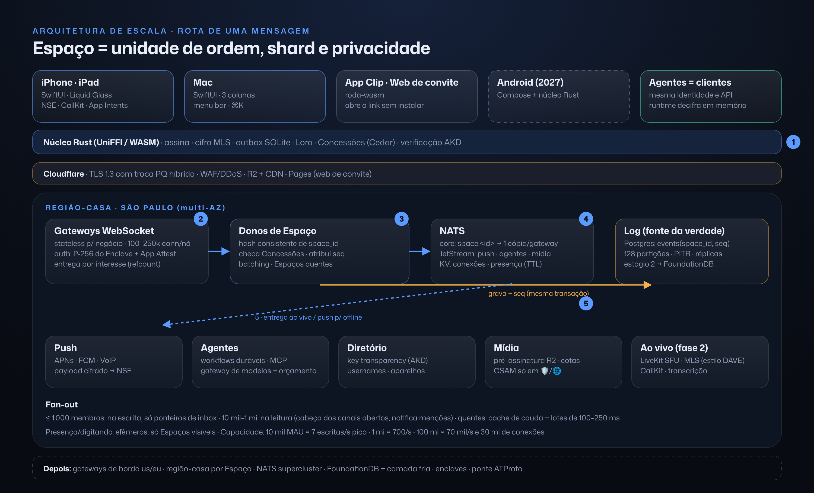
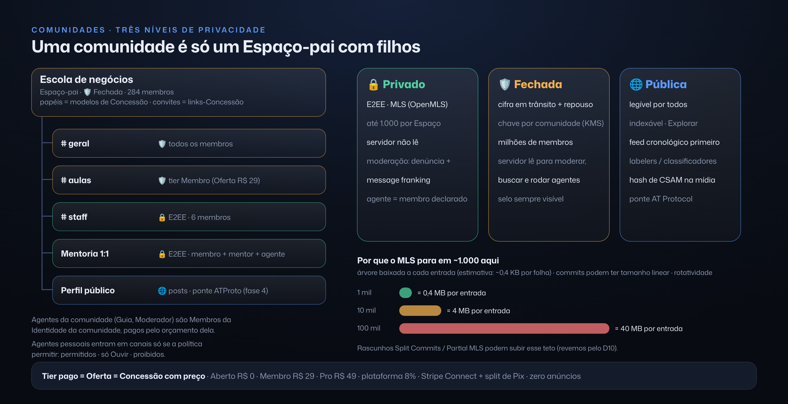

# Repensado do zero: pessoas, comunidades e agentes

Este documento registra a visão e o plano original, com decisões que evoluíram. O nome confirmado do produto e do agente é Zoen. O [roadmap atual](roadmap-status.md) substitui o cronograma do protótipo como critério de conclusão; [páginas vivas](product/live-pages.md) detalha a referência atual de edição e colaboração. Nomes técnicos antigos seguem a [migração de nomenclatura](dev/naming.md).


> Um redesenho a partir dos 133 posters de tironi.xyz, agora com **todas as decisões tomadas**.
> Critério: **máximo de elegância e máximo de ambição.** O alvo final é jogar na liga de WhatsApp, iMessage, Slack e Ando, com o menor conjunto de ideias capaz de gerar tudo isso.
> Referências como **#063** apontam para `img/063-*.png`. Fatos externos foram checados na web em 07/10/2026; o que não pude confirmar está marcado com *(a verificar)*.
> É um documento de pensamento: nenhum código foi escrito.

---

## 0. Resumo

- **Produto:** **Zoen**. É um app novo e nativo da Apple. O motor é o núcleo em Rust que nasce do signal-rust. **Zoen** é o agente padrão que vem junto (e pode ser renomeado).
- **Tese:** a conversa é onde o trabalho e a vida acontecem, e agentes são membros dela com a mesma dignidade das pessoas. Tudo que nasce ali é seu: versionado, compartilhável e portátil.
- **Momento mágico:** em menos de 60 segundos, sem cadastro, você fala uma frase, o seu agente transforma isso em algo concreto dentro da conversa, e você chama alguém com um link (App Clip no iPhone, navegador no resto).
- **5 primitivos:** Identidade, Espaço, Membro, Item e Concessão, todos registrados num **log de eventos assinado** por Espaço. **133 telas viram 20.**
- **Cliente:** 100% Swift/SwiftUI para iOS 26+ e macOS 26+, com Liquid Glass de verdade. O núcleo Rust fica por baixo via UniFFI. Web só como visualizador de convite. Android em 2027, com Compose sobre o mesmo núcleo.
- **Protocolos em camadas:**
  - **Espaços privados:** MLS (OpenMLS).
  - **Escala:** protocolo próprio, o "Zoen Sync" (eventos assinados, sequenciados por Espaço).
  - **Camada pública, depois:** AT Protocol (Bluesky). Nostr/Marmot fica como saída de soberania.
- **Escala:** relay em Rust, ordem por Espaço com dono definido por hash consistente (como os Channel Servers do Slack), NATS para entrega por interesse, Postgres particionado e, depois, FoundationDB. São Paulo primeiro.
- **Segurança:** MLS com caminho para pós-quântico, key transparency (AKD), aparelhos com chave própria, backup cifrado por passkey, agentes declarados como leitores e message franking para denúncias.
- **Preço:** Grátis · **Plus R$ 29/mês** · **Max R$ 79/mês** · **Equipes R$ 39/pessoa**. Criadores pagam **8%** sobre a receita. **Nunca anúncios.**
- **Primeiras 12 semanas:** demo da semana 4 = momento mágico no iPhone e no Mac; demo da semana 8 = convite, E2EE, pedidos de agente e Live Activity; semana 12 = TestFlight com 300 pessoas.

---

## Decisões (registro no estilo ADR)

O Enzo delegou todas as decisões. Elas estão tomadas abaixo, cada uma com o porquê e com **o que nos faria rever**.

| # | Decisão | Por quê (uma linha) | Revemos se… |
|---|---|---|---|
| D1 | **Público do v1:** você + seu agente + grupos pequenos (família, amigos, times de até 50), em PT/EN/ES | O momento mágico funciona sozinho e cria rede pelo convite; equipes vêm em seguida | Na semana 8, mais de 60% do uso for em grupos de trabalho → antecipar Equipes |
| D2 | **Plataforma:** iOS 26+ e macOS 26+ nativos (SwiftUI). Web é só visualizador de convite. Android em 2027 (Compose + núcleo Rust) | Liquid Glass e integrações de sistema (NSE, CallKit, App Intents) são o nosso fosso de qualidade | Mais de 40% dos convites forem abertos em Android e a conversão no web cair abaixo de 15% → antecipar Android |
| D3 | **Soberania invisível:** passkey + chaves por baixo, sem "chave privada" na UI. Exportar/assinador ficam em Avançado | Soberania é garantia, não onboarding | Os usuários avançados forem um segmento relevante → expor um "modo soberano" |
| D4 | **Agentes em E2EE:** Espaços privados são E2EE (MLS), e o agente é um **membro-leitor declarado**. O runtime decifra em memória na nossa nuvem, com enclaves em 2027 e a opção "só agentes locais" | Honestidade sobre quem lê é o diferencial frente a Ando e Slack, que leem tudo | A qualidade dos agentes cair por falta de contexto, ou enclaves com GPU ficarem baratos antes |
| D5 | **Preço:** Grátis (R$ 3/mês de IA inclusos, 5 GB) · **Plus R$ 29/mês ou R$ 290/ano** (R$ 15 de IA, 100 GB, Ao vivo com agentes) · **Max R$ 79/mês** (R$ 50 de IA) · **Equipes R$ 39/pessoa** (R$ 15 de IA por pessoa, num pool) · recargas de R$ 20/R$ 50 · criadores pagam **8%** · **zero anúncios** | Cobrar por pessoa com orçamento de IA embutido é previsível (a filosofia do Ando) e protege a margem | A margem bruta ficar abaixo de 60%, ou a conversão para Plus ficar abaixo de 3% em 90 dias |
| D6 | **Casa e nome:** produto novo, **Zoen**. O signal-rust vira o motor. **Zoen** vira o agente padrão (renomeável) e é a ponte com os usuários atuais do tryzoen | O nome Zoen é humano, curto, global e combina com o logo de anéis; o Zoen ganha o papel que já sabe fazer | A marca ou o domínio estiverem indisponíveis (INPI/USPTO/.app) *(a verificar)* |
| D7 | **Protocolos:** MLS (OpenMLS, MIT) para privados · **Zoen Sync** próprio para escala · **AT Protocol** para a camada pública (fase 4) · Nostr/Marmot como ponte opcional | Cada camada usa o protocolo que é o melhor naquilo (ver §Protocolos) | O Marmot amadurecer (spec estável, auditoria) → avaliar grupos soberanos via Nostr |
| D8 | **Servidor em Rust** (tokio/axum), com os mesmos crates do cliente | Segurança de memória ao lidar com entrada hostil, latência sem GC e tipos compartilhados | Contratação em Rust virar gargalo (improvável no Brasil, que tem comunidade Rust ativa) |
| D9 | **Armazenamento:** Postgres particionado por Espaço → **FoundationDB** quando passar de ~30 mil escritas/s sustentadas ou ~10 TB quentes. Segmentos frios vão para object storage | Postgres é simples hoje; FDB dá ordem transacional por Espaço (versionstamps) sem um serviço sequenciador | A operação do FDB pesar demais → ScyllaDB (o caminho do Discord) |
| D10 | **Comunidades em 3 níveis:** 🔒 Privado E2EE (até 1.000 membros) · 🛡️ Fechada (legível pelo servidor, para moderar) · 🌐 Pública | O MLS não escala com conforto para 100 mil membros, e moderar exige ler | Split/Partial Commits do MLS maturarem → subir o limite do E2EE |
| D11 | **Feed:** cronológico, de quem você segue e das suas comunidades. "Para você" só depois, com sinais explicados e feeds escolhíveis | Confiança antes de engajamento; nada de anúncios | Retenção do Explorar for baixa → testar ranking transparente |
| D12 | **Pagamentos:** Brasil = IAP (obrigatório oferecer) **+ Pix/cartão via processador alternativo** dentro do app (regras do iOS 26.5 no Brasil). EUA = IAP + link para checkout web. Resto = IAP | Pelas regras do Brasil, o processador alternativo custa 10% (pequenas empresas) contra 10% + 5% da IAP | As regras da Apple mudarem |
| D13 | **Nomes próprios:** "Ao vivo" no lugar de Jam e "Rascunhos" no lugar de Studio | Os dois nomes já são recursos do Ando | — |
| D14 | **Código proprietário:** todo o código, inclusive a spec do protocolo e o núcleo cliente, é de todos os direitos reservados (ver `LICENSE`); o repositório é público só para leitura. Abrir a spec é uma decisão para depois | Transparência para quem lê o código sem abrir mão de nenhum direito | Leitura pública facilita copiar ideias (o valor está em UX, agentes e rede) |
| D15 | **Idade mínima de 18 anos no v1**, com política de 13+ só na fase 3, quando a moderação existir | O ECA Digital (Lei 15.211/2025) exige proteção robusta de menores | A pilha de moderação e verificação de idade ficar pronta |
| D16 | **Equipe inicial:** 4 pessoas (2 Swift/Apple, 1 Rust de núcleo/servidor, 1 produto/design) + Enzo | O WhatsApp de 2014 tinha ~25 engenheiros para 465M de usuários | Velocidade abaixo do plano das 12 semanas |

---

## 1. Tese e momento mágico

### Tese, em uma frase
**"Converse com pessoas e agentes no mesmo lugar, e tudo que a conversa produz é seu: versionado, sob seu controle e capaz de ir com você para qualquer lugar."**

Os posters perseguem isso, mas espalham a ideia em 11 capítulos. O redesenho a reduz a uma lei só: **toda a experiência é um Espaço com membros, que produz Itens, governado por Concessões.**

### O que diferencia de cada referência
| | Onde é forte | Onde a gente vai além |
|---|---|---|
| WhatsApp | Escala, simplicidade, criptografia de ponta a ponta | Agentes como membros; a conversa produz coisas (docs, planos), não só mensagens |
| iMessage | Acabamento nativo, integração com o sistema | Multiplataforma, comunidades, criadores |
| Slack | Canais, threads, integrações | Vale também para a vida pessoal e para criadores; espaços entre organizações são nativos, sem "Connect" |
| **Ando** (confirmado na pesquisa) | Agentes como membros nativos de equipes, com proatividade por canal, curations de contexto, Jams com transcrição, Studio, Bridge channels, MCP/API e Liquid Glass no iOS | **Ando é só para equipes e lê seus dados no servidor.** Aqui tem consumidor + equipes + criadores, criptografia de ponta a ponta onde importa, identidade portátil e economia de criadores |

> ⚠️ **"Jam" e "Studio" já são nomes de recursos do Ando**, que faz exatamente isto: chamadas com transcrição e o lugar de contexto e integrações. Recomendo nomes próprios. Neste documento uso **"Ao vivo"** e **"Rascunhos"**.

### Momento mágico (primeiros 60 s)
1. **0–5 s:** o app abre direto numa conversa com o **seu agente**. Não há tela de boas-vindas nem cadastro: a identidade é criada em silêncio no aparelho. O composer já está em foco: *"O que você quer resolver?"*
2. **5–30 s:** você digita ou fala, por exemplo *"Planejar a viagem ao Chile com a Marina em outubro"*. O agente responde em streaming e **cria um Item** (o plano), que aparece como cartão vivo na conversa (estilo #052 e #063, só que instantâneo).
3. **30–45 s:** você toca no plano e edita uma linha. O agente reage à edição ("ajustei o orçamento"), e um "Desfazer" discreto aparece no rodapé.
4. **45–60 s:** você toca em "Chamar a Marina". Sai um link pelo share sheet (ou WhatsApp), e a Marina abre **sem instalar nada** (App Clip no iPhone, navegador no resto), já dentro do mesmo Espaço, vendo o plano e o agente.

**Por que esse momento:** ele funciona sozinho (o valor não depende de rede) e cria rede logo em seguida (o convite já carrega valor). Isso mata o problema de cold start que o conceito atual tem.

---

## 2. O modelo mínimo

### Os 5 primitivos (+ 1 substrato)

| Primitivo | O que é | Exemplos que ele absorve |
|---|---|---|
| **Identidade** | Um par de chaves com nome e rosto. Pessoas, agentes e Espaços têm uma. Assina tudo que produz. | Conta, perfil, perfil de agente, perfil de comunidade, aparelhos (subchaves), assinador externo |
| **Espaço** | Um lugar com membros, regras e histórico. Pode ser privado ou público e pode ter Espaços-filhos. | DM, grupo, thread, canal, comunidade, workspace, sessão reservada, perfil público, seu "contexto" pessoal |
| **Membro** | Uma Identidade dentro de um Espaço, com papel. **Pessoa e agente são o mesmo objeto**; o agente tem, a mais, *dono*, *nível de confiança* e *orçamento*. | Participantes, papéis, moderadores, agentes no chat, agentes no "ao vivo", agentes públicos |
| **Item** | Qualquer coisa produzida num Espaço: mensagem, arquivo, documento, tarefa, post, resumo ou definição de agente. **Todo Item é versionado, bifurcável e tem origem.** | Anexos, Plano.md, cenários (bifurcação), checkpoints (versões), releases de agente, wiki, publicações, rascunhos, recibos |
| **Concessão** | Um objeto assinado que diz "*quem* pode fazer *o quê* em *qual* Espaço ou Item, com *quais limites* (orçamento, prazo)". Pode ser pedida, dada, vendida e revogada. | Permissões, papéis, nível de confiança do agente, convites, links de compartilhamento, planos e tiers, compras, assinaturas, aprovações, aparelhos autorizados, retenção |
| *Evento (substrato)* | O log append-only e assinado de cada Espaço. Nenhuma tela o mostra; ele é a fonte da verdade de tudo. | Histórico, sincronização, offline, desfazer, auditoria, portabilidade, migração |

Dois modos que **não são objetos novos**:
- **Ao vivo:** qualquer Espaço pode entrar em modo voz/vídeo/tela. Quando termina, o modo produz Itens (resumo, transcrição). Isso substitui "Jam" como entidade.
- **Oferta:** uma Concessão-modelo com preço. Tier, assinatura, compra avulsa e agente pago são todos Ofertas.

### Diagrama
Ver `repensado-diagrama.png` / `repensado.html`.

```
Identidade ──é──▶ Membro ──participa de──▶ Espaço ──contém──▶ Item (versões, bifurcações, origem)
     │                │                       │   └─▶ Espaço-filho (thread, canal, cenário)
     └──assina──▶ Concessão ◀── governa ──────┴── e Item          Oferta = Concessão com preço
Tudo vira Evento assinado no log do Espaço → sync, offline, desfazer, auditoria, portabilidade
```

### Como os 11 capítulos colapsam

| Capítulo (telas) | Primitivos | O que some ou se funde | Fica como tela | Vira estado/componente | Some |
|---|---|---|---|---|---|
| 1. Sua identidade (10) | Identidade + Concessão (aparelho) | Boas-vindas e "escolher experiência" somem. Backup é adiado e vira um cartão. Restaurar e recuperar viram uma tela só, "Entrar". | 2 | 6 | 2 |
| 2. Conversas e grupos (15) | Espaço + Membro + Item | Nova conversa e criar grupo são a **mesma folha**. Revisar anexo e revisar foto somem (envia e desfaz). Papéis viram um toque no membro. | 5 | 8 | 2 |
| 3. Seus agentes (10) | Membro (agente) + Item (definição) + Concessão (orçamento) | Release, rascunho, rollback e fork do agente viram **Versões** e **Duplicar**, que valem para qualquer Item. O perfil do agente usa o mesmo template de perfil de pessoa. | 1 | 8 | 1 |
| 4. Trabalhar com agentes (17) | Membro + Concessão + Item (tarefa) | "Solicitar admissão" some (adicionar agente = adicionar membro). Permissões viram **um controle de confiança**. "Revisar ação", "recusada", "incerta" e "recibo" viram **um componente**: o cartão de pedido. "Contexto da tarefa" some, porque o contexto é o próprio Espaço. | 0 | 14 | 3 |
| 5. Colaboração ao vivo (14) | Espaço em modo Ao vivo + Item | Criar Jam some: "Ao vivo" é um botão. Diálogos do sistema e o seletor de tela não precisam de design próprio. O acesso a documentos herda do Espaço. | 2 | 7 | 5 |
| 6. Arquivos e cenários (15) | Item (versões e bifurcações) + Espaço-filho | Workspace do agente, tela de impacto e resultado da restauração somem (restaurar é reversível). Cenários = bifurcações. Consolidar = Juntar. | 3 | 9 | 3 |
| 7. Conhecimento (9) | Item + Concessão (escopo de trecho) | "Promover conhecimento" com pendente, negado e aprovado é só **Compartilhar** com um pedido de Concessão. | 1 | 8 | 0 |
| 8. Comunidades e criadores (12) | Espaço público + Espaços-filhos + Ofertas | Ativar e revisar comunidade somem: publicar um Espaço é um toggle. Canais = Espaços-filhos. Membros e papéis usam a mesma tela de Info. | 1 | 9 | 2 |
| 9. Conteúdo e acessos (12) | Oferta + Concessão | Revisar assinatura some (o Apple Pay, o Pix ou o checkout já confirmam). Expirado e negado são **um componente "trancado"**. A biblioteca de compras some: o que você comprou aparece em Itens. | 1 | 9 | 2 |
| 10. Presença pública e Studio (7) | Espaço público + Item (post) + Concessão (publicar) | Studio deixa de ser uma tela: rascunhos ficam no seu perfil e as sugestões dos agentes vão para Atividade. "Edição invalida aprovação" vira uma regra automática (a aprovação fica presa ao hash da versão). | 1 | 5 | 1 |
| 11. Portabilidade e preferências (12) | Evento (log) + Identidade | Réplicas, conflito e migração somem da UI: o CRDT e o log resolvem, e a migração é um assistente avançado. A tela de Configurações duplicada some. | 2 | 5 | 5 |
| **Total (133)** | | | **19** | **88** | **26** |

**Em números:** 114 das 133 telas (86%) deixam de precisar de design próprio. 26 (20%) somem por completo, porque a regra do sistema as torna desnecessárias. 88 viram estados de ~12 componentes reutilizáveis: cartão de pedido, recibo, estado trancado, pílula de privacidade, folha Nova, folha Conceder, Versões, Comparar, medidor de orçamento, banner offline, toast de desfazer e checkout. Somando a aba nova "Você", o app inteiro cabe em **20 telas**.

---

## 3. Design da experiência

### Navegação: 4 abas (e por que não 5)

```
┌──────────────────────────────────────────────────────┐
│  (  Conversas   Atividade   Explorar   Você  )   (⌕) │  ← cápsula de vidro + botão de busca/nova separado
└──────────────────────────────────────────────────────┘
```

1. **Conversas:** todos os seus Espaços numa lista só. DMs com pessoas, com agentes e grupos aparecem misturados por recência. Comunidades aparecem como **pilhas** que abrem seus canais (Espaços-filhos). Filtros em pílula: Todas · Pessoas · Agentes · Comunidades (#011 melhorado).
2. **Atividade:** *o que precisa de você e o que está sendo feito por você.* Topo: pedidos de agentes em lote. Meio: tarefas em andamento, com progresso ao vivo (#051). Embaixo: menções e respostas. É aqui que o modelo de confiança vive (#024 promovido a aba).
3. **Explorar:** Rede (Seguindo/Para você), comunidades e agentes públicos. É o motor de crescimento e a vitrine dos criadores (#091 + #115 numa tela só).
4. **Você:** seu perfil público e seus rascunhos, além de **Agentes**, **Itens** (todos os arquivos e docs, de todos os Espaços), **Memória** (o que os agentes sabem de você), **Acessos** (assinaturas, compras e o que você concedeu), **Segurança** e **Configurações**. Uma única tela de configurações.
5. **Botão de vidro à direita** (o padrão de "search tab" do iOS 26): busca global. Puxado para cima, vira **Nova** (conversa, grupo, agente, Item).

**Por que "Agentes" não é aba:** uma aba de agentes trata o agente como ferramenta. Na tese, agente é **membro**: ele aparece onde as pessoas aparecem (Conversas, Atividade, perfis). Configurar agentes é raro e mora em Você. Além disso, o botão central elevado dos posters é um padrão Android/Instagram que briga com a tab bar em cápsula do Liquid Glass.

**Por que Arquivos não é aba:** arquivo é Item, e todo Item vive num Espaço. A visão "todos os meus itens" é um filtro (Você › Itens ou Busca), não um destino diário.

### As 20 telas
| # | Tela | Absorve (exemplos) |
|---|---|---|
| 1 | Conversas | #011, #098, #122 |
| 2 | **Espaço** (conversa) | #015, #036, #043, #049, #117, #041/#042 (pílula de privacidade), #045–#048 (cartões) |
| 3 | Info do Espaço | #016, #017, #100, #102, #101 (seção Acesso) |
| 4 | Atividade | #024, #040, #087, #118 (sugestões) |
| 5 | Busca | #025, #067 |
| 6 | Explorar | #091, #115 |
| 7 | **Perfil universal** (pessoa, agente ou Espaço público) | #116, #027, #092, #097, #029/#030 (seções do agente) |
| 8 | Criar agente (conversando) | #028, #031 |
| 9 | **Item** (documento, arquivo, tarefa) | #064, #052, #071, #084, #085 |
| 10 | Versões | #073, #033, #034, #074 |
| 11 | Comparar e juntar | #076, #077, #078 |
| 12 | Conceder (compartilhar) | #072, #086, #038 |
| 13 | Ao vivo | #056, #060, #063 |
| 14 | Ofertas (para criadores) | #103, #101 |
| 15 | Você (hub) | *nova* |
| 16 | Você › Memória | #082, #083, #090 |
| 17 | Você › Segurança | #130, #004, #125 |
| 18 | Você › Configurações | #132, #133, #128 (Avançado) |
| 19 | Entrar | #005, #006, #007 |
| 20 | Conectar aparelho | #008, #009, #010 |

### Uma única representação de agente
- **Pessoa:** avatar **circular** com foto.
- **Agente:** avatar em **squircle** (quadrado arredondado, como ícone de app) com um glifo monocromático sobre um gradiente da cor escolhida, mais um **mini-avatar circular do dono** no canto inferior direito. O "de quem é" fica visível sem texto.
- **Espaço/comunidade:** squircle com foto de capa e sem mini-avatar.
- **Nome:** "Financeiro" no título e "Financeiro · Enzo" como subtítulo quando o agente não é seu.
- **Morrem:** o selo "AG" de letras, o cubo 3D, os ícones que mudam de cor entre telas e a palavra "Agente" como badge de texto. A forma diz que é agente; o mini-avatar diz de quem é.
- **Estados no próprio avatar:** um anel animado quando está trabalhando, um ponto âmbar quando espera você e um anel parcial como medidor quando está perto do limite de orçamento.

### Onboarding progressivo (a identidade só aparece quando há algo a proteger)
| Momento | O que acontece | O que o usuário vê |
|---|---|---|
| Abrir o app | Identidade gerada no aparelho (chave no Secure Enclave/Keystore) | Nada. Só a conversa com o agente. |
| Primeiro Item criado | — | Nada. Valor primeiro. |
| Convidar alguém ou instalar em outro aparelho | Pede um nome e (opcional) uma foto | "Como a Marina vai te ver?" (uma linha) |
| ~3 Itens ou 1º grupo | **Passkey**: a chave raiz é cifrada com o PRF da passkey e sincroniza pelo iCloud Keychain/Google | Cartão "Proteja o que é seu", 1 toque, Face ID |
| Pagar, criar comunidade ou publicar | Verificação de contato (e-mail ou telefone) para recuperação e descoberta | Folha curta |
| Avançado (opcional) | Código de recuperação, assinador externo, exportar chave | Você › Segurança |

As palavras "chave privada", "assinador" e "backup criptografado" **nunca aparecem no fluxo principal**. A soberania está lá por baixo; a UI fala de "seus aparelhos" e "proteger".

### Modelo de confiança (substitui ~30% das telas de revisar/confirmar)

**1. Nível de confiança por agente e por Espaço** (um controle só, no toque do membro):
| Nível | O agente… | Padrão para |
|---|---|---|
| **Ouvir** | Lê só quando chamado e responde com texto | Agentes de terceiros, comunidades |
| **Sugerir** | Prepara rascunhos e propostas; nada sai sem você | Agentes novos |
| **Agir** | Faz o que é reversível dentro do Espaço e do orçamento, sempre com desfazer | Seus agentes nos seus Espaços |
| **Autônomo** | Também age fora (agenda, e-mail, pagamentos pequenos) dentro dos limites | Escolha explícita |

**2. Três leis simples:**
- **Reversível → faz e mostra "Desfazer".** Como tudo é versionado, quase tudo é reversível: editar, mover, criar, renomear, restaurar.
- **Irreversível ou externo → pede.** Enviar para fora, pagar, apagar de verdade, publicar para uma audiência maior.
- **Linhas vermelhas fixas:** dinheiro acima do teto, nova audiência pública e dados de terceiros sempre pedem, em qualquer nível.

**3. Pedidos em lote:** pedidos não interrompem; acumulam em Atividade como *"Financeiro quer 3 coisas"*, com Aprovar todos / Revisar. Cada pedido é um cartão (#045 simplificado) com **o que muda, para quem e quanto custa**. A aprovação fica presa ao hash do conteúdo, então editar invalida sozinho (fim do #121 como tela).

**4. A confiança cresce com o histórico:** depois de N aprovações sem edição de um mesmo tipo de ação, o app sugere "Deixar o Financeiro fazer isso sozinho?". Confiança se conquista, não se configura.

### Como mostrar custo
- **Nunca por mensagem.** Custo por mensagem gera ansiedade e convida a comparar com o ChatGPT "ilimitado".
- **Orçamento mensal em R$** (nada de tokens nem de "créditos"), por agente e por Espaço. O medidor é o anel no avatar e uma linha no perfil (#030 simplificado).
- **Custo da tarefa no recibo** (#048), só quando você abre o detalhe.
- Alerta aos 80% e parada no teto, com "Aumentar limite" (exemplo: "+R$ 20 este mês").
- **Regra de quem paga, numa frase:** *quem é dono do agente paga o agente.* Nas comunidades, o criador decide quanto do orçamento dos agentes dele cada tier inclui (ver §6).

### Onde mora a infraestrutura
Em Você › Configurações › **Avançado**, fechado por padrão: provedor de modelo, onde os agentes rodam, relay/host do Espaço, armazenamento e exportar/mover Espaço. Para quase todos os usuários, isso é "Automático". A única infra que aparece na superfície é um selo de privacidade no cabeçalho do Espaço: 🔒 *Ponta a ponta*, ou 🌐 *Público*.

### Direção visual (alinhada ao PR 211)
- **Pele do PR 211:** Zoen Night (cinzas azulados), Mona Sans com o itálico do Instrument Serif só em momentos editoriais, e um azul de ação.
- **Liquid Glass só na camada de navegação e controle:** a tab bar em cápsula que encolhe ao rolar, o cabeçalho que vira vidro, o composer, as folhas e os cartões de pedido flutuantes. O conteúdo (mensagens, Itens) **não é vidro**: fica sólido e legível.
- **Large titles** nas raízes e compactos ao rolar, alvos de 44 pt, Dynamic Type, e "Reduzir transparência" troca vidro por sólido.
- **Movimento com significado:** o cartão do Item "nasce" da mensagem do agente, o desfazer desliza do composer e o anel do avatar respira enquanto o agente trabalha.
- **Mudanças em relação aos posters:** sai o preto puro e entra o Night; sai a tab bar opaca com FAB e entra a cápsula de vidro; botões primários viram pílulas; o modo claro passa a ser cidadão de primeira classe.

---

## 4. Como construir: arquitetura e tecnologias

### Princípio: os mesmos primitivos do pixel ao disco
- O **núcleo em Rust** implementa Identidade, Espaço, Membro, Item, Concessão e o log de Eventos **uma vez**. Ele roda no cliente Apple (iOS/macOS via UniFFI), na web de convite (WASM), no Android, com o cliente nativo já em revisão em 2026, no servidor e no runtime de agentes.
- O servidor é um **relay**: ordena, guarda e distribui eventos, sem regra de negócio duplicada.
- Um agente é **um cliente como outro qualquer**: tem Identidade, entra em Espaços como Membro e usa a mesma API.

### Diagrama do sistema


Detalhes de escala e segurança em §5.

### Paridade de recursos (WhatsApp / iMessage / Slack / Ando) mapeada nos primitivos
| Recurso | Como sai dos primitivos |
|---|---|
| Mensagens, respostas, reações, editar/apagar, encaminhar, enquetes, localização, figurinhas | Itens e eventos no log do Espaço (editar = nova versão; apagar = evento de tombstone) |
| Mensagens temporárias, visualização única | Concessão com prazo no Item, mais apagamento local |
| Confirmação de entrega/leitura, digitando, presença | Eventos efêmeros (não persistidos) |
| Grupos, comunidades e canais do WhatsApp; canais e threads do Slack | Espaços e Espaços-filhos, públicos ou privados |
| Status/Stories | Itens com prazo de 24 h no seu Espaço público (fase 3) |
| Ligações, vídeo, tela, huddles, SharePlay, Jams do Ando | Modo Ao vivo de qualquer Espaço |
| Canvas e Lists do Slack, docs | Item com CRDT |
| Slack Connect, Bridge channels do Ando | Nativo: um Espaço não pertence a uma empresa, e membros de organizações diferentes são só Membros |
| Apps, workflows e integrações do Slack; MCP/API/webhooks do Ando | Agentes como Membros, com ferramentas MCP, e Concessões |
| Curations do Ando (contexto) | Itens + Concessão de leitura para o agente (Memória) |
| Proatividade por canal do Ando | Nível de confiança + "frequência" por Espaço |
| Admin, SSO, SCIM, retenção, eDiscovery | Concessões de organização sobre Espaços (fase 5) |
| Apple Pay no iMessage | Pix e cartão dentro da conversa como Item "cobrança" (fase 3) |

### Plano de tecnologia por área
Cada área traz a escolha para o v1, a evolução, se é comprar ou construir, e o principal tradeoff.

**1. Clientes**
- **Decidido (D2):** iOS 26+ e macOS 26+ 100% SwiftUI com Liquid Glass real, núcleo Rust via UniFFI, web só para convites (WASM) + App Clip, e Android em 2027 (Compose sobre o mesmo núcleo). Detalhes em **§4A Cliente Apple nativo**.
- **Descartados:** Flutter (sem Liquid Glass fiel) e React Native/Expo (cripto, extensões e background fracos).

**2. Tempo real e sincronização**
- **v1:**
  - **WebSocket/TLS** com frames **protobuf** (prost).
  - Cada Espaço tem um **log append-only** com **número de sequência atribuído pelo relay**, o que dá ordem total por Espaço. Cada evento é **assinado** pelo autor e encadeado por hash.
  - Cliente **offline-first**: **SQLite** local (SQLCipher no mobile; SQLite-WASM com OPFS na web). A fila de saída tem idempotência por ID de cliente (ULID).
  - **Multi-aparelho:** cada aparelho tem a própria subchave, e a sincronização é por cursor de sequência.
  - Recibos e digitando são **eventos efêmeros** via **NATS**. A entrega é confirmada pelo ack do relay. A leitura é um evento cifrado e opcional.
- **Depois:** **WebTransport/QUIC** em redes móveis ruins.
- **Construir** o relay (é o coração e é pequeno), **comprar** o NATS (Synadia Cloud ou self-host).
- **Tradeoff:** ordem por servidor é simples e robusta. Ordem causal pura (sem servidor) é mais soberana, mas complica tudo; fica para os hosts alternativos.

**3. Criptografia de ponta a ponta**
- **v1:** **MLS (RFC 9420) via OpenMLS** (Rust, licença MIT) para DMs e grupos até ~2–5 mil membros: um protocolo para 1:1 e para grupos, com escala logarítmica e forward secrecy/PCS. Espaços **públicos** e comunidades grandes usam cifra em trânsito e em repouso, legíveis pelo servidor (como canais do Telegram e o Slack), com um selo claro na UI.
- **Agentes em Espaços cifrados:** o agente é **membro MLS com chave própria**, e o runtime dele guarda essa chave. Isso torna explícito que **adicionar um agente = adicionar um leitor**; a UI diz *"Financeiro lê esta conversa · roda em Nuvem do app"*. Há uma opção por Espaço: "só agentes locais" (modelos no aparelho).
- **Depois:** runtime confidencial (**AWS Nitro Enclaves** e GPUs com computação confidencial, com atestação remota) para que nem o operador veja. Também **message franking** para denúncias verificáveis em Espaços cifrados.
- **Construir** sobre o OpenMLS. Por que não **libsignal:** é AGPL e foi pensado para 1:1 e grupos pequenos.
- **Tradeoff:** agentes inteligentes precisam ler, e ser honesto sobre isso é o diferencial frente a Ando e Slack, que leem tudo.

**4. Mídia**
- **v1:**
  - Upload direto para **Cloudflare R2** (sem custo de egress) com URL pré-assinada e **cifra no cliente** (AES-GCM por arquivo, chave dentro do evento).
  - Miniaturas e transcodificação **no cliente** (AVFoundation/MediaCodec, com H.264/HEVC). Notas de voz em **Opus**, com transcrição no aparelho.
  - **CDN Cloudflare.**
- **Depois:** mídia pública das comunidades transcodificada no servidor (**Cloudflare Stream** ou **Mux**).
- **Comprar** armazenamento e CDN.
- **Tradeoff:** com E2EE o servidor não pode gerar miniaturas, então o cliente trabalha mais.

**5. Voz, vídeo e Ao vivo**
- **v1:** **LiveKit Cloud** (SFU WebRTC, open source) com E2EE por insertable streams. **CallKit/PushKit** no iOS e ConnectionService no Android. Agentes entram como participantes via **LiveKit Agents**, com STT/TTS e interrupção natural.
- **Transcrição:** no aparelho (SpeechAnalyzer do iOS 26 ou Whisper) em Espaços cifrados; no servidor (**Deepgram** ou Whisper) nos públicos. Gravação via **LiveKit Egress**, só com consentimento explícito e em Espaço não cifrado.
- **Depois:** self-host do LiveKit para custo.
- **Comprar**, depois self-host.
- **Tradeoff:** gravação/transcrição no servidor e E2EE são incompatíveis; a UI precisa deixar a escolha clara.

**6. Documentos colaborativos**
- **v1:** **Loro** (CRDT em Rust) para rich text, listas e árvores. Ele tem **histórico, checkout de versões e bifurcações nativas**, ou seja, Versões, Cenários e Comparar saem quase de graça. Os updates viajam como eventos cifrados no log, com snapshots periódicos.
- **Editor:** **nativo**, com `TextEditor` + `AttributedString` (rich text do iOS 26) ligado ao Loro. O TipTap fica só na web de convite.
- **Depois:** TextKit 2 para casos avançados (tabelas, blocos).
- **Construir** em cima do Loro.
- **Tradeoff:** o Loro é mais novo que o **Yjs** (ecossistema maior), mas o Yjs é JS-first e tem histórico fraco. O **Automerge** é a alternativa Rust, porém mais lento em texto grande.

**7. Notificações push**
- **v1:** **gateway próprio** para **APNs e FCM** (e Web Push). O payload é só o evento cifrado ou um "acorde + id". A **Notification Service Extension** do iOS decifra com o núcleo Rust (limite de ~24 MB de memória, então o núcleo precisa de um modo enxuto), e Communication Notifications mostram avatar e nome. No Android, data messages no FCM.
- **Construir** (é pequeno). Por que não OneSignal: metadados sensíveis.
- **Tradeoff:** E2EE exige decifrar no aparelho, o que exige engenharia de extensão.

**8. Busca**
- **v1:** **no aparelho** com **SQLite FTS5** (tokenização com acentos PT) para tudo que é cifrado, e **sqlite-vec** com embeddings pequenos (Core ML) para busca semântica local. No servidor, **Postgres FTS + pgvector** para Espaços públicos e Explorar.
- **Depois:** **Typesense/Meilisearch** ou OpenSearch quando Explorar crescer.
- **Tradeoff:** a busca cifrada é por aparelho, e o histórico antigo precisa ser sincronizado para ser buscado.

**9. Threads, canais e huddles (estilo Slack)**
- **v1:** tudo é **Espaço-filho**: uma thread é filho de uma mensagem e um canal é filho de uma comunidade. O huddle é o modo Ao vivo do canal. Mensagens agendadas e lembretes são eventos com data. Os workflows **são agentes**.
- **Fase 2:** importadores de Slack e WhatsApp (export .zip) para trazer equipes.
- **Tradeoff:** um modelo só é mais elegante, mas o desempenho de listas com muitos filhos precisa de índice dedicado.

**10. Runtime de agentes**
- **v1:**
  - Cada agente é uma Identidade com um **Item "definição"** versionado: instruções, ferramentas, fontes e modelo.
  - Um serviço de runtime se inscreve nos Espaços onde o agente é Membro e roda tarefas em **workflows duráveis** com **Restate** (leve, binário único, Rust). Isso cobre retries, espera por aprovação e timers. Alternativa: **Temporal**.
  - Ferramentas via **MCP**, e qualquer agente externo entra pela mesma API (BYO agent, como no Ando).
  - Código e navegação rodam em **sandboxes microVM** (**E2B** ou **Modal** no v1; Firecracker próprio depois).
  - **Concessões** são checadas antes de cada ferramenta e cada recuperação de contexto, com o **mesmo avaliador** do núcleo (políticas em **Cedar**, que é Rust e roda igual no cliente e no servidor).
- **Modelos:** um **gateway de modelos** próprio e fino (roteia OpenAI/Anthropic/Google; aceita chave própria do usuário). Ele **pré-autoriza o custo estimado contra o orçamento** (que é uma Concessão com limite) e debita o real num evento de uso. Modelos **no aparelho** (Apple Foundation Models) cobrem resumos e privacidade.
- **Memória/RAG:** conhecimento = Itens. Os embeddings guardam **a origem e a Concessão de cada trecho**, e a recuperação filtra pelo que o agente pode ler. Uma revogação apaga os derivados (#090 vira uma regra). A Memória fica visível e editável em Você.
- **Construir** o runtime e o gateway (são o produto); **comprar** sandboxes e modelos.
- **Tradeoff:** proatividade ("o agente decide falar") precisa de um roteador anti-loop entre agentes, como o Ando já aprendeu.

**11. Identidade, chaves e backup**
- **v1:**
  - Chave raiz **Ed25519** em software (cifrada pela passkey) e **chaves de aparelho P-256 no Secure Enclave**, que só suporta P-256. Login e recuperação com **passkeys (WebAuthn)**, usando a **extensão PRF** para cifrar o backup da chave raiz, que sincroniza pelo iCloud Keychain ou Google Password Manager.
  - Código de recuperação opcional. Aparelhos novos entram por **QR**.
  - Descoberta por username, link e (opcional) telefone/e-mail com hash e rate limit.
- **Depois:** assinador externo (NIP-46/hardware) e chave **secp256k1** derivada para a ponte Nostr.
- **Construir** sobre as APIs do sistema.
- **Tradeoff:** passkey cria dependência do ecossistema Apple/Google para recuperar, mas é o único jeito de ter soberania sem fricção.

**12. Pagamentos** (decidido, D12)
- **Brasil (iOS 26.5, acordo com o CADE):** oferecer a IAP é obrigatório, e é permitido **processador alternativo dentro do app** (Pix/cartão via Stripe ou PSP) com o entitlement StoreKit External Purchase.
  - **IAP:** 21% de comissão (10% no Small Business Program e em assinaturas após o 1º ano), mais **5%** de processamento da Apple.
  - **Processador alternativo:** a mesma comissão, sem os 5%.
  - **Link para fora:** 15% (ou 10%) sobre as vendas feitas até 7 dias depois do toque.
  - Fonte: Apple Developer, "Payment options on the App Store in Brazil".
- **EUA:** IAP + link para checkout web (*a verificar o status do recurso judicial de 2025*). **Resto:** IAP.
- **Criadores:** Stripe Connect + split de Pix via PSP brasileiro.
- **Lightning:** fora do v1.
- **Tradeoff:** taxa da loja contra conversão. O Pix dentro do app tende a ganhar no Brasil.

**13. Moderação e abuso**
- **v1:**
  - Denúncia em todo lugar (#023), com moderadores por comunidade (Membros com Concessão de moderar) e um **agente moderador** como Membro, que é elegante e configurável.
  - Para conteúdo público: classificadores (OpenAI Moderation ou Hive) e **hash de CSAM** (ferramenta da Cloudflare/PhotoDNA).
  - Limites para contas novas e reputação pelo grafo de convites.
- **Em Espaços cifrados:** a denúncia envia evidência decifrada pelo denunciante; message franking vem depois.
- **Lei:** **Marco Civil** (guarda de registros de acesso por 6 meses) e **ECA Digital (Lei 15.211/2025)**, que exige verificação de idade e proteção de menores em redes sociais.
- **Comprar** classificadores, **construir** fluxos.
- **Tradeoff:** feed público = custo de moderação permanente. Esse é o motivo de ele ficar na fase 3.

**14. Observabilidade**
- **v1:** **OpenTelemetry** em tudo, enviado para o **Grafana Cloud**; **Sentry** para crashes; e **PostHog** para produto e **LLM analytics** (já está no stack de vocês). **Nunca** capturar conteúdo: só eventos e métricas.
- **Comprar.**
- **Tradeoff:** em E2EE, o debug é cego; o investimento em telemetria estruturada precisa vir desde o início.

**15. Infra, hosting e escala**
- **v1 (time de 2–4 pessoas):**
  - **Fly.io** na região GRU, para relay, push, runtime e gateway.
  - **Postgres gerenciado em São Paulo**, com o log particionado por Espaço.
  - **NATS JetStream**, **Cloudflare** (borda, R2, CDN, Workers para links públicos) e **LiveKit Cloud**.
  - IaC com **Terraform**.
- **Escala:**
  - Shard de Espaços por hash entre nós de relay.
  - O Postgres aguenta até dezenas de milhões de eventos/dia. Depois, o log vai para **ScyllaDB** ou **FoundationDB**, e entram regiões múltiplas e AWS para enclaves.
- **Tradeoff:** começar gerenciado custa mais por usuário, mas economiza o recurso mais caro, que é o time.

**16. Conformidade (LGPD e afins)**
- Encarregado (DPO), registro de operações e lista de suboperadores.
- **Contratos com provedores de IA com retenção zero** e cláusulas-padrão da ANPD para transferência internacional (Res. 19/2024).
- Direitos do titular nativos: **Você › Dados** exporta e apaga. Retenção = Concessões com prazo.
- **Minimização**, que a E2EE ajuda a provar.
- ECA Digital, Marco Civil e termos de criador/marketplace (repasses, nota fiscal, impostos).
- **Depois:** SOC 2 e ISO 27001 para equipes e empresas.

### Tabela do stack (v1 → depois)
| Área | v1 | Depois | Comprar/Construir |
|---|---|---|---|
| Núcleo | Rust (UniFFI, WASM) | — | Construir |
| iOS/macOS | SwiftUI (iOS/macOS 26+) + Liquid Glass + extensões | watchOS/visionOS | Construir |
| Android | — | Compose + núcleo Rust (2027) | Construir |
| Web | Só web de convite (WASM) + App Clip | Web completo (2027+) | Construir |
| Transporte | WebSocket + protobuf | WebTransport/QUIC | Construir |
| Relay/servidor | Rust (axum, tokio) | Shards, hosts alternativos | Construir |
| Fila/efêmeros | NATS JetStream | — | Comprar/OSS |
| Banco | Postgres particionado (+ pgvector, FTS) | FoundationDB (alt.: ScyllaDB) | Comprar/OSS |
| Local | SQLite/SQLCipher, FTS5, sqlite-vec | — | OSS |
| E2EE | OpenMLS | Enclaves, franking | OSS + construir |
| Docs | Loro + editor nativo AttributedString | TextKit 2 | OSS |
| Mídia | R2 + CDN Cloudflare | Stream/Mux para público | Comprar |
| Ao vivo | LiveKit Cloud + Agents | LiveKit self-host | Comprar → OSS |
| Push | Gateway próprio APNs/FCM | — | Construir |
| Agentes | Restate + MCP + E2B/Modal + Cedar | Firecracker próprio, enclaves | Construir + comprar |
| Modelos | Gateway próprio (multi-provedor, BYOK) + on-device | Modelos próprios ajustados | Construir |
| Identidade | Raiz Ed25519 (passkey PRF) + P-256 no Secure Enclave + AKD | Assinador externo, DID ATProto | Construir |
| Pagamentos | StoreKit 2 + Pix via processador alternativo (BR) + Stripe | Connect + split de Pix (criadores) | Comprar |
| Moderação | Hive/OpenAI + hash CSAM + agente moderador | Franking | Comprar + construir |
| Observabilidade | OTel + Grafana + Sentry + PostHog | — | Comprar |
| Hosting | Fly.io GRU + Cloudflare | Multi-região, AWS | Comprar |

### Nostr/relays agora ou servidor convencional primeiro?
**Servidor próprio primeiro, com protocolo pronto para portabilidade.**
- Mensagem privada em Nostr vaza metadados, e grupos grandes ali ainda são imaturos.
- Um relay próprio dá push, ordem, entrega, anti-abuso e velocidade de produto.
- O que preservamos desde o dia 1 são três coisas: **eventos assinados pelo autor**, **log exportável** e **identidade de chave**. Com elas, mover um Espaço para outro host (#128) vira engenharia, não reescrita.
- **Fase 4:** a presença pública ganha uma **ponte AT Protocol** (e Nostr como opção). O veredito completo está em §7 Protocolos.
- **Atalho elegante: o Marmot** (MLS + identidade de chave Nostr + payloads em formato de evento) já foi desenhado **agnóstico de transporte**, e a spec prevê Nostr e QUIC. Podemos adotar o mesmo formato de grupo **sobre o nosso relay** no v1 e abrir para relays Nostr depois, sem migrar dados. Ressalva: o protocolo é experimental (mudanças incompatíveis, poucos testes entre clientes), então vale acompanhar e contribuir antes de depender dele.

### O que é v1 e o que vem depois, em uma frase por camada
- **v1:** núcleo Rust, iOS + macOS nativos (+ App Clip/web de convite), relay único em São Paulo, MLS, Loro, passkeys, agentes com gateway medido e push com NSE.
- **Depois:** Ao vivo e Equipes (2027 S1), comunidades e criadores (2027 S2), Android, ATProto e enclaves (2027–28), FoundationDB e multi-região.

---

## 4A. Cliente Apple nativo (iOS + macOS)

**Decisão:** 100% Swift 6 + SwiftUI, com alvo mínimo **iOS 26 e macOS 26**. São eles que trazem o Liquid Glass completo e os Foundation Models no aparelho. O núcleo Rust fica por baixo via **UniFFI** (Swift Package gerado). Não usamos Catalyst nem Flutter.

### Divisão de responsabilidades
| Fica em Rust (`roda-core`) | Fica em Swift |
|---|---|
| Primitivos (Identidade, Espaço, Membro, Item, Concessão), log assinado e validação | Toda a UI, a navegação e o Liquid Glass |
| MLS (OpenMLS), cifra de mídia e verificação de key transparency | Secure Enclave (CryptoKit), passkeys (AuthenticationServices + PRF) e Keychain |
| Sync (WebSocket, outbox, cursores) e armazenamento SQLite/SQLCipher | CallKit, PushKit, LiveKit Swift SDK e áudio |
| CRDT (Loro): versões, bifurcações e diff | Editor rico: `TextEditor` + `AttributedString` (iOS 26), ligado ao Loro |
| Avaliador de Concessões (Cedar) e medição de orçamento local | StoreKit 2, App Intents, Spotlight, WidgetKit/ActivityKit e SpeechAnalyzer |
| Índice de busca FTS5 + sqlite-vec | Foundation Models (resumos e classificação no aparelho) |

**Fluxo de dados:** o núcleo é a única fonte de verdade (SQLite num **App Group** compartilhado com as extensões). Ele emite fluxos de mudança (callbacks UniFFI viram `AsyncStream`) para stores `@Observable`. Não usamos Core Data nem SwiftData, porque duas fontes de verdade são o caminho certo para bugs de sync.

### Estrutura do app
- **Shells por plataforma:** `ZoeniOS` (TabView com 4 abas + aba de busca) e `ZoenMac` (NavigationSplitView em 3 colunas: Espaços | conversa | Item/inspetor).
- **Código compartilhado:** cerca de 85% da UI em pacotes SwiftUI comuns.
- **Extensões:**
  - **Notification Service:** decifra pushes E2EE.
  - **Share:** "Mandar para o Zoen / para um Espaço".
  - **Widgets + Live Activities.**
  - **App Intents.**
  - **App Clip:** o convidado abre o link no iPhone sem instalar. Atenção ao tamanho do App Clip com o núcleo Rust *(a verificar)*.

### Componentes de Liquid Glass (sistema primeiro, custom só onde faz sentido)
- **Sistema:** `TabView` com `Tab(role: .search)` e `.tabBarMinimizeBehavior(.onScrollDown)`; toolbars e sheets de vidro; `.buttonStyle(.glass / .glassProminent)`; `GlassEffectContainer` + `.glassEffect()` para agrupar controles que se fundem.
- **Custom (DesignSystem):**
  - `Composer`, uma cápsula de vidro com anexos e voz.
  - `RequestCard`, o pedido de agente, flutuante.
  - `UndoToast`, que nasce do composer.
  - `AgentAvatar` (squircle + glifo + mini-avatar do dono + anéis de estado) e `BudgetRing`.
  - `PrivacyPill`, com o selo 🔒/🛡️/🌐 no cabeçalho.
- **Regra:** vidro só na camada de controle; o conteúdo é sólido. "Reduzir transparência" e "Aumentar contraste" são respeitados automaticamente.

### Integrações de sistema (o fosso de qualidade)
| Integração | Uso |
|---|---|
| **Notification Service Extension** | O push chega com o evento cifrado e a NSE decifra com o núcleo em "modo leve" (limite de ~24 MB de memória). Nome e avatar via Communication Notifications (`INSendMessageIntent`). Se falhar, mostra "Nova mensagem". |
| **CallKit + PushKit** | Chamadas "Ao vivo" tocam como chamada nativa e funcionam na tela bloqueada. |
| **Secure Enclave** | Chave de aparelho **P-256** não exportável (o Enclave só faz P-256). Ela assina o login no relay e a credencial do aparelho. |
| **Passkeys + PRF** | A passkey desbloqueia o backup da **chave raiz** (Ed25519, em software), cifrada com a chave derivada pelo PRF e sincronizada pelo iCloud Keychain. |
| **App Intents / Atalhos / Siri** | "Perguntar ao Zoen", "Criar tarefa em…", "Resumir conversa", "Mandar para Espaço". As entidades `SpaceEntity`, `ItemEntity` e `AgentEntity` ficam indexáveis e disponíveis para o Apple Intelligence. |
| **Live Activities / Dynamic Island** | Uma tarefa de agente em andamento mostra progresso, custo e o botão "Aprovar" (App Intent, com Face ID). |
| **Widgets / Controles** | "O que precisa de você" (pedidos pendentes), conversa fixada e o controle "Pergunte" no Centro de Controle. |
| **Share Extension** | Qualquer coisa vira Item num Espaço ou um pedido ao agente. |
| **Spotlight** | Índice local (Core Spotlight) com títulos decifrados **só no aparelho**. |
| **StoreKit 2** | Assinaturas (Plus/Max) e compras de criadores; no Brasil, ao lado do Pix via processador alternativo (D12). |
| **Foundation Models** | Resumo, título e classificação no aparelho. É também a base da opção "só agentes locais". |

### Especificidades do Mac
- Janela com 3 colunas e sidebar de vidro, com várias janelas (abrir um Item na própria janela).
- Paleta de comandos com ⌘K, atalhos para tudo e arrastar/soltar arquivos.
- **Menu bar extra** "Pergunte" com atalho global; "Ao vivo" em janela flutuante (PiP).
- Arquivos grandes e pastas como Itens, com sincronização em segundo plano.

### Web: só o visualizador de convite
Uma página leve (Cloudflare Pages + `roda-wasm`) para quem recebe o link e ainda não tem o app. Ela permite ver e responder no Espaço convidado e editar Itens de forma simples, depois convida a instalar. No iPhone, o link abre o **App Clip**; no Android e no desktop, abre a web. O app web completo não está no plano antes de 2027.

---

## 5. Arquitetura de escala e segurança


### 5.1 Escalar o chat

**Princípio:** a unidade de ordem, de shard e de privacidade é o **Espaço**. Não existe ordem global, igual ao Slack ("não há ordem global de eventos fora de um canal").

**Caminho de uma mensagem:**
1. O cliente assina e (se privado) cifra o evento com MLS. Ele vai para a outbox do SQLite e é enviado por WebSocket.
2. O **gateway** (sem estado de negócio) autentica o aparelho (assinatura P-256 + App Attest) e encaminha ao **dono do Espaço**.
3. O **dono do Espaço** (escolhido por hash consistente de `space_id`) checa as Concessões, atribui `seq` e grava.
4. Ele publica no NATS `space.<id>`.
5. Cada gateway com membros conectados recebe **uma cópia** e entrega localmente. Quem está offline recebe push e, ao reconectar, busca pelo cursor.

**Ordem e sequência**
- **v1:** a sequência mora no Postgres, numa linha por Espaço (`UPDATE … RETURNING seq` + `INSERT` na mesma transação). Aguenta milhares de eventos/s por Espaço.
- **Escala:** dono em memória por hash consistente, com batching de commits (os Channel Servers do Slack fazem exatamente isso, em Java, ~16 mi de canais por host no pico).
- **Estágio 2:** **versionstamps do FoundationDB** dão ordem transacional por Espaço sem serviço dedicado.

**Gateways e registro de conexões**
- Gateways WebSocket são stateless para o negócio e guardam só as conexões. Meta por nó (16 vCPU/32 GB, tokio): **100–250 mil conexões**, a validar em teste de carga. Para comparação, o WhatsApp rodava ~1 mi de conexões por servidor Erlang em 2014, depois de demonstrar 2 mi em 2012.
- O registro de quem está onde fica no **NATS KV**, com TTL e heartbeat. Ele é usado para push e presença, não para rotear mensagens.
- A **entrega é por interesse:** o gateway assina `space.<id>` com refcount dos usuários conectados. O NATS entrega uma vez por gateway, e o gateway multiplica localmente.

**Estratégias de fan-out**
| Tipo de Espaço | Estratégia |
|---|---|
| DM e grupos ≤ 1.000 (privados) | **Fan-out na escrita só de ponteiros:** atualiza `inbox(user) → (space, seq, unread)` de cada membro, enquanto o conteúdo fica uma vez só no log. Push para os offline. |
| Comunidades grandes (10 mil–1 mi) | **Fan-out na leitura:** nada de ponteiro por membro a cada mensagem. O cliente busca a "cabeça" dos canais abertos, e as notificações só vêm de menções, respostas e canais seguidos. |
| Espaços quentes (uma live com 100 mil) | Cache da cauda do canal no gateway (coalescência de leituras, como os serviços Rust do Discord), entregas em lote a cada 100–250 ms, presença só agregada ("12,4 mil aqui") e modo lento por política. |

**Presença e digitando**
- São eventos **efêmeros** (nunca vão para disco), enviados só para os Espaços visíveis na tela. O Slack faz o mesmo e só envia presença dos usuários visíveis.
- "Digitando" tem throttle de 1 a cada 3 s. Em comunidades grandes, aparece só como contagem.

**NATS JetStream**
- **Core NATS:** entrega ao vivo para os gateways. Não precisa persistir, porque a fonte da verdade é o log.
- **JetStream:** filas duráveis e idempotentes (push, gatilhos de agentes, mídia, indexação, webhooks). **KV:** registro de conexões e presença.
- **Superclusters:** multi-região mais tarde.

**Pipeline de push**
- O relay coloca o evento na fila JetStream `push`. Os workers em Rust (APNs HTTP/2, FCM v1) aplicam mudo, colapso e prioridade.
- O payload é o evento cifrado se couber em 4 KB; senão, vai só "acorde + id". A NSE decifra.
- Chamadas usam **VoIP push** (PushKit) e CallKit.

**Pipeline de mídia**
- Cifra AES-GCM no cliente, PUT pré-assinado no **R2** (multipart e retomável acima de 100 MB) e evento com ponteiro + chave + hash + blurhash.
- Miniaturas e transcodificação no aparelho. Mídia pública (🌐) é processada no servidor (Cloudflare Images/Stream) e passa por hash de CSAM.

**Armazenamento**
- **Estágio 1:** Postgres com a tabela `events(space_id, seq)`, particionada por hash de `space_id` (128 partições), com PITR e réplicas.
- **Estágio 2 (gatilhos D9):** **FoundationDB** para o log e os índices quentes, com segmentos frios compactados no object storage.
- **Por que FDB:** ordem transacional e versionstamps, e o CloudKit da Apple roda sobre o FDB Record Layer. O Signal está migrando seu armazenamento de mensagens para FDB em 2026, segundo os commits públicos do Signal-Server.
- **Alternativa:** ScyllaDB, o caminho do Discord. Eles migraram trilhões de mensagens de **177 nós Cassandra para 72 nós ScyllaDB**, com p99 de leitura caindo de 40–125 ms para ~15 ms e inserção em ~5 ms.

**Multi-região**
- **v1:** São Paulo (Fly GRU ou AWS sa-east-1), multi-AZ, com Postgres HA e backups com PITR.
- **Fase 2:** gateways de borda em us-east e eu-west (latência), mantendo **região-casa por Espaço** para o sequenciamento.
- **Fase 3+:** Espaços com casa em várias regiões (residência de dados) e NATS supercluster.

**Capacidade (estimativa)**

Premissas:
- DAU = 50% do MAU, com 40 eventos escritos por DAU por dia. O WhatsApp de 2014 fazia ~41 mensagens recebidas por MAU por dia (19 bi/dia para 465 mi).
- Pico = 3× a média e fan-out médio de 6.
- ~1 KB por evento cifrado.
- Conexões simultâneas = 30% do MAU (WhatsApp 2014: 147 mi para 465 mi ≈ 32%).

| | **10 mil MAU** | **1 mi MAU** | **100 mi MAU** |
|---|---|---|---|
| Eventos/dia | 200 mil | 20 mi | 2 bi |
| Escritas/s (média → pico) | 2 → 7 | 230 → 700 | 23 mil → 70 mil |
| Entregas/s no pico | ~40 | ~4 mil | ~420 mil |
| Conexões simultâneas | 3 mil | 300 mil | 30 mi |
| Log novo/dia (sem mídia) | 0,2 GB | 20 GB | 2 TB |
| Gateways | 2 (HA) | 3–6 | 150–300 |
| Banco | 1 Postgres pequeno HA | Postgres particionado + réplicas | FoundationDB (ou Scylla) + camada fria |
| Infra (sem IA nem Ao vivo) | ~US$ 500–1 mil/mês | ~US$ 10–25 mil/mês | dezenas de US$ milhões/ano *(ordem de grandeza)* |

O **custo dominante é a IA, não o chat**. Por isso o orçamento por agente é uma Concessão medida no gateway de modelos.

**O que os grandes fizeram, e o que pegamos**
| Quem | O que fizeram (fatos checados) | O que pegamos |
|---|---|---|
| **WhatsApp** | Erlang + FreeBSD. Em 2014: 465 mi de MAU, 147 mi de conexões simultâneas, pico de 342 mil msgs/s entrando e 712 mil saindo, ~550 servidores (~150 de chat, ~1 mi de conexões cada), ~10 pessoas no Erlang. A empresa tinha ~50 funcionários e ~25 engenheiros. Mensagens guardadas só até a entrega. | Obsessão por simplicidade, poucas peças e conexão barata. **Diferença:** guardamos o log (cifrado), porque multi-aparelho, Itens e agentes exigem histórico. |
| **Discord** | Elixir para tempo real; mensagens em ScyllaDB particionadas por canal + bucket de tempo; serviços de dados em Rust com coalescência de leituras; **DAVE**, E2EE de áudio e vídeo **usando MLS**. | Partição por Espaço, coalescência em Espaços quentes, Rust nos caminhos críticos e MLS também no Ao vivo. |
| **Slack** | Gateways regionais (WebSocket), Channel Servers com hash consistente por canal e ordem total por canal, Presence Servers só para usuários visíveis, MySQL sharded via **Vitess** por canal/usuário (2,3 mi QPS no pico). | Dono por Espaço com hash consistente, gateways regionais e presença só do que está visível. |
| **Signal** | Servidor em Java com Redis + DynamoDB (TTL de 7 dias), migrando para FoundationDB (commits de 2026); armazena para entregar e apaga. | Mínimo de metadados e de retenção, e FDB como estágio 2. |

**Por que Rust no servidor**
- Segurança de memória ao fazer parsing de entrada hostil: é a primeira linha de defesa de um mensageiro.
- Latência previsível, sem pausas de GC. Foi o motivo do Discord trocar Go por Rust no serviço de Read States, e de sofrer com o GC da JVM no Cassandra.
- **Os mesmos crates** de tipos, validação e Concessões no cliente e no servidor.
- O tokio aguenta centenas de milhares de conexões por nó.

**Tradeoff assumido:** o Erlang/Elixir tem a melhor história de "um milhão de conexões". O Rust ganha no compartilhamento de código e na segurança.

### 5.2 Segurança

**Modelo de ameaças** (de quem nos defendemos):
1. Rede passiva ou ativa.
2. **Nós mesmos**: operador curioso, servidor comprometido ou pedido legal. Não podemos ler conteúdo privado.
3. Membro malicioso.
4. Aparelho roubado.
5. **Agente ou provedor comprometido e prompt injection** vindo do conteúdo.
6. Spam e abuso.
7. Cadeia de suprimentos (dependências, CI).

**E2EE: MLS em vez de Signal Protocol**
- **MLS (RFC 9420, 2023) via OpenMLS:** um protocolo só para 1:1 e grupos, com atualizações em **O(log n)**, forward secrecy e **post-compromise security em grupo**. É padrão IETF e já está em produção no DAVE (chamadas do Discord), no Webex e no Wire.
- **Signal:** usa Double Ratchet no 1:1 (com **PQXDH** em 2023 e o **Triple Ratchet/SPQR** com ML-KEM em out/2025) e **Sender Keys** nos grupos. Isso dá distribuição O(n) e uma recuperação pós-comprometimento mais fraca em grupo.
- **Ciphersuite:** `MLS_128_DHKEMX25519_AES128GCM_SHA256_Ed25519` no v1.
- **Pós-quântico:** suite **híbrida X-Wing (X25519 + ML-KEM-768)** assim que estiver estável no OpenMLS *(a verificar o status)*. Até lá, o transporte usa TLS 1.3 com troca híbrida de chaves PQ (padrão em Cloudflare e navegadores), contra "colher agora, decifrar depois" nos metadados.

**Key transparency**
- Diretório de chaves auditável com o **AKD** (biblioteca da Meta usada no WhatsApp desde 2023, em Rust, auditada pela NCC Group). Ele mapeia Identidade → chaves de aparelho.
- Os clientes verificam provas de inclusão automaticamente, e auditores externos verificam a consistência. Inspiração extra: o Contact Key Verification do iMessage, em que os próprios aparelhos checam a consistência.

**Verificação de aparelhos:** "Verificar pessoalmente" com QR e números de segurança na ficha do membro. Uma troca de chave gera aviso, que a key transparency deixa raro e confiável.

**Multi-aparelho**
- Cada aparelho tem **a própria folha MLS** e a própria chave (como o WhatsApp desde 2021), e a chave raiz assina a lista de aparelhos publicada no diretório.
- Vincular um aparelho = QR + confirmação, e o histórico vai por transferência cifrada entre aparelhos.

**Metadados**
- Nada de grafo de contatos no servidor; descoberta por username e link. Pushes, nomes de Espaços e Itens vão cifrados, e os envelopes têm padding.
- **Sealed sender** (inspirado no Signal) na fase 2: credenciais anônimas por Espaço, para o relay entregar sem saber quem enviou.
- **Tensão legal:** o Marco Civil exige guardar registros de acesso (IP + horário) por 6 meses. Guardamos isso e nada além.

**Backups:** a chave raiz e o arquivo de histórico são cifrados com a chave derivada do **PRF da passkey** e sincronizados pelo iCloud Keychain. Há um código de recuperação opcional e, depois, um cofre com HSM no estilo dos backups E2EE do WhatsApp.

**Agentes dentro de Espaços E2EE**
- O agente é membro MLS com folha própria e é **declarado na UI** ("Financeiro lê esta conversa · roda em Zoen Cloud").
- A chave do agente fica no runtime, embrulhada por KMS. A decifragem acontece em memória por tarefa, sem logs de conteúdo, e a memória do agente é gravada **como Itens cifrados no seu Espaço**.
- Provedores de modelo externos operam com contratos de retenção zero e lista permitida por Espaço.
- **2027:** runtime em **enclaves** (AWS Nitro + GPUs com computação confidencial, com atestação remota).
- **Já no v1:** a opção "só agentes locais" (Foundation Models no aparelho).
- **Contra prompt injection:** conteúdo de terceiros é sempre "não confiável", toda ferramenta passa pelo avaliador de Concessões e as linhas vermelhas pedem humano.

**Endurecimento do servidor**
- Rust, mTLS interno, segredos no KMS, IAM mínimo, Cloudflare WAF/DDoS e rate limit por identidade e por IP.
- **App Attest** contra bots e `cargo-deny`/`cargo-audit` + SBOM.
- Regra de 2 pessoas para produção, backups cifrados e builds reproduzíveis dos clientes (fase 3).

**Abuso com E2EE**
- **Message franking:** um compromisso criptográfico na mensagem permite que a denúncia prove o conteúdo sem o servidor ler nada antes.
- Pedidos de mensagem de desconhecidos (como o Signal), limites para contas novas e reputação pelo grafo de convites.
- Prévias de link geradas por quem envia.

**Auditorias e bounty:** auditoria externa de cripto e integração antes do lançamento público (NCC, Trail of Bits ou Cure53, por exemplo) e bug bounty aberto após o beta. Abrir a spec fica para depois (D14).

**LGPD:**
- Encarregado e RIPD (relatório de impacto) para o processamento de IA.
- Dados em São Paulo; transferência internacional com as cláusulas da ANPD (Res. 19/2024).
- "Você › Dados" para exportar e apagar; retenção como Concessão com prazo.
- ECA Digital e 18+ no v1 (D15).

---

## 6. Comunidades (como construir)



**Uma comunidade é só um Espaço-pai** com Espaços-filhos (canais), papéis (modelos de Concessão), convites (Concessões em forma de link, com limite e prazo) e Ofertas (tiers). Não existe um objeto "comunidade" à parte.

### Três níveis de privacidade (visíveis no cabeçalho)
| Nível | Para quê | Cifra | Limite | Selo |
|---|---|---|---|---|
| **Privado** | DMs, grupos e canais de staff | E2EE (MLS) | até **1.000** membros por Espaço | 🔒 Ponta a ponta |
| **Fechada** | Comunidade com membros aprovados, cursos e tiers pagos | Em trânsito + em repouso (chave por comunidade no KMS). **O servidor pode ler para moderar, buscar e rodar agentes da comunidade** | milhões | 🛡️ Fechada |
| **Pública** | Perfis, posts e comunidades abertas | Legível por todos e indexável. Ponte AT Protocol na fase 4 | ilimitado | 🌐 Pública |

Uma comunidade 🛡️ pode ter canais 🔒 dentro dela (por exemplo, "staff" ou "mentoria 1:1"). O selo muda por canal, e a regra fica sempre à vista.

**Por que o MLS não vai para 100 mil membros**
- **Entrar exige baixar e validar a árvore inteira**, que cresce linearmente: com 100 mil folhas e credenciais, são dezenas de MB por entrada.
- Commits de remoção e atualização podem ter tamanho linear, e todo membro precisa processar todo commit. Com a rotatividade de uma comunidade grande (gente entrando e saindo o tempo todo), as épocas trocariam a cada segundo.
- Moderação, busca e descoberta exigem texto legível.
- O RFC/arquitetura do MLS mira grupos de milhares até dezenas de milhares. Os rascunhos *Split Commits* e *Partial MLS* reduzem custos, mas ainda não estão maduros (revemos pelo D10).

### Papéis, convites e regras
- **Papéis = modelos de Concessão:** Dono, Admin, Moderador, Membro, Convidado e Agente da comunidade.
- **Permissões por canal** herdam do pai, com exceções explícitas.
- **Convites:** um link é uma Concessão com limite de usos, prazo e tier, e pode exigir aprovação (o pedido cai em Atividade dos moderadores).
- **Política de agentes por canal:** "agentes de membros: permitidos · só Ouvir · proibidos".

### Moderação
- **Camadas:** papéis humanos, um **agente moderador** (Membro com Concessão de moderar, que age com desfazer), classificadores de texto e imagem (Hive ou OpenAI Moderation) e **hash de CSAM** (PhotoDNA/Cloudflare) em mídia 🛡️/🌐, com denúncias à SaferNet/NCMEC.
- **Recursos (apelação):** como toda remoção é versionada, ela é reversível. A apelação vira um pedido no Atividade dos moderadores, com prazo.
- **Transparência:** ações de moderação são eventos do log, visíveis como "Registro de moderação" da comunidade.
- **Em 🔒:** a moderação é por denúncia com message franking.

### Descoberta (Explorar)
- Categorias, busca (Postgres FTS → Typesense), "Crescendo" (crescimento relativo ao tamanho) e Destaques curados.
- Contra manipulação: idade da conta, grafo de convites e App Attest.

### Feed
- **v1:** cronológico, de quem você segue e das suas comunidades.
- **Depois:** "Para você" com motivos explicados ("porque você segue a Ana") e **feeds escolhíveis** (a ideia de feeds customizados do AT Protocol). Nada de otimizar só tempo de tela. **Zero anúncios.**

### Tiers pagos e repasses
- Uma **Oferta = Concessão-modelo com preço** (mensal, anual ou avulsa). A compra emite uma Concessão para a Identidade de quem comprou, e o acesso é só isso.
- **Repasse:** Stripe Connect (cartão, global) + PSP brasileiro com **split de Pix** (Pagar.me, Asaas ou similar) *(a verificar a disponibilidade de cada um)*.
- **Taxa da plataforma:** 8%. Exemplo canônico de tiers do criador: Aberto R$ 0 · Membro R$ 29 · Pro R$ 49.

### Agentes nas comunidades
- **Agentes da comunidade** (Guia, Moderador, Mentor) pertencem à Identidade da comunidade e gastam o orçamento dela. O tier define quanto desse orçamento cada membro usa.
- **Agentes pessoais** entram em canais só se a política do canal permitir.
- Em 🛡️ eles leem pelo servidor; em 🔒 são membros MLS declarados.

---

## 7. Protocolos: existe algum que resolva tudo?

**Resposta curta: nenhum resolve tudo.** O desenho certo é em camadas, cada uma com o melhor protocolo para o seu problema.

| | Chat privado E2EE | Comunidades grandes | Feed público | Identidade/portabilidade | Agentes | Escala | Maturidade | Licença |
|---|---|---|---|---|---|---|---|---|
| **MLS (RFC 9420)** | ✅ Excelente, com PCS em grupo e O(log n) | ⚠️ Mira milhares; caro perto de 50–100 mil | — | Credenciais plugáveis (traga sua identidade) | ✅ Agente = membro com folha | ✅ | Padrão IETF (2023). OpenMLS; em produção no Discord DAVE, Webex e Wire | OpenMLS **MIT** |
| **Signal Protocol** | ✅ Estado da arte no 1:1 (PQXDH 2023, SPQR/Triple Ratchet 2025) | ⚠️ Sender Keys, grupos até ~1.000 | — | Conta central (telefone/username) | ❌ Não pensado | ✅ Bilhões (WhatsApp) | Muito maduro | libsignal **AGPL-3.0** |
| **Matrix** | ✅ Olm/Megolm. ⚠️ MLS ainda em proposta (MSC4256, 2026) | ⚠️ Federação de salas; salas enormes são pesadas | — | ⚠️ ID preso ao servidor (`@user:server`) | Bots como usuários | ⚠️ Federação custosa | Maduro (Element) | Spec Apache-2.0; Synapse AGPL |
| **Nostr** | ⚠️ NIP-17 (gift wrap, até ~10 pessoas) · **Marmot** = MLS sobre Nostr (experimental) | ⚠️ NIP-29: grupos no relay, **sem E2EE** | ✅ Simples, com zaps (Lightning) | ✅ Chave = identidade (perder a chave = perder tudo) | Agente = chave | ⚠️ Relays sem garantia de entrega e ordem | Specs informais, ecossistema pequeno | Diversas abertas |
| **AT Protocol (Bluesky)** | ❌ Sem E2EE nativo (o Germ e o XMTP fazem MLS por fora) | — | ✅ **O melhor desenho:** feeds customizados, labelers (moderação componível), firehose | ✅ DID + PDS migrável | Bots como contas | ✅ Rede de dezenas de milhões *(ordem de grandeza)* | Em maturação, com adoção real | Abertas (MIT/Apache) |
| **XMTP** | ✅ MLS | ✅ Grupos MLS | — | Carteiras e identidades ATProto | ✅ Foco declarado em agentes | ⚠️ Ordem de commits via blockchain L3 | Mainnet prevista para 2026 | MIT |
| **ActivityPub** | ❌ Sem E2EE padrão | Instâncias federadas | ✅ Federado (Mastodon, Threads) | ⚠️ Identidade presa à instância | Bots | Desigual | Recomendação W3C (2018) | W3C |

### Veredito para o nosso desenho em camadas
1. **Espaços privados → MLS via OpenMLS.** ✅ Confirmado. Não usamos Signal Protocol (AGPL e grupos mais fracos) nem Matrix (o MLS não foi entregue e a federação é complexa).
2. **Transporte e escala → protocolo próprio simples ("Zoen Sync").** ✅ Confirmado. São eventos assinados em protobuf sobre WebSocket, sequenciados por Espaço; as mensagens MLS viajam dentro do envelope. O formato pode seguir a forma de payload do Marmot onde for barato, para deixar a porta aberta.
3. **Camada pública → AT Protocol (fase 4)**, com Nostr como ponte opcional.
   - ⚠️ **Correção da visão "Nostr ou ATProto":** a pesquisa favorece o **ATProto** para o feed público. Ele tem feeds customizados, moderação componível (labelers), identidade migrável (DID/PDS) e público real. O Nostr ganha em simplicidade e em identidade por chave, mas perde em moderação e descoberta.
   - Fica assim: **ATProto para presença pública; Nostr/Marmot como "saída de soberania"** para grupos privados sem servidor, quando o Marmot amadurecer.
   - **XMTP:** não adotamos (a dependência de blockchain para ordem não combina com o produto).
   - **ActivityPub:** só via ponte de terceiros, se pedirem.

---

## 8. Signal como inspiração?

**Veredito:** **sim, para a segurança. Não, para o produto.** Copiamos do Signal o rigor e a minimalidade de dados. Do resto do mercado, pegamos produto e escala.

| Copiar do Signal | Não copiar do Signal |
|---|---|
| Rigor criptográfico: specs públicas, provas formais, PQ cedo (PQXDH, SPQR) | Produto minimalista sem recursos de servidor (sem agentes, sem comunidades grandes, sem busca no servidor) |
| Minimização de metadados: sealed sender, nada de grafo social no servidor | Grupos pequenos como teto (~1.000) |
| Cliente e protocolo abertos, com auditorias públicas | Multi-aparelho historicamente dependente do celular principal (aparelhos "vinculados") |
| Sem anúncios e sem rastreamento | Conta ancorada no telefone (melhorou com usernames em 2024) |
| Pedidos de mensagem de desconhecidos | Velocidade de produto lenta e modelo de fundação/doações |
| Retenção mínima no servidor (TTL) | Stack Java + Redis/DynamoDB (não é o nosso) |

**De outros, em vez disso:**
- **WhatsApp:** simplicidade obsessiva, time minúsculo, multi-aparelho com chaves por aparelho, **key transparency (AKD)** e backups E2EE.
- **Telegram:** velocidade de produto, canais gigantes, bots de primeira e sync instantâneo. Não copiamos o E2EE fora do padrão.
- **Discord:** comunidades com canais, papéis granulares, AutoMod e voz sempre à mão; Rust e Scylla nos caminhos quentes; MLS nas chamadas (DAVE).
- **Slack:** dono por canal com hash consistente, gateways regionais, threads, integrações e espaços entre empresas.
- **Ando:** agentes como membros, proatividade por canal e contexto visível.
- **iMessage:** integração com o sistema, PQ3 e Contact Key Verification.

**Licença:**
- **libsignal e o Signal-Server são AGPL-3.0.** Usar no app obrigaria a abrir o código do cliente sob AGPL, e no servidor gera obrigações de copyleft de rede.
- **OpenMLS (MIT), AKD (MIT/Apache), Loro (MIT), LiveKit (Apache-2.0), NATS (Apache-2.0) e Cedar (Apache-2.0)** são permissivas.
- A licença do Restate é *(a verificar: possivelmente BSL)*; a alternativa é o Temporal (MIT).

---

## 9. Roadmap por fases (atualizado para o cliente Apple nativo)

| Fase | Quando | Escopo | Desbloqueia |
|---|---|---|---|
| **1 · MVP "Uma conversa que vira coisa"** | Semanas 1–12 → TestFlight; App Store no T1/2027 | iOS + macOS nativos, App Clip + web de convite, Zoen (seu agente), DMs e grupos pequenos E2EE, Itens (doc, arquivo, tarefa) com Versões e Desfazer, confiança + orçamento + Atividade, passkey progressiva, push com NSE, busca local, Spotlight, Share, App Intents, Live Activities, Plus/Max (StoreKit + Pix) | Momento mágico, retenção individual e rede via link |
| **2 · Equipes** | 2027 S1 | Threads e canais, **Ao vivo** (LiveKit + CallKit + agentes + transcrição), agentes externos (MCP/API), importar Slack/WhatsApp, sealed sender, Equipes R$ 39/pessoa | Uso diário de trabalho e receita por pessoa |
| **3 · Criadores** | 2027 S2 | Comunidades 🛡️/🌐, Explorar, Ofertas (tiers, compras, agentes pagos), Stripe Connect + split de Pix, moderação completa, 13+ com proteções | Motor de crescimento e marketplace |
| **4 · Android + Soberania** | 2027 S2 → 2028 | **Android (Compose + núcleo Rust)**, web completo, ponte ATProto, exportar/mover Espaço, enclaves para agentes, PQ no MLS | Mercado Android (~80% do Brasil) e confiança de infraestrutura |
| **5 · Escala** | 2028+ | FoundationDB, multi-região ativa, enterprise (SSO/SCIM, retenção, eDiscovery), SOC 2 | Contas grandes e escala de categoria |

---

## 10. O que eu construiria primeiro (12 semanas)

### Marcos
| Semanas | Marco | Entregável |
|---|---|---|
| 1–2 | **Fundação** | Workspace Rust (tipos, cripto, log, store) com testes de propriedade; relay axum + WebSocket + Postgres; UniFFI gerando o `RodaCore` Swift; app iOS/Mac com a cápsula de vidro e Conversas lendo do núcleo; CI (GitHub Actions + Xcode Cloud) |
| 3–4 | **Agente na conversa** | Runtime de agentes v0 (gateway de modelos com streaming, Zoen como Membro que usa a mesma API); Itens com Loro e cartão vivo; editor nativo `AttributedString` ↔ Loro; Desfazer; offline e sync. **Demo da semana 4** |
| 5–6 | **Pessoas** | Link de convite + web de convite (`roda-wasm`) + App Clip; grupos; push APNs; passkey progressiva com backup via PRF; app Mac com 3 colunas |
| 7–8 | **Confiança e privacidade** | Níveis de confiança, orçamento medido no gateway, Atividade com pedidos em lote, recibos; **MLS (OpenMLS)** nos Espaços privados; a NSE decifra; Live Activity de tarefa. **Demo da semana 8** |
| 9–10 | **Acabamento nativo** | Busca FTS5 + Spotlight, Share Extension, App Intents/Atalhos, widgets, Versões/Comparar básicos, key transparency v0 (AKD), telemetria (OTel, Sentry, PostHog sem conteúdo) |
| 11–12 | **Beta** | StoreKit 2 + Pix via processador alternativo, documentos de LGPD, revisão de segurança externa focada em cripto, teste de carga (100 mil conexões simuladas por gateway), **TestFlight com 300 pessoas** |

### Workspace Rust (`roda/`)
```
zoen-native/
├─ crates/
│  ├─ roda-types      # Identidade, Espaço, Membro, Item, Concessão, Evento (prost/protobuf)
│  ├─ roda-crypto     # chaves, assinaturas, embrulho por PRF, hashing, padding
│  ├─ roda-mls        # OpenMLS ↔ Espaço (épocas, folhas de aparelho e de agente)
│  ├─ roda-log        # log append-only, cadeia de hash, validação, compactação
│  ├─ roda-grants     # políticas Cedar, avaliação, orçamento
│  ├─ roda-store      # SQLite/SQLCipher, migrações, FTS5, sqlite-vec
│  ├─ roda-crdt       # Loro: Itens, versões, bifurcar, diff, juntar
│  ├─ roda-sync       # cliente: outbox, cursores, WebSocket, retomada
│  ├─ roda-ffi        # UniFFI → Swift Package RodaCore (e Kotlin no port Android de 2026)
│  └─ roda-wasm       # web de convite
├─ services/
│  ├─ relay           # gateway WebSocket + dono de Espaço (axum/tokio)
│  ├─ push            # APNs/FCM/VoIP
│  ├─ agents          # runtime (workflows), MCP, gateway de modelos, medição
│  ├─ media           # pré-assinatura, cotas
│  └─ directory       # key transparency (AKD), usernames
└─ tools/  loadgen · xtask · spec (protocolo Zoen Sync, aberto)
```

### Módulos SwiftUI (`apple/`)
```
apple/
├─ Apps/      ZoeniOS · ZoenMac · ZoenClip
├─ Extensions/ NotificationService · Share · Widgets(+LiveActivities) · Intents
└─ Packages/
   ├─ RodaCore        # bindings UniFFI + atores e AsyncStreams
   ├─ AppModel       # stores @Observable sobre o núcleo
   ├─ DesignSystem    # GlassTabBar, Composer, AgentAvatar, RequestCard, UndoToast, BudgetRing, PrivacyPill
   ├─ Features/       Conversations · Space · Item · Activity · You · Onboarding · Invite
   ├─ System/         Passkeys · SecureEnclave · Push · Intents · Spotlight · LiveActivities
   └─ Commerce        # StoreKit 2 + processador alternativo (BR)
```

### As 5 primeiras telas
1. **Conversas:** lista única, cápsula de vidro, filtros, pedidos pendentes no topo e o anel de "trabalhando" nos agentes.
2. **Espaço:** conversa com pessoas e agentes; streaming; o Item nasce da mensagem; Desfazer; pílula de privacidade; Ao vivo (desabilitado até a fase 2).
3. **Item:** documento nativo editável com presença do agente, Versões e "Bifurcar".
4. **Atividade:** pedidos em lote com custo e Face ID, tarefas ao vivo e menções.
5. **Convite:** folha nativa com o link e a experiência do convidado (App Clip ou web) já dentro do Espaço.

### "Demo que impressiona"
- **Semana 4:** no iPhone, sem conta, digo por voz *"planeja meu fim de semana em Paraty com a Marina, até R$ 1.500"*.
  - Em menos de **10 s** o Zoen cria um plano vivo. Edito uma linha e ele recalcula; toco em Desfazer.
  - Em **modo avião** tudo continua funcionando e sincroniza ao voltar. O mesmo Espaço aparece no **Mac** em tempo real.
  - Meta: primeiro Item p50 < 10 s, nenhum spinner acima de 1 s, 60 fps no scroll.
- **Semana 8:** convido a Marina por link. Ela abre num **Android pelo navegador** e no iPhone pelo **App Clip**, já vendo o plano.
  - O agente Financeiro pede para "reservar a pousada (R$ 420)". O pedido aparece em lote no Atividade e numa **Live Activity**, e aprovo com Face ID.
  - O push chega **cifrado e decifrado na NSE**, e o cabeçalho mostra 🔒 Ponta a ponta com o agente declarado.
  - Meta: entrega p99 < 250 ms em São Paulo e 100 mil conexões simuladas por gateway.

---

## 11. Correções das inconsistências

| Problema (posters) | Correção |
|---|---|
| Pro a R$ 59 (#101) vs R$ 49 (#103–#108) | **Uma fonte de verdade:** os tiers são Ofertas definidas uma vez (#103), e todas as telas leem dali. Exemplo canônico: Aberto R$ 0 · Membro R$ 29 · Pro R$ 49. |
| "Uso de agentes independe do plano" (#101) vs "20 tarefas/mês no Pro" (#103/#104) | **Regra única:** *quem é dono do agente paga o agente.* Os agentes do criador gastam o orçamento do criador, e cada tier define **quanto desse orçamento** o membro pode usar ("inclui 20 tarefas com os agentes da Ana"). Seus agentes pessoais gastam o seu orçamento, em qualquer lugar. A tela #101 passa a dizer isso. |
| Sessão reservada "o criador não recebe" (#027) vs "visível para você e para ela" (#104) | **A privacidade é uma propriedade do Espaço, escolhida ao começar e fixa no cabeçalho:** 🔒 *Só você* (o criador não é membro e recebe só contagens agregadas de uso) ou 👥 *Com a Ana*. O checkout (#104) diz "Você escolhe por conversa: só você ou com a Ana". E é honesto: "o agente roda em [provedor]". |
| Duas telas de Configurações (#131 vs #132) | **Uma só**, em Você › Configurações, com seções Conta · Notificações · Privacidade e aparelhos · Agentes · Acessos e pagamentos · Aparência · Dados · Avançado · Ajuda. |
| Em "Seus agentes" a aba ativa é Conversas (#026); Atividade e Busca sem aba; ícone de Rede trocando | **Uma regra de navegação:** toda tela pertence a exatamente uma aba (Agentes → Você; Atividade é aba; Busca é o botão de vidro), e há um conjunto de ícones fechado, com um ícone por destino, sempre. |
| Agente desenhado de 3 jeitos (AG, ícone, cubo 3D) | **Squircle + glifo + mini-avatar do dono** (§3). Cor e glifo pertencem à Identidade do agente e aparecem iguais em todo lugar. |
| Mesma comunidade com 284 e com 0 membros; datas de 2024/2025/2026 misturadas | Um **roteiro de dados fictícios** único para o pitch: um mês, um elenco e uma história contínua (o "Plano de expansão"). |
| Backup e chave privada no 1º minuto (#004/#005) | Onboarding progressivo (§3). |
| Lightning no checkout (#104) | Pix + cartão. Lightning fica para a fase 4, como opção. |

---

## 12. Como isso se encaixa no Zoen e no signal-rust (decidido)

**Decisão (D6):** **Zoen** é o produto, o **signal-rust é o motor** e o **Zoen é o primeiro agente**.

**Zoen (EnzoTironi/tryzoen)**
- O companion 1:1 vira o agente padrão do Zoen e o momento mágico. Metas e Ideias viram Itens (tarefa e nota), Library vira Você › Itens e Activity vira a aba Atividade.
- As integrações de Telegram e WhatsApp continuam como **pontes de aquisição**: fale com o Zoen pelo WhatsApp e migre para o Zoen quando quiser grupos ou documentos.
- O PR 211 (Zoen Night + Liquid Glass) vira a base do DesignSystem nativo, agora em SwiftUI.
- O tryzoen (Next.js) segue no ar até a migração. Sua landing vira a landing do Zoen, com "Zoen incluso".

**signal-rust (EnzoTironi/signal-rust)**
- Vira o repositório do núcleo (`roda/`). O plano do PR #34 era Nostr-first com Flutter.
- **Ajustes decididos:** UI nativa (SwiftUI agora, Compose em 2027) no lugar do Flutter; servidor próprio primeiro; MLS via OpenMLS; ATProto para o público; Nostr/Marmot como ponte.
- Ressalva: não li o código do signal-rust. Confirmar o estado real antes de reaproveitar.

---

## Apêndice: destino de cada uma das 133 telas

Legenda: **Tela** = continua como tela própria (19). **Estado/componente** = vira estado ou componente de outra tela (88). **Some** = desnecessária no novo modelo (26).

| # | Tela original | Destino | Onde/por quê |
|---|---|---|---|
| 001 | Boas-vindas | Some | A conversa com seu agente é a primeira tela |
| 002 | Identidade e perfil | Estado/componente | Nome e foto pedidos no fluxo, depois |
| 003 | Escolher sua experiência | Some | Sem escolher 'experiência': tudo é Espaço |
| 004 | Criar e proteger backup | Estado/componente | Vira o cartão 'Proteger' quando já há algo seu |
| 005 | Entrar e recuperar | Tela | Entrar: passkey, outro aparelho ou código |
| 006 | Restaurar backup protegido | Estado/componente | Parte de Entrar |
| 007 | Identidade recuperada | Estado/componente | Confirmação vira toast |
| 008 | Conectar dispositivo | Tela | Conectar aparelho (QR) |
| 009 | Conexão de dispositivo expirada | Estado/componente | Estado de erro |
| 010 | Dispositivo conectado | Estado/componente | Toast |
| 011 | Conversas | Tela | Conversas (aba) |
| 012 | Iniciar uma conversa | Estado/componente | Folha 'Nova': mesma para pessoa, agente ou grupo |
| 013 | Criar grupo | Estado/componente | Mesma folha 'Nova' com 2+ membros |
| 014 | Grupo novo e convites pendentes | Estado/componente | Estado vazio da conversa |
| 015 | Grupo de trabalho | Tela | Tela do Espaço (conversa) |
| 016 | Participantes | Tela | Info do Espaço: membros, itens, regras |
| 017 | Papéis humanos por conversa | Estado/componente | Toque no membro → nível |
| 018 | Escolher mídia e arquivos | Estado/componente | Menu + do composer |
| 019 | Revisar um anexo | Some | Envia direto, com desfazer |
| 020 | Revisar foto capturada | Some | Prévia nativa da câmera basta |
| 021 | Revisar mensagem de voz | Estado/componente | Estado do composer |
| 022 | Envio pendente e tentativa posterior | Estado/componente | Estado da mensagem |
| 023 | Bloquear e reportar | Estado/componente | Folha do membro |
| 024 | Notificações | Tela | Atividade (aba) |
| 025 | Busca unificada | Tela | Busca (botão de vidro) |
| 026 | Biblioteca de agentes | Estado/componente | Você › Agentes (lista) |
| 027 | Perfil e modalidades | Estado/componente | Perfil universal |
| 028 | Criar e configurar agente | Tela | Criar agente (conversando) |
| 029 | Conhecimento e ferramentas | Estado/componente | Seção do perfil do agente |
| 030 | Atividade e limites | Estado/componente | Medidor de orçamento no perfil |
| 031 | Rascunho e teste do agente | Estado/componente | Rascunho = versão do Item 'definição' |
| 032 | Revisar publicação do release | Some | Publicar = nova versão, com desfazer |
| 033 | Release em uso | Estado/componente | Metadado 'v4' na resposta |
| 034 | Atualizar ou restaurar conhecimento | Estado/componente | Versões (universal) |
| 035 | Fork com nova identidade de agente | Estado/componente | 'Duplicar' (universal) |
| 036 | DM com agentes | Estado/componente | Mesma tela do Espaço |
| 037 | Escolher agentes | Estado/componente | Folha 'Adicionar membro' |
| 038 | Permissões do agente no chat | Estado/componente | Um controle: nível de confiança |
| 039 | Solicitar admissão de agente | Some | Adicionar agente = adicionar membro |
| 040 | Admissão de agente pendente | Some | Se a regra exigir, vira pedido em Atividade |
| 041 | Sessão reservada com agente | Estado/componente | Pílula de privacidade no cabeçalho |
| 042 | Sessão acompanhada | Estado/componente | Mesma pílula |
| 043 | Thread dentro da DM | Estado/componente | Espaço-filho, mesma tela |
| 044 | Coordenação entre agentes | Estado/componente | Conteúdo da conversa |
| 045 | Revisar uma ação | Estado/componente | Cartão de pedido (inline e em lote) |
| 046 | Ação recusada | Estado/componente | Estado do cartão |
| 047 | Resultado externo incerto | Estado/componente | Estado do cartão |
| 048 | Recibo de ação externa | Estado/componente | Recibo (componente) |
| 049 | Thread colaborativa | Estado/componente | Mesma tela do Espaço |
| 050 | Contexto da tarefa | Some | Contexto = o Espaço; ajuste por chip |
| 051 | Pessoas e agentes trabalhando | Estado/componente | Item 'tarefa' ao vivo |
| 052 | Resultado da tarefa e artefato | Estado/componente | Item |
| 053 | Criar ou agendar Jam | Some | 'Ao vivo' é um botão de qualquer Espaço |
| 054 | Antes de entrar | Estado/componente | Folha pré-entrada |
| 055 | Permissões do sistema para mídia | Some | Diálogo do sistema |
| 056 | Voz e câmera | Tela | Ao vivo (chamada/Jam) |
| 057 | Chamadas e falhas | Some | Chamadas ficam no histórico do Espaço |
| 058 | Reentrar no Jam | Estado/componente | Banner 'voltar' |
| 059 | Escolher compartilhamento de tela | Some | Seletor do sistema |
| 060 | Compartilhar tela | Estado/componente | Estado do Ao vivo |
| 061 | Compartilhamento ativo e encerramento | Estado/componente | Estado do Ao vivo |
| 062 | Segundo agente e acesso ao documento | Some | Herda as concessões do Espaço |
| 063 | Jam e documento colaborativo | Estado/componente | Ao vivo sobre um Item |
| 064 | Editor multiplayer | Tela | Item (documento/arquivo) |
| 065 | Editor com teclado e texto grande | Estado/componente | Estado do editor |
| 066 | Resumo autorizado | Estado/componente | Resumo vira Item automático |
| 067 | Seus arquivos | Estado/componente | Busca/Você › Itens (filtro) |
| 068 | Workspace próprio do agente | Some | Itens do agente vivem nos Espaços dele |
| 069 | Operações de arquivo | Estado/componente | Menu de contexto |
| 070 | Importação e fila de transferências | Estado/componente | Progresso inline |
| 071 | Prévia e resultados | Estado/componente | Item |
| 072 | Compartilhar arquivo ou pasta | Tela | Compartilhar = Conceder (universal) |
| 073 | Histórico e checkpoints | Tela | Versões (universal) |
| 074 | Cenários da thread | Estado/componente | Bifurcações aparecem em Versões |
| 075 | Criar alternativa | Estado/componente | Um toque: 'Bifurcar' |
| 076 | Comparar cenários | Tela | Comparar (universal) |
| 077 | Resolver divergências | Estado/componente | Dentro de Comparar |
| 078 | Consolidar ou restaurar | Estado/componente | 'Juntar' dentro de Comparar |
| 079 | Impacto da restauração | Some | Restaurar é reversível: sem tela de impacto |
| 080 | Resultado da restauração | Some | Toast |
| 081 | Fork independente do workspace | Estado/componente | 'Bifurcar' em novo Espaço |
| 082 | Cofre pessoal | Tela | Você › Memória (o que os agentes sabem) |
| 083 | Importar uma fonte | Estado/componente | Adicionar Item |
| 084 | Origem e restrições | Estado/componente | Info do Item (origem) |
| 085 | Wiki de conhecimento | Estado/componente | Item doc num Espaço |
| 086 | Promover conhecimento | Estado/componente | Compartilhar = Conceder |
| 087 | Promoção de conhecimento pendente | Estado/componente | Pedido em Atividade |
| 088 | Promoção de conhecimento negada | Estado/componente | Estado do pedido |
| 089 | Conhecimento aprovado e incorporado | Estado/componente | Estado do pedido |
| 090 | Fonte revogada e derivações restritas | Estado/componente | Estado do Item |
| 091 | Descobrir comunidades | Tela | Explorar (aba) |
| 092 | Página da comunidade | Estado/componente | Perfil universal (Espaço público) |
| 093 | Ativar comunidade preparada | Some | Publicar o Espaço é um toggle |
| 094 | Revisão final da comunidade preparada | Some | Idem |
| 095 | Ativação falhou ou foi recusada | Estado/componente | Estado de erro |
| 096 | Criar comunidade manualmente | Estado/componente | Folha 'Nova' + 'público' |
| 097 | Aceitar convite da comunidade | Estado/componente | Perfil do Espaço com convite |
| 098 | Canais e threads | Estado/componente | Espaços-filhos na mesma lista |
| 099 | Criar canal da comunidade | Estado/componente | Folha 'Nova' dentro do Espaço |
| 100 | Membros e papéis | Estado/componente | Info do Espaço (= 16) |
| 101 | Regras e tiers | Estado/componente | Seção 'Acesso' do perfil |
| 102 | Administrar comunidade | Estado/componente | Info do Espaço (admin) |
| 103 | Configurar tiers | Tela | Ofertas (concessões com preço) |
| 104 | Contratar acesso | Estado/componente | Folha de checkout nativa |
| 105 | Revisar assinatura e pagamento | Some | Apple Pay/Pix/Stripe já confirmam |
| 106 | Pagamento pendente | Estado/componente | Estado do checkout |
| 107 | Pagamento recusado | Estado/componente | Estado do checkout |
| 108 | Pagamento confirmado e acesso | Estado/componente | Toast + acesso liberado |
| 109 | Assinatura e uso | Estado/componente | Você › Acessos |
| 110 | Revisar cancelamento da renovação | Estado/componente | Você › Acessos (gerenciar) |
| 111 | Membresia expirada | Estado/componente | Estado 'trancado' (componente) |
| 112 | Recurso negado ou expirado | Estado/componente | Mesmo componente |
| 113 | Comprar conteúdo individual | Estado/componente | Mesmo checkout |
| 114 | Conteúdo adquirido na biblioteca | Some | Comprados aparecem em Itens |
| 115 | Feed público | Estado/componente | Explorar › Seguindo |
| 116 | Pessoa e seus agentes | Tela | Perfil universal (pessoa, agente, Espaço) |
| 117 | Conversa pública | Estado/componente | Espaço público, mesma tela |
| 118 | Studio do criador | Estado/componente | Rascunhos no seu perfil + sugestões em Atividade |
| 119 | Compor e aprovar | Estado/componente | Composer com 'Publicar em' |
| 120 | Publicação agendada | Estado/componente | Estado do Item |
| 121 | Edição invalida aprovação anterior | Some | Aprovação presa ao hash: regra automática |
| 122 | Offline e autorização | Estado/componente | Banner offline |
| 123 | Réplicas incompletas | Some | Infra escondida |
| 124 | Conflito de sincronização | Some | CRDT mescla; raro conflito vai inline |
| 125 | Exportar e restaurar | Estado/componente | Você › Dados |
| 126 | Migração interrompida | Some | Avançado, guiado pelo sistema |
| 127 | Migração retomada e cliente atualizado | Some | Idem |
| 128 | Mudar de provedores | Estado/componente | Configurações › Avançado › Provedores |
| 129 | Concessão revogada após reconexão | Estado/componente | Estado do Item |
| 130 | Privacidade e dispositivos | Tela | Você › Segurança (aparelhos, chave, backup) |
| 131 | Navegar até as preferências | Some | Configurações duplicada |
| 132 | Configurações gerais | Tela | Você › Configurações (única) |
| 133 | Aparência e acessibilidade | Estado/componente | Seção de Configurações |
