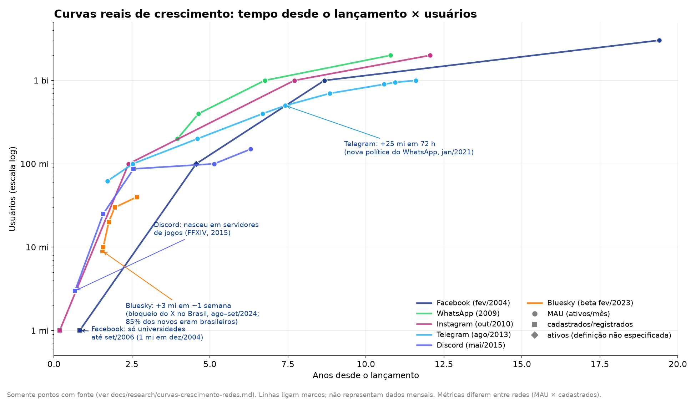
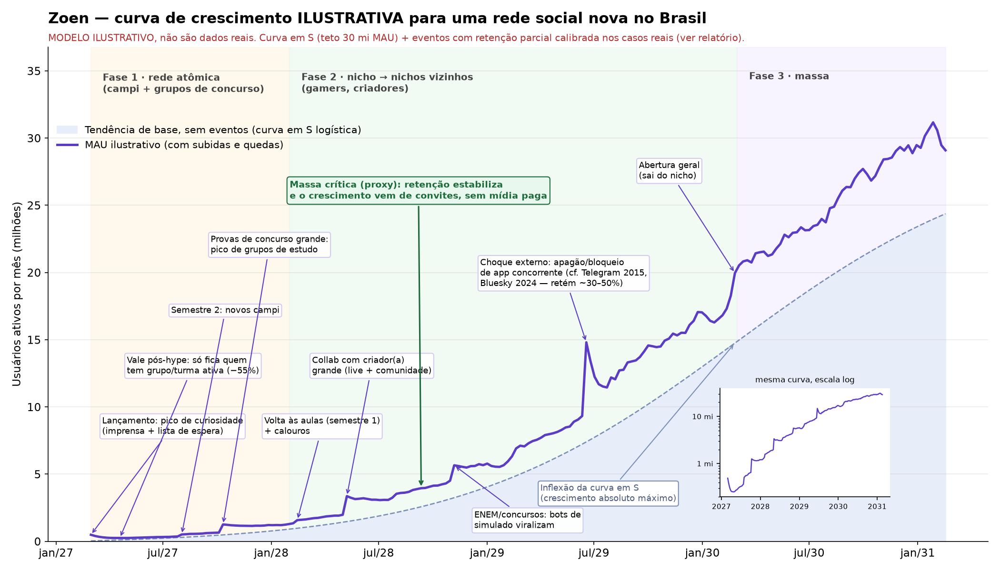

# Curvas de crescimento de redes sociais — o que funcionou, o que morreu, e o que isso diz para o Zoen

> Research snapshot. Figures, availability and source references retain their original review date. Current implementation and completion gates are in [roadmap status](../roadmap-status.md).

> Pesquisa feita em 09/10/2026 para orientar a estratégia de crescimento do Zoen no Brasil.
> **Regra deste documento:** todo número tem link de fonte. Quando não achamos fonte, está escrito **não encontrado**.
> "Massa crítica" e o "formato da curva" são **julgamentos nossos** a partir dos dados, e estão marcados como tal.
> As métricas variam entre redes: **MAU** = ativos no mês, **DAU** = ativos no dia, **cadastrados** = contas criadas e **alcance de anúncio** = público que a plataforma diz que um anunciante alcança (não é MAU).

*Figura 1: só pontos com fonte, com tempo normalizado desde o lançamento e escala log. As linhas ligam marcos; não são séries mensais.*

*Figura 2: **modelo ilustrativo, não são dados reais.** Explicação dos parâmetros na seção 4.*

---

## 0. Resumo em 11 linhas

1. **Nenhuma rede grande cresceu em linha reta.** As vencedoras têm uma curva em S ou em degraus por cima de uma base orgânica. As de hype têm um pico seguido de queda de 60–90% em meses.
2. **O Facebook ficou restrito a universidades por ~2,5 anos** (fev/2004 → set/2006). Mais da metade dos alunos de graduação de Harvard entrou **em cerca de uma semana**. Chegou a 1 mi de usuários em dez/2004, a 100 mi em ago/2008 e a 1 bi em out/2012.
3. **O Discord nasceu de um post no subreddit de Final Fantasy XIV** (~600 usuários no dia), cresceu de guilda em guilda e chegou a 3 mi cadastrados em jan/2016, 25 mi em dez/2016, 100 mi MAU em 2020 e 150 mi MAU em 2021.
4. **O Telegram cresce em degraus que vêm de falhas do WhatsApp.** Ganhou +1,5 mi de brasileiros em horas no bloqueio de dez/2015 e +25 mi de usuários em 72 h com a política de privacidade de jan/2021. Diz que **nunca pagou anúncio** (200 mi MAU em 2018, 700 mi em 2022, >1 bi em mar/2025).
5. **O Bluesky ganhou +2,6 mi de usuários em dias (85% brasileiros)** quando o X foi bloqueado no Brasil (ago/2024). Quando o X voltou, o DAU caiu de 1,2 mi para 600 mil, mas ficou **2× acima do nível pré-bloqueio** (300 mil): **~1/3 do pico foi retido.**
6. **Clubhouse:** 9,6 mi de downloads em fev/2021, 2,7 mi em mar (−72%) e ~900 mil em abr. Demitiu mais da metade da equipe em abr/2023.
7. **Threads:** 100 mi de cadastros em 5 dias (jul/2023), DAU −70% em semanas, mas se recuperou para **400 mi MAU em ago/2025**, porque estava ancorado no grafo social do Instagram.
8. **Google+ declarou 90 mi de usuários** (jan/2012), mas 90% das sessões duravam menos de 5 segundos. Fechou em 2019. Tamanho emprestado não cria rede.
9. **No Brasil:** o WhatsApp está em **98% dos smartphones** (jan/2024) e o Instagram tem **147 mi** de alcance de anúncio (fim de 2025). O Orkut, que já foi ~50% brasileiro, perdeu a liderança para o Facebook em dez/2011.
10. **Veredito:** começar por um nicho denso é **a estratégia com mais evidência a favor**, desde que o nicho seja uma **rede atômica** (turma, curso, grupo de estudo para um concurso específico) e não uma "categoria" (todos os universitários). Recomendação: **universitários, por turma/curso de calouros, com concurseiros como segundo nicho e o ENEM como ponte.** Detalhes na seção 5.
11. **Gringos:** o Fizz saturou Stanford (~95% de downloads, segundo a empresa) antes de ir para outros campi; o Gas fez 1 mi de DAU em 2 meses escola por escola e morreu em 15 meses; o BeReal saiu de campi franceses e achou nos EUA o maior mercado. O TikTok entrou pagando (fusão com o musical.ly + anúncios) e o Kwai gastou >R$ 7 bi para entrar no Brasil. **Recomendação: Brasil primeiro, pronto para o mundo** (PT/EN/ES desde o 1º dia; próximos passos: diáspora e Portugal, depois LatAm, depois nichos sem idioma). Seção 6.

---

## 1. Redes de massa (as que venceram)

### 1.1 Facebook (lançado em fev/2004)

**Formato da curva (julgamento):** em degraus no início, um degrau por liberação de universidades, depois de escolas de ensino médio e por fim de todo mundo. Em seguida vem a curva em S global, que hoje está no platô (~3 bi).

| Marco | Usuários | Métrica | Fonte |
|---|---|---|---|
| ~1 semana após o lançamento | >50% dos alunos de graduação de Harvard | cadastrados | [Harvard Crimson, 17/02/2004](https://www.thecrimson.com/article/2004/2/17/show-your-best-face-lets-talk/) |
| 2 semanas | 4.300 usuários | cadastrados | [Harvard Crimson, 18/02/2004](https://www.thecrimson.com/article/2004/2/18/harvard-bonds-on-facebook-website-harvard/) |
| mar/2004 | aberto a Columbia, Stanford e Yale | — | [AP, linha do tempo](https://apnews.com/timeline-key-dates-in-facebooks-10-year-history-ac9ec5689b5b43509b925756e8549a43) |
| dez/2004 | 1 milhão | usuários ativos | [AP, linha do tempo](https://apnews.com/timeline-key-dates-in-facebooks-10-year-history-ac9ec5689b5b43509b925756e8549a43) |
| set/2006 | aberto a qualquer pessoa com 13+ anos | — | [História do Facebook (Wikipedia)](https://en.wikipedia.org/wiki/History_of_Facebook) |
| ago/2008 | 100 milhões | ativos | [CNET](https://www.cnet.com/tech/computing/facebooks-user-numbers-still-growing-but-how-high-can-it-go/) |
| out/2012 | 1 bilhão | MAU | [Meta Newsroom](https://about.fb.com/news/2012/10/one-billion-people-on-facebook/) |
| 2º tri/2023 | 3,03 bilhões | MAU | [Meta, resultados do 2º tri de 2023](https://investor.atmeta.com/investor-news/press-release-details/2023/Meta-Reports-Second-Quarter-2023-Results/default.aspx) |
| **Brasil, dez/2011** | 36,1 mi visitantes (ultrapassa o Orkut, que tinha 34,4 mi); +192% em 12 meses | visitantes únicos | [comScore](https://www.comscore.com/Insights/Press-Releases/2012/1/Facebook-Blasts-into-Top-Position-in-Brazilian-Social-Networking-Market) |
| **Brasil, fim de 2025** | 109 mi | alcance de anúncio | [DataReportal, Digital 2026 Brazil](https://datareportal.com/reports/digital-2026-brazil) |

**Massa crítica (julgamento):** dentro de cada campus, foi atingida em dias (>50% de Harvard em ~1 semana). Como rede nacional, por volta de 2005–2006: abrir cada nova universidade passou a ser só ligar um interruptor, porque a demanda já existia antes do acesso. O proxy aqui é a **densidade por campus**, não o número total.

### 1.2 WhatsApp (2009)

**Formato:** exponencial quase sem ruído, com +50 mi a cada ~2 meses em 2013, segundo o WSJ. Hoje está em platô. Sem marketing pago, com crescimento puramente viral pela agenda de contatos.

| Marco | Usuários | Métrica | Fonte |
|---|---|---|---|
| abr/2013 | >200 mi | MAU | [TechCrunch](https://techcrunch.com/2013/04/16/whatsapp-bigger-than-twitter-with-over-200m-monthly-active-users-8b-inbound-and-12b-outbound-messages-daily/) |
| dez/2013 | 400 mi (+100 mi em 4 meses) | MAU | [Blog do WhatsApp](https://blog.whatsapp.com/400-million-stories) |
| fev/2016 | 1 bilhão | mensal | [Blog do WhatsApp](https://blog.whatsapp.com/one-billion) |
| fev/2020 | 2 bilhões | usuários | [Blog do WhatsApp](https://blog.whatsapp.com/two-billion) |
| **Brasil, dez/2015** | ~93 mi (93% da população online) a >100 mi | usuários | [TechCrunch](https://techcrunch.com/2015/12/17/telegram-brazil-spike/), [AP](https://apnews.com/general-news-68bd996de4c54bfc89d9e47487cfc7c9) |
| **Brasil, 2018** | >120 mi | usuários | [Reuters](https://www.reuters.com/article/world/facebooks-whatsapp-flooded-with-fake-news-in-brazil-election-idUSKCN1MV04I/) |
| **Brasil, jan/2024** | instalado em 98% dos smartphones | pesquisa | [Panorama Mobile Time/Opinion Box, mar/2024](https://pesquisas.mobiletime.com.br/mensageria-no-brasil-marco-de-2024/) |

**Massa crítica (julgamento):** a rede usa a agenda telefônica que já existe, então cada novo usuário já encontra amigos lá dentro. Não encontramos a data exata em fonte. **Implicação para o Zoen:** o WhatsApp é o "ar" no Brasil. Competir de frente pelo grafo de contatos é a briga mais difícil possível.

### 1.3 Instagram (out/2010)

**Formato:** começou num nicho (fotos com filtro no iPhone) e virou uma curva em S longa. Teve degraus com o Android (abr/2012) e com os Stories (2016).

| Marco | Usuários | Métrica | Fonte |
|---|---|---|---|
| dez/2010 (~2 meses) | 1 milhão | cadastrados | [TechCrunch](https://techcrunch.com/2010/12/21/instagram-one-million/) |
| fev/2013 | 100 milhões | MAU | [TechCrunch](https://techcrunch.com/2013/02/26/instagram-100-million/) |
| jun/2018 | 1 bilhão | MAU | [TechCrunch](https://techcrunch.com/2018/06/20/instagram-1-billion-users/) |
| out/2022 | >2 bilhões | MAU | [Bloomberg](https://www.bloomberg.com/news/articles/2022-10-26/meta-s-instagram-users-reach-2-billion-closing-in-on-facebook) |
| **Brasil, fim de 2025** | 147 mi (87,3% dos adultos) | alcance de anúncio | [DataReportal, Digital 2026 Brazil](https://datareportal.com/reports/digital-2026-brazil) |

### 1.4 TikTok (Douyin em 2016, TikTok internacional em 2017–2018)

**Formato:** degraus. O maior veio da fusão com o musical.ly (2018) e da pandemia (2020). Diferente das outras redes, o TikTok **não depende de grafo social**: o algoritmo de recomendação resolve o "partida a frio" do lado do consumo.

| Marco | Usuários | Métrica | Fonte |
|---|---|---|---|
| set/2021 | 1 bilhão | MAU | [TikTok Newsroom](https://newsroom.tiktok.com/en-gb/1-billion-people-on-tiktok-uk), [CNBC](https://www.cnbc.com/2021/09/27/tiktok-reaches-1-billion-monthly-users.html) |
| marcos anteriores (MAU oficial) | não encontrado | — | — |
| **Brasil, fim de 2025** | 131 mi adultos (+19,6 mi em 12 meses) | alcance de anúncio | [DataReportal, Digital 2026 Brazil](https://datareportal.com/reports/digital-2026-brazil) |

### 1.5 Twitter / X (2006)

**Formato:** curva em S até ~2013–2014, depois platô longo. No Brasil, teve um **degrau negativo forçado** (bloqueio de 30/ago a out/2024).

| Marco | Usuários | Métrica | Fonte |
|---|---|---|---|
| jun/2013 (S-1) | 218,3 mi (média) | MAU | [SEC, S-1 do Twitter](https://www.sec.gov/Archives/edgar/data/1418091/000119312513390321/d564001ds1.htm) |
| 2º tri/2022 | 237,8 mi | mDAU (DAU monetizável) | [Statista](https://www.statista.com/statistics/970920/monetizable-daily-active-twitter-users-worldwide/), [SEC, 1º tri/2022](https://www.sec.gov/Archives/edgar/data/1418091/000141809122000072/twtrq122ex991.htm) |
| **Brasil, ago/2024** | ~22 mi (estimativa) | usuários | [CNBC](https://www.cnbc.com/2024/09/04/social-media-platform-bluesky-attracts-millions-in-brazil-after-judge-bans-musks-x-.html) |
| **Brasil, fim de 2025** | 17,1 mi (−19,1% em 12 meses) | alcance de anúncio | [DataReportal, Digital 2026 Brazil](https://datareportal.com/reports/digital-2026-brazil) |

### 1.6 LinkedIn (mai/2003)

**Formato:** lento e linear por anos, depois uma curva em S longa. É o caso de rede de nicho profissional que **nunca saiu do nicho** e mesmo assim chegou a 1 bi de cadastrados.

| Marco | Usuários | Métrica | Fonte |
|---|---|---|---|
| 1º mês (2003) | 4.500 | cadastrados | [LinkedIn, fact sheet](https://press.linkedin.com/content/dam/press/images/news-releases/acquisition/linkedin-fact-sheet.pdf) |
| ago/2004 | 1 milhão | cadastrados | [LinkedIn, fact sheet](https://press.linkedin.com/content/dam/press/images/news-releases/acquisition/linkedin-fact-sheet.pdf) |
| nov/2023 | 1 bilhão | cadastrados | [Reuters](https://www.reuters.com/technology/linkedin-hits-1-billion-members-adds-ai-features-job-seekers-2023-11-01/) |
| MAU global | não encontrado (o LinkedIn não divulga) | — | — |
| **Brasil, fim de 2025** | 90 mi (+15,4% em 12 meses) | cadastrados (alcance de anúncio) | [DataReportal, Digital 2026 Brazil](https://datareportal.com/reports/digital-2026-brazil) |

### 1.7 Telegram (ago/2013)

**Formato (o mais relevante para o Zoen):** **escada**. A base orgânica cresce devagar e, a cada falha, bloqueio ou polêmica do WhatsApp, vem um degrau. Parte de cada degrau fica.

| Marco | Usuários | Métrica | Fonte |
|---|---|---|---|
| mai/2015 | 62 mi | MAU | [The Verge](https://www.theverge.com/2015/12/17/10386776/brazil-whatsapp-ban-telegram-millions-users) |
| **17/12/2015, Brasil** | +1,5 mi de brasileiros em horas (bloqueio judicial do WhatsApp, que durou ~12 h) | novos cadastros | [TechCrunch](https://techcrunch.com/2015/12/17/telegram-brazil-spike/), [AP](https://apnews.com/general-news-68bd996de4c54bfc89d9e47487cfc7c9) |
| fev/2016 | 100 mi | MAU | [Blog do Telegram](https://telegram.org/blog/100-million) |
| mar/2018 | 200 mi ("nunca promovemos o Telegram com anúncios") | MAU | [Blog do Telegram](https://telegram.org/blog/200-million) |
| abr/2020 | 400 mi (eram 300 mi um ano antes) | MAU | [Blog do Telegram](https://telegram.org/blog/400-million) |
| jan/2021 | >500 mi, +25 mi em 72 h (21% da América Latina) | MAU / novos | [Times of India](https://timesofindia.indiatimes.com/business/india-business/whatsapps-new-privacy-policy-25-million-new-users-join-telegram-in-past-72-hours/articleshow/80246127.cms), [Decrypt](https://decrypt.co/53847/telegram-sees-25-million-new-users-in-72-hours) |
| jun/2022 | 700 mi ("só por indicação pessoal") | MAU | [Blog do Telegram](https://telegram.org/blog/700-million-and-premium/fa?setln=en) |
| mar/2024 → jul/2024 | 900 mi → 950 mi | MAU | [TechCrunch](https://techcrunch.com/2024/07/23/telegrams-userbase-climbs-to-950m-plans-to-launch-app-store/) |
| mar/2025 | >1 bilhão (41 min/dia, 21 aberturas/dia) | MAU | [TechCrunch](https://techcrunch.com/2025/03/19/telegram-founder-pavel-durov-says-app-now-has-1b-users-calls-whatsapp-a-cheap-watered-down-imitation/), [TASS](https://tass.com/economy/1930999) |
| **Brasil, jan/2024** | instalado em 63% dos smartphones; primeira queda depois de 4 anos de alta | pesquisa | [Mobile Time](https://www.mobiletime.com.br/noticias/07/03/2024/apos-quatro-anos-de-crescimento-telegram-registra-queda-no-brasil/) |

**Massa crítica (julgamento):** por volta de 2016–2018. O proxy é a **declaração recorrente de crescimento 100% orgânico** combinada com crescimento anual sustentado, de +100 mi/ano entre 2019 e 2020. **Lição:** um "segundo app" no Brasil vive de **momentos de falha do líder**. O Zoen precisa estar pronto (servidores, onboarding em segundos, importação de grupos) para quando o próximo choque acontecer.

---

## 2. Redes de nicho, de hype ou que estagnaram

### 2.1 Discord (mai/2015): nicho que consolidou

**Formato:** S longo com um degrau grande na pandemia (2020). O crescimento foi de servidor em servidor e de guilda em guilda.

| Marco | Usuários | Métrica | Fonte |
|---|---|---|---|
| mai/2015 | ~600 usuários no dia do post no r/FFXIV | — | [Blog do Discord](https://discord.com/blog/whats-going-down-in-discord-town/) |
| jan/2016 | >3 mi, ~1 mi de novos por mês | cadastrados | [Blog do Discord](https://discord.com/blog/whats-going-down-in-discord-town/) |
| dez/2016 | 25 mi | cadastrados | [TechCrunch](https://techcrunch.com/2016/12/09/gamer-chat-app-discord-hits-25-million-users-can-now-be-used-in-developers-own-games/) |
| 2017 | 45 mi → 87 mi em 6 meses | cadastrados | [Blog do Discord](https://discord.com/blog/discord-did-things-in-2017) |
| jun/2020 | >100 mi (e o reposicionamento "Your place to talk", além de jogos) | MAU | [Blog do Discord](https://discord.com/blog/your-place-to-talk) |
| set/2021 | >150 mi | MAU | [Blog do Discord](https://discord.com/blog/an-update-on-our-business) |
| **Brasil** | não encontrado | — | — |

**Massa crítica (julgamento):** **por servidor**, quando um servidor tem um núcleo que conversa todo dia. Como empresa, ~2016: 1 mi de novos usuários por mês sem mídia paga relevante (proxy). **Lição:** levou ~5 anos no nicho de gamers antes de abrir para "qualquer comunidade".

### 2.2 Twitch (jun/2011): spin-off de nicho

Saiu do Justin.tv (lifestreaming generalista), que **morreu**, ao focar só em games.

| Marco | Usuários | Métrica | Fonte |
|---|---|---|---|
| fev/2014 | 1 mi de streamers ativos por mês | broadcasters/mês | [Blog da Twitch](https://blog.twitch.tv/en/2014/02/09/twitch-hits-one-million-monthly-active-broadcasters-21dd72942b32/) |
| jul/2014 | >55 mi de visitantes únicos, 15 bi de minutos | visitantes/mês | [Amazon](https://press.aboutamazon.com/2014/8/amazon-com-to-acquire-twitch) |
| ago/2014 | Justin.tv encerrado | — | [The Verge](https://www.theverge.com/2014/8/5/5971939/justin-tv-the-live-video-pioneer-that-birthed-twitch-officially-shuts) |
| MAU atual / Brasil | não encontrado | — | — |

**Lição:** é o caso mais limpo de "**generalista morreu, nicho do mesmo produto venceu**".

### 2.3 BeReal (2020): hype que caiu

**Formato:** pico viral (meados de 2022, puxado pelo TikTok) seguido de queda acentuada.

| Marco | Usuários | Métrica | Fonte |
|---|---|---|---|
| ago/2022 (pico) | ~73,5 mi | MAU | fonte secundária (Apptopia via [agregador](https://corq.studio/insights/the-rise-and-fall-of-bereal-is-the-anti-instagram-app-still-relevant/)); fonte primária não encontrada |
| out/2022 → mar/2023 | ~15 mi → <6 mi (−61%) | DAU | Apptopia via [NYT](https://www.nytimes.com/2023/04/13/style/bereal-app.html) (paywall; número também visto em secundárias) |
| abr/2023 | "o app perdeu a novidade" | análise | [The Verge / Platformer](https://www.theverge.com/2023/4/26/23698859/bereal-losing-interest-missed-opportunity) |
| **Brasil** | não encontrado | — | — |

**Lição:** uma **mecânica nova** (postar uma vez por dia) cria pico, mas não cria uma razão diária para voltar quando a novidade passa.

### 2.4 Clubhouse (2020): hype da pandemia

**Formato:** subida vertical em jan–fev/2021 e colapso em 2 meses.

| Marco | Números | Métrica | Fonte |
|---|---|---|---|
| 1 → 16/02/2021 | 3,5 mi → 8,1 mi de downloads | downloads acumulados | [TechCrunch / Sensor Tower](https://techcrunch.com/2021/02/18/report-social-audio-app-clubhouse-has-topped-8-million-global-downloads/) |
| fev → abr/2021 | 9,6 mi → 2,7 mi → ~0,9 mi | downloads/mês | [Business Insider](https://www.businessinsider.com/clubhouse-downloads-900000-in-april-2021-5), [TheWrap](https://www.thewrap.com/clubhouse-monthly-downloads-plunge-72-percent/) |
| **Brasil, fev/2021** | 6º país em instalações no iOS (308 mil); 58 mil downloads em 6/fev; buscas no Google +4.900% | downloads | [Mobile Time](https://www.mobiletime.com.br/noticias/12/02/2021/brasil-e-o-sexto-em-instalacoes-do-clubhouse-revela-sensor-tower/), [InfoMoney](https://www.infomoney.com.br/negocios/clubhouse-veio-para-ficar-rede-salta-4-900-nas-buscas-no-google-mas-usuarios-do-android-ficam-de-fora/) |
| abr/2023 | demitiu mais da metade da equipe | — | [TechCrunch](https://techcrunch.com/2023/04/27/clubhouse-needs-to-fix-things-and-today-it-cut-more-than-half-of-staff/) |
| MAU/WAU com fonte primária | não encontrado | — | — |

**Lição:** um pico puxado por celebridades e exclusividade (convite + só iOS) é **emprestado**. Sem rede atômica (grupos que voltam), o pico vira vale.

### 2.5 Mastodon (2016): choque externo sem retenção

| Marco | Usuários | Métrica | Fonte |
|---|---|---|---|
| out → nov/2022 | ~380 mil → >2,5 mi (êxodo do Twitter) | MAU | [TechCrunch](https://techcrunch.com/2022/12/23/how-mastodon-is-scaling-amid-the-twitter-exodus/) |
| 31/12/2022 | 1,8 mi | MAU | [Relatório anual do Mastodon 2022](https://joinmastodon.org/reports/Mastodon%20Annual%20Report%202022.pdf) |
| jan–fev/2023 | ~1,4 mi | MAU | [WIRED](https://www.wired.com/story/the-mastodon-bump-is-now-a-slump/), [Guardian](https://www.theguardian.com/news/datablog/2023/jan/08/elon-musk-drove-more-than-a-million-people-to-mastodon-but-many-arent-sticking-around) |

**Retenção do choque:** (1,4 − 0,38) / (2,5 − 0,38) ≈ **48%** do ganho ficou. A conta é nossa, feita com os números acima. O onboarding difícil (escolher servidor) atrapalhou.

### 2.6 Bluesky (beta em fev/2023, aberto em fev/2024): o choque brasileiro

**Formato:** escada de choques: o bloqueio do X no Brasil (ago/2024) e a eleição nos EUA (nov/2024).

| Marco | Usuários | Métrica | Fonte |
|---|---|---|---|
| ~30/08 → 04/09/2024 | +2,6 mi em dias, **85% brasileiros**, total >8 mi | cadastrados | [AP](https://apnews.com/article/brazil-musk-x-bluesky-moraes-threads-meta-social-media-01d4db0f1311e98f1385e544ea47fa36), [Engadget](https://www.engadget.com/social-media/bluesky-added-over-2-million-brazilian-users-after-brazil-banned-elon-musks-x-140032042.html) |
| 06/09/2024 | +3 mi (+~50% em uma semana), >9 mi | cadastrados | [TechCrunch](https://techcrunch.com/2024/09/07/bluesky-grows-to-9m-users/) |
| set/2024 | >93% dos novos falam português (Appfigures) | — | [Fast Company](https://www.fastcompany.com/91192731/bluesky-could-become-brazils-next-big-social-media-platform-it-has-elon-musks-x-to-thank) |
| 16/09/2024 | 10 mi | cadastrados | [TechCrunch](https://techcrunch.com/2024/09/16/bluesky-now-has-10-million-users/) |
| out/2024 (o X volta) | DAU 1,2 mi → 600 mil (pré-bloqueio: ~300 mil); 45% dos posts em português | DAU (plataforma) | [Fediverse Report](https://fediversereport.com/last-week-in-the-atmosphere-oct-24-week-3/) |
| nov/2024 → jan/2025 | 20 mi → 30 mi | cadastrados | [TechCrunch](https://techcrunch.com/2024/11/19/bluesky-tops-20m-users-narrowing-gap-with-instagram-threads/), [The Verge](https://www.theverge.com/news/602049/bluesky-now-has-30-million-users) |
| ~out/2025 | 40 mi | cadastrados | [Social Media Today](https://www.socialmediatoday.com/news/bluesky-reaches-40-million-users/804467/) |

**Retenção do choque brasileiro:** (600k − 300k) / (1,2 mi − 300k) ≈ **33%** do DAU ganho ficou depois que o X voltou (conta nossa). **É o parâmetro de "choque externo" usado na Figura 2.**

### 2.7 Threads (jul/2023): lançamento rápido com grafo emprestado

| Marco | Usuários | Métrica | Fonte |
|---|---|---|---|
| 5 dias | 100 mi | cadastros | [Reuters](https://www.reuters.com/technology/metas-twitter-rival-threads-hits-100-mln-users-record-five-days-2023-07-10/) |
| fim de jul/2023 | DAU ~−70% a −75% do pico (~13 mi) | DAU (Sensor Tower) | [SiliconANGLE](https://siliconangle.com/2023/07/21/threads-daily-active-user-base-reportedly-declined-70/), [Sensor Tower](https://sensortower.com/blog/threads-meta-snap-earnings-2q23-review) |
| ago/2025 | >400 mi | MAU | [TechCrunch](https://techcrunch.com/2025/08/12/threads-now-has-more-than-400-million-monthly-active-users/) |
| out/2025 | >150 mi | DAU | [Engadget](https://www.engadget.com/social-media/threads-reaches-150-million-daily-users-and-is-ramping-up-ads-214259945.html) |
| **Brasil** | não encontrado (no bloqueio do X foi o 2º app grátis mais baixado no iOS) | — | [TechCrunch](https://techcrunch.com/2024/09/07/bluesky-grows-to-9m-users/) |

**Lição:** o vale pós-hype de −70% é **normal**. O que decide é se existe um motor contínuo por baixo (no caso do Threads, a distribuição do Instagram). **Esse é o parâmetro de "vale pós-hype" usado na Figura 2.**

### 2.8 Orkut (2004–2014): o caso brasileiro

| Marco | Usuários | Métrica | Fonte |
|---|---|---|---|
| ago/2008 | ~60 mi cadastrados no mundo, 51,28% brasileiros | cadastrados | [Gazeta do Povo](https://www.gazetadopovo.com.br/economia/brasil-continua-lider-no-orkut-eua-ultrapassam-india-e-assumem-2-lugar-b77azcjumihuvmni4aqp0hzri/) |
| ago/2010 | 29,4 mi de visitantes no Brasil (o Facebook cresceu 5× no ano) | visitantes únicos | [comScore 2010](https://www.comscore.com/por/Insights/Press-Releases/2010/10/Orkut-Continues-to-Lead-Brazil-s-Social-Networking-Market-Facebook-Audience-Grows-Fivefold) |
| dez/2011 | 34,4 mi (+5% no ano), contra 36,1 mi do Facebook (+192%) | visitantes únicos | [comScore 2012](https://www.comscore.com/Insights/Press-Releases/2012/1/Facebook-Blasts-into-Top-Position-in-Brazilian-Social-Networking-Market) |
| jun/2014 | fechamento anunciado (encerrado em 30/09/2014); ~50% dos usuários eram brasileiros | — | [G1](https://g1.globo.com/tecnologia/noticia/2014/06/rede-social-orkut-sera-encerrada-em-30-de-setembro.html), [TechCrunch](https://techcrunch.com/2014/06/30/google-will-shut-down-its-orkut-social-network-in-september/) |

**Lição (julgamento):** o Orkut **tinha** massa crítica no Brasil (comunidades!) e mesmo assim perdeu. Uma rede atômica forte não protege de um concorrente com produto melhor e grafo global. A migração para o Facebook aconteceu em ~2 anos (2010–2011). **Para o Zoen, isso é uma esperança:** o brasileiro troca de rede inteira quando o grupo dele troca.

### 2.9 Google+ (2011–2019): "ser tudo" sem razão de uso

| Marco | Números | Fonte |
|---|---|---|
| jan/2012 | 90 mi de usuários declarados (o número "60% ativos por dia" misturava outros produtos Google) | [Ars Technica](https://arstechnica.com/gadgets/2012/01/google-claims-90-million-google-users-60-active-daily/), [AllThingsD](https://allthingsd.com/20120119/about-all-those-active-google-users/) |
| out/2018 | 90% das sessões duravam <5 s; fechamento anunciado | [Google (Project Strobe)](https://blog.google/innovation-and-ai/technology/safety-security/project-strobe/), [TechCrunch](https://techcrunch.com/2018/10/08/google-plus-hack/) |
| abr/2019 | encerrado | [BBC](https://www.bbc.com/news/technology-47771927) |

**Outros que morreram:** Vine (>200 mi de usuários ativos, fechado pelo Twitter em out/2016; [TechCrunch](https://techcrunch.com/2016/10/27/twitter-is-shutting-down-vine/)) e Path (fechado em out/2018; [Engadget](https://www.engadget.com/2018-09-17-path-private-social-network-stickers-dead.html); o número de usuários no pico não foi verificado).

---

## 3. O que as curvas ensinam (síntese)

| Padrão | Exemplos | Por quê |
|---|---|---|
| **Degraus por liberação de acesso** | Facebook (campus → todos), Instagram (Android) | Demanda reprimida acumulada antes de abrir |
| **Escada de choques externos** | Telegram (WhatsApp 2015/2021), Bluesky (X/BR 2024), Mastodon | O líder falha e um pedaço da base testa a alternativa; **33–50% do ganho fica** |
| **Pico seguido de vale** | Clubhouse, BeReal, Threads (no início) | Novidade e celebridade; vale de −60% a −75% em semanas |
| **S longa a partir de um nicho** | Discord, LinkedIn, Twitch | Densidade dentro do nicho e depois expansão para nichos vizinhos |
| **Platô de saturação** | WhatsApp no Brasil (98%), Facebook (~3 bi) | Mercado acabou; o crescimento passa a vir de tempo de uso e monetização |

**Definição operacional de massa crítica usada aqui.** Este é um julgamento; os dados públicos raramente permitem medir isso de fora. Uma rede (ou uma rede atômica) atingiu massa crítica quando, **ao mesmo tempo**:
1. **A retenção estabiliza:** a curva de coortes para de cair (exemplo prático: a retenção de D30 fica plana por 3 coortes seguidas).
2. **O crescimento orgânico supera a perda:** novos usuários vindos de convites são maiores que o churn, **sem mídia paga**. É o que o Telegram declara desde 2018.
3. **Depois de um choque, o patamar não volta ao nível de antes:** o Bluesky ficou em 2× o pré-bloqueio.

---

## 4. Gráfico ilustrativo para o Zoen (Figura 2): parâmetros

**Não são dados reais.** É um modelo para ilustrar a forma esperada. Script que gera as duas figuras: [`scripts/curvas_charts.py`](scripts/curvas_charts.py) (matplotlib).

- **Base:** curva em S logística com teto de 30 mi de MAU, inflexão no ano 3 e início de ~40 mil usuários (equivalente a alguns campi). O teto é conservador diante de 150 mi de identidades em redes sociais no Brasil ([DataReportal](https://datareportal.com/reports/digital-2026-brazil)).
- **Pico de lançamento → vale de −55%:** calibrado pelo Threads (−70% de DAU) e pelo Clubhouse (−72% de downloads), suavizado porque o Zoen nasce em grupos fechados.
- **Degraus de semestre** (fev/mar e ago): o calendário acadêmico brasileiro. Cada degrau retém 70% do ganho, porque calouros entram em turmas que já estão no Zoen.
- **Picos de concurso/ENEM:** grupos de estudo explodem antes das provas e retêm ~40%. Referência de tamanho: o CNU de 2024 teve 2,14 mi de inscritos ([G1](https://g1.globo.com/trabalho-e-carreira/concursos/noticia/2024/02/23/enem-dos-concursos-governo-detalha-concorrencia-e-perfil-de-inscritos.ghtml)).
- **Collab com criador:** um pico que retém ~45%.
- **Choque externo** (apagão ou bloqueio do líder): retém 30%, calibrado pelo Bluesky (33%) e pelo Mastodon (~48%).
- **Sazonalidade:** −7% em janeiro e −4% em julho (férias), mais ruído semanal de ~3,5%.
- **Fases:** 1) rede atômica, com campi e grupos de concurso; 2) nichos vizinhos, como gamers e criadores; 3) abertura geral, só depois de a retenção dos nichos estar estável.

---

## 5. Começar de nicho é válido? Veredito e recomendação

### 5.1 Evidência a favor
- **Facebook:** 2,5 anos restrito a universidades. Saturava cada campus (>50% em ~1 semana em Harvard) antes de abrir o próximo. É o exemplo mais citado de rede atômica.
- **Discord:** 5 anos em gamers antes do "Your place to talk". Mesmo depois de abrir, o núcleo continuou sendo gamer.
- **Twitch:** o nicho venceu o generalista (Justin.tv) dentro da mesma empresa.
- **LinkedIn:** nunca saiu do nicho profissional e chegou a 1 bi.
- **Teoria:** Andrew Chen (*The Cold Start Problem*) chama isso de **rede atômica**, a menor rede estável que se sustenta sozinha. No Slack, ~3 pessoas ativas num time; no Uber, um ponto e um horário específicos ([resumo no Lenny's Newsletter](https://www.lennysnewsletter.com/p/atomic-network)). O "bowling pin" (derrubar um pino de cada vez, de Geoffrey Moore) é a mesma ideia aplicada a mercados.

### 5.2 Evidência contra e riscos
- **"Ser tudo para todos" falhou** (Google+, e o Orkut perdeu quando apareceu algo melhor). Já **nichos grandes demais** viram categoria, não rede. "Universitários" não é uma rede atômica; "turma de Medicina da USP 2027" é.
- **Nicho com sazonalidade forte** (concurso) tem picos e vales: o grupo morre depois da prova. É preciso reter quem passou (posse, trabalho) ou quem vai fazer o próximo concurso.
- **Rótulo de nicho grudado:** o Discord levou anos para deixar de ser "app de gamer". O nome e a marca do Zoen precisam ser gerais desde o início; só a **entrada** é de nicho.
- **WhatsApp está em 98% dos smartphones.** O nicho precisa de um trabalho que o WhatsApp faz mal: comunidades organizadas, bots de estudo, arquivos e agenda da turma. Senão, o grupo volta para o WhatsApp.

### 5.3 Recomendação (julgamento)
1. **Primeiro nicho: universitários, entrando por turma ou curso de calouros.** São ~9,98 mi de matrículas ([Censo da Educação Superior 2023, INEP/MEC](https://www.gov.br/mec/pt-br/assuntos/noticias/2024/outubro/mec-e-inep-divulgam-resultado-do-censo-superior-2023)). O calendário de semestres dá degraus previsíveis, as turmas são densas e fechadas, o espaço já existe (grupo da turma, centro acadêmico, atléticas) e existe um "trabalho" claro: materiais, provas, agenda e bot da turma.
2. **Segundo nicho, em paralelo e pequeno: concurseiros por concurso específico** (exemplo: "CNU 2027, Bloco 4"). A demanda é intensa, eles pagam por material (bom para criadores e para a Store) e os picos têm data marcada. O risco é o vale pós-prova.
3. **Ponte: o ENEM e os cursinhos.** Ligam os dois nichos e alimentam o calouro do semestre seguinte.
4. **Depois:** gamers e criadores, nichos vizinhos usando o mesmo produto de comunidades, e então a abertura geral.

### 5.4 Limiares de massa crítica por nicho

São metas operacionais (julgamento), inspiradas nos casos acima:

| Nicho | Unidade atômica | Limiar de massa crítica | Âncora |
|---|---|---|---|
| Universitários | turma ou curso de um campus | **≥40–50% da turma ativa por semana em 2 semanas** e ≥3 pessoas postando todo dia | Harvard >50% em ~1 semana; Slack com ~3 ativos |
| Universitários (campus) | campus | **≥25% dos alunos com conta** e ≥10 turmas atômicas antes de ir para o campus vizinho | rollout do Facebook, um campus de cada vez |
| Concurseiros | grupo de estudo de um concurso | **≥8–15 membros, ≥5 ativos por dia, retenção de 4 semanas ≥60%** até a prova | julgamento; não encontramos benchmark público |
| Gamers | servidor ou clã | **≥20 membros, ≥5 conversando por dia** | primeiros servidores do Discord (julgamento) |
| Criadores | comunidade de 1 criador | **≥1% da audiência do criador entra e ≥20% dela fica ativa por mês** | julgamento; não encontrado em fonte |

**O que medir desde o primeiro dia:** densidade por unidade atômica (a % da turma que está ativa), retenção por coorte em D7, D30 e D90, o K-fator por convite (quantos convites viram conta ativa) e a % de crescimento sem mídia paga. Isso determina quando passar de uma fase para a outra, e não o número total de usuários.

### 5.5 Preparar-se para choques
Os choques mais lucrativos do Brasil vieram de **falhas do líder** (bloqueios judiciais do WhatsApp em 2015–2016 e do X em 2024). O Zoen precisa de: onboarding em menos de 30 s, importar grupos e contatos, infraestrutura que aguente 10× de carga em 48 h (o Bluesky tinha 14 engenheiros trabalhando "dia e noite"; [Fast Company](https://www.fastcompany.com/91192731/bluesky-could-become-brazils-next-big-social-media-platform-it-has-elon-musks-x-to-thank)) e uma razão para ficar quando o líder voltar. A referência é reter ≥33%, o que o Bluesky conseguiu.

---

## 6. "Pense nos gringos": lançamentos de nicho lá fora e travessia de fronteiras

### 6.1 Lançamentos em campus fora do Brasil (EUA e França)

| App | Como entrou | Números | Fonte | O que aconteceu |
|---|---|---|---|---|
| **Fizz** (EUA, Stanford, jul/2021) | Um campus só, com "lançamentos controlados" em poucos campi depois | >700 usuários na 1ª semana. Em jan/2022: 5.100 usuários (~3/4 dos alunos de graduação), 80% ativos por semana. Em meados de 2022: ~95% dos ~7.600 alunos de graduação baixaram (Rice: 70%), com 50–60% dos usuários ativos por dia, segundo a empresa. Eram 13 campi em out/2022, 25 em nov/2022 e >80 em ago/2023 | [Stanford, estudo de caso](https://ethicsinsociety.stanford.edu/sites/ethicsinsociety/files/media/file/case_study_fizz1.pdf), [Stanford Daily](https://stanforddaily.com/2022/01/23/from-buzz-to-fizz-anonymous-social-platform-takes-off-at-stanford/), [TechCrunch out/2022](https://techcrunch.com/2022/10/04/fizz-app-college-stanford-social/), [TechCrunch nov/2022](https://techcrunch.com/2022/11/23/fizz-college-social-app-series-a/), [GovTech](https://www.govtech.com/education/higher-ed/stanford-social-media-platform-fizz-gaining-popularity) | É a rede atômica de manual: saturar um campus e só então abrir o próximo. Alerta: parte dos downloads foi "comprada" com donuts grátis (TechCrunch). A meta de 1.000 campi até o fim de 2023 não foi confirmada (não encontrado) |
| **Gas** (EUA, ensino médio, ago/2022) | Escola por escola: a pessoa entra com a escola e vota em enquetes positivas sobre colegas | 1 mi de DAU em 2 meses; 30 mil novos por hora em out/2022; nº 1 da App Store dos EUA; 7,4 mi de instalações e ~US$ 7 mi de gastos dos usuários (Sensor Tower); equipe de 4 pessoas. O Discord comprou em jan/2023 e fechou em nov/2023 | [The Verge](https://www.theverge.com/2023/1/17/23558563/discord-gas-app-social-media-acquisition), [TechCrunch (aquisição)](https://techcrunch.com/2023/01/17/discord-acquires-gas-a-compliments-based-social-media-app-for-teens/), [TechCrunch (fechamento)](https://techcrunch.com/2023/10/19/discord-kills-gas-anonymous-compliments-app-bought-nine-months-ago/) | A densidade por escola **acende** a rede muito rápido, mas uma mecânica de novidade não **retém**. É o mesmo padrão do tbh, do mesmo fundador, comprado e fechado pelo Facebook |
| **BeReal** (França, 2020 → EUA e Reino Unido, jan/2022) | Primeiro campi franceses. Nos EUA e no Reino Unido, um **programa pago de embaixadores**: US$ 30 por indicação, US$ 50 por download com avaliação, festas e grupos de fraternidade | ~500 mil usuários em campi franceses em 2021 (fonte secundária). 7,67 mi de downloads em 2022 até abril (França 20,5%, EUA 19,7%; Apptopia). Até mar/2023, os downloads foram 33,3 mi nos EUA, 10,3 mi no Reino Unido e 5,9 mi na França (fonte secundária) | [Brown Daily Herald](https://www.browndailyherald.com/article/2022/02/new-social-media-app-tells-students-to-bereal), [Business Insider](https://www.businessinsider.com/new-social-media-app-bereal-used-campus-ambassadors-to-grow-2022-4), [Contrary Research](https://research.contrary.com/report/bereal) | Um app francês achou o maior mercado **fora de casa**, e os campi foram a porta de entrada. Embaixadores pagos geram pico, não rede (veja a queda na seção 2.3) |

### 6.2 Como redes atravessaram fronteiras

- **Telegram, global desde o 1º dia, país por país via lacunas do líder.** Em 2016, os maiores mercados eram EUA, Brasil, Itália, Alemanha, Espanha, Irã, Índia, Malásia e Indonésia ([Quartz](https://qz.com/623863/this-free-chat-app-offers-secrecy-and-bots-and-now-has-100-million-users)). No Irã, virou o app nº 1, com ~40 mi de usuários mensais, depois que o Viber foi bloqueado ([Freedom House 2017](https://freedomhouse.org/country/iran/freedom-net/2017)). A Índia virou o maior mercado, com 22% das instalações acumuladas em 2021 ([India Today / Sensor Tower](https://www.indiatoday.in/technology/news/story/whatsapp-rival-telegram-has-highest-number-of-users-in-india-clocks-1-billion-downloads-globally-1847681-2021-08-31)). No surto de jan/2021, **21% dos novos usuários eram da América Latina** ([Times of India](https://timesofindia.indiatimes.com/business/india-business/whatsapps-new-privacy-policy-25-million-new-users-join-telegram-in-past-72-hours/articleshow/80246127.cms)). **Lição:** um mensageiro "alternativo" cruza fronteiras onde o líder falha (bloqueio, censura, privacidade), e esses eventos acontecem em datas diferentes em cada país.
- **Discord, a fronteira atravessada pelo nicho.** Jogos são globais: uma guilda de FFXIV junta várias nacionalidades, então o produto se espalhou sem "lançamento por país". Números por país: **não encontrado**.
- **TikTok, que comprou a entrada.** A ByteDance anunciou a fusão com o musical.ly em nov/2017 ([PR Newswire](https://en.prnasia.com/releases/apac/Bytedance_and_Musical_ly_Announce_Agreement_to_Merge-193715.shtml)), um negócio de ~US$ 1 bi segundo o [TechCrunch](https://techcrunch.com/2018/08/02/musically-tiktok/). As duas se fundiram em ago/2018, quando o musical.ly tinha ~100 mi de MAU e o TikTok dizia ter 500 mi ([PR Newswire](https://www.prnewswire.com/news-releases/musically-and-tiktok-unite-to-debut-new-worldwide-short-form-video-platform-300690719.html), [TechCrunch](https://techcrunch.com/2018/08/02/musically-tiktok/)). Em 2018 fez uma ofensiva de anúncios de instalação: no pico, foi ~22% dos anúncios de app no iOS dos EUA dentro da rede do Facebook (Sensor Tower via [Reuters](https://www.reuters.com/article/technology/factbox-facebook-and-tiktoks-fraught-history-idUSKCN2512FQ/)). O gasto de >US$ 1 bi em 2018 vem do WSJ, citado em [fonte secundária](https://www.readmargins.com/p/tiktok-the-facebook-competitor). **Lição:** "global desde o 1º dia" funcionou para um produto de **algoritmo**, que não depende de amigos, e com bilhões de dólares.
- **Kwai, um app chinês entrando no Brasil.** Entrou pelo Nordeste em 2019 ([Coletiva](https://coletiva.net/noticias/kwai-reforca-presenca-no-brasil-e-aposta-em-conteudo-local-e-vida-real/)), investiu **>R$ 7 bi no país desde 2019** (Flamengo, seleções, BBB, São João, minisséries) ([Acontecendo Aqui](https://acontecendoaqui.com.br/marketing/kwai-for-business-apresenta-novo-posicionamento-no-brasil/)) e fez parceria de dados grátis (zero rating) com a Claro em 2025. Hoje tem **60 mi de MAU no Brasil**, metade ativa por dia ([Mobile Time](https://www.mobiletime.com.br/noticias/19/01/2026/kwai-zero-rating-2026/)). **Lição:** é o preço de entrar no Brasil "de fora". Para um gringo, competir aqui custa bilhões; nós temos essa vantagem em casa.
- **Gartic (Onrizon), um app brasileiro que saiu do Brasil.** Foi só em português de 2008 a 2017 e ganhou versão internacional em 2017 ([Rice Digital](https://ricedigital.co.uk/what-is-gartic-phone/)). O Gartic Phone (dez/2020) viralizou no mundo por meio de **streamers e VTubers**. Hoje tem média de 19 mi de visitas por mês e está em 42 idiomas, segundo a empresa ([Onrizon](https://onrizon.com/en/products/garticphone)). **Lição:** um produto social brasileiro atravessa fronteiras quando o formato é **independente de idioma** (desenho, jogo, voz) e quando criadores gringos o levam.
- **Orkut, o caso inverso.** Era um produto americano que o Brasil "sequestrou" (51% brasileiros em 2008; seção 2.8). Mostra que um nicho por país pode dominar uma rede global, e que isso pode afastar os outros países. Esse último ponto é julgamento nosso.
- **Um app social brasileiro com escala global além do Gartic:** não encontrado.

### 6.3 Brasil primeiro ou global desde o 1º dia?

| Critério | Brasil primeiro | Global desde o 1º dia |
|---|---|---|
| Densidade da rede atômica (turma, grupo, campus) | ✅ Densidade é local. Fizz, Facebook e Gas venceram um campus de cada vez | ❌ Espalha usuários finos demais; ninguém encontra amigos |
| Custo de aquisição | ✅ Vantagem de casa (o Kwai precisou de R$ 7 bi para entrar) | ❌ Só funciona com algoritmo + bilhões (TikTok) |
| Choques externos | ✅ O Brasil tem histórico de bloqueios (WhatsApp 2015/16, X 2024, Discord Go Live 2026) | ✅ Telegram: cada país tem seus choques; estar disponível em vários idiomas captura todos |
| Teto de mercado | ⚠️ 150 mi de identidades em redes sociais no Brasil ([DataReportal](https://datareportal.com/reports/digital-2026-brazil)) é grande, mas não chega a 1 bi | ✅ |
| Risco de marca "local" | ⚠️ Orkut virou "coisa de brasileiro" | ✅ |
| Nichos que não dependem de idioma (gamers, criadores, jogos) | ⚠️ Desperdiça o alcance natural | ✅ Discord e Gartic atravessaram por jogos e streamers |

**Recomendação (julgamento): "Brasil primeiro, pronto para o mundo".**
1. **A densidade começa no Brasil.** As redes atômicas (turmas, concursos) são locais por natureza, e aqui o custo de aquisição é o mais baixo possível.
2. **O produto nasce global:** interface em PT, EN e ES desde o 1º dia, marca sem cara regional, onboarding web em qualquer idioma e infraestrutura multi-região. Assim, um choque em outro país (bloqueio, apagão, polêmica de privacidade) vira um degrau, como aconteceu com o Telegram.
3. **Primeiros pinos fora do Brasil, em ordem:**
   - (a) **brasileiros no exterior e Portugal**, mesmo idioma e o grafo vai junto;
   - (b) **América Latina hispânica** (México, Argentina, Colômbia): culturas igualmente centradas no WhatsApp, e 21% dos novos usuários do Telegram em 2021 eram da América Latina;
   - (c) **nichos sem idioma, gamers e criadores**, pelo caminho Discord/Gartic: comunidades de streamers que já têm público internacional;
   - (d) **campi dos EUA** só com o playbook provado, num lançamento controlado no estilo Fizz (um campus por vez, sem pagar embaixador por download).
4. **Gatilho para ir para fora:** quando o playbook de turma atingir o limiar da seção 5.4 em ≥3 campi diferentes, com coortes de D30 estáveis. Antes disso, gringos entram de forma orgânica (convites, criadores, choques) mas sem esforço dedicado.
5. **Cuidado regulatório:** o ECA Digital vale no Brasil, e cada país tem sua regra (verificação de idade nos EUA e Reino Unido, DSA na Europa). Projetar os padrões para menores de forma global evita refazer tudo a cada país.
