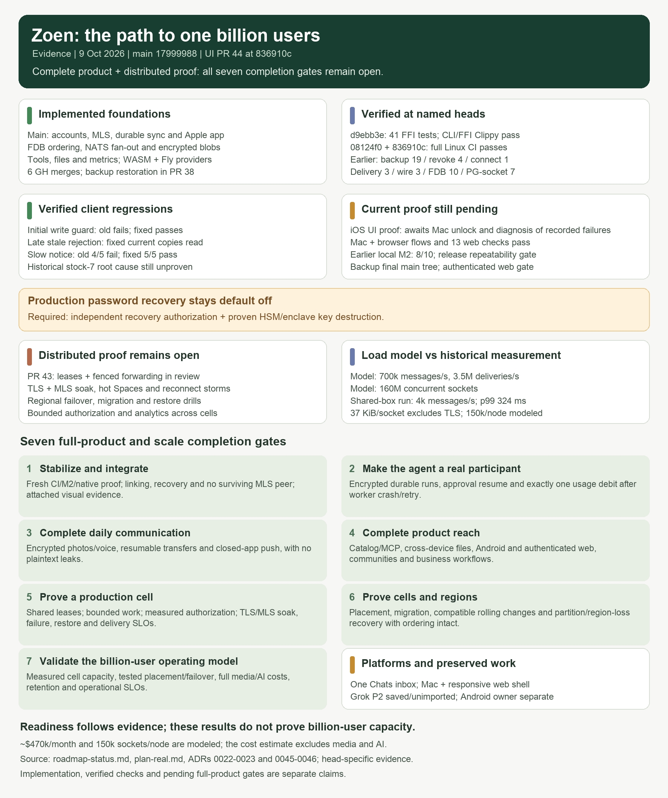

# Roadmap status: the path to one billion users

Evidence reviewed on 2026-10-09, against `main` at `f50b589` and open PRs
[#33](https://github.com/EnzoTironi/zoen-native/pull/33) through
[#38](https://github.com/EnzoTironi/zoen-native/pull/38).
The target is the complete product at one billion monthly users.
The original prototype schedule in [repensado.md](repensado.md) does not determine readiness.

## Current position

Zoen has real encrypted messaging foundations, a native Apple app, staging infrastructure,
and several tested building blocks for agents, files and growth. It is still completing
the product and its distributed infrastructure. A screen, an accepted ADR,
a passing unit test and a deployed journey are different kinds of evidence.

| Area | Implemented on main | Remaining completion gate |
|---|---|---|
| Accounts and sync (M1) | Device identities, signed binary events, durable outbox, paged sync, real relay and native account flow; [staging journey](../scripts/journey-staging.sh) | Repeatable release journeys across devices, interruptions and upgrades; account lifecycle and recovery UI |
| Encryption (M2) | OpenMLS DMs/groups by default, membership removal, concurrent commit handling, sealed local state and relay pruning | Integrate device linking and account backup, finish their native UI, verify revocation and recovery through subsequent messages |
| Relay scale (S1–S9) | FDB ordering, dedupe, per-Space batching, NATS two-node fan-out, rate limits, telemetry, load harness | Shared leases and placement, crash-safe durable forwarding, cell routing, migration and regional failover proofs |
| Agent tools | Grants, signed tool manifests, budgets, sandbox lifecycle, gVisor/Firecracker/browser backends | Real agent identities and MLS membership, durable model/tool run loop, approval resume, idempotent usage ledger, model gateway (M3) |
| Media (M4) | Encrypted blob transport, backgrounds, profile photos and Item blobs | Photos and voice messages through the same transport, interrupted/resumed transfer, real S3 integration journey |
| Push (M5) | Planned protocol and delivery design | Token registration, APNs worker, encrypted notification extension, simulator and HTTP/2 sink journeys, then physical-device validation |
| Files and apps | Loro documents, file viewers/editors, pages, declarative view types and local mini-app examples (ADRs 0040–0042) | Multi-device editing and agent approval journeys, complete permissions, remote MCP interoperability, signed catalog publishing/search/install (M6) |
| Growth and analytics | Invite mechanics, MAU/sent-message counters, retention reports, source attribution, experiment assignment/exposure foundations (ADRs 0043–0044) | Client flows per acquisition source, experiment guardrails, stronger invite eligibility, partitioned/columnar analytics and validated cell-level aggregation |
| Platforms and distribution | Native iOS/macOS; real staging in Fly gru behind Cloudflare | Android and functional web client, universal links/passkeys, notification entitlements, release and compatibility testing |
| Communities and commerce | Product design and UI foundations | Real discovery, moderation/reporting, creator/community workflows, business agent integrations and payment/credit ledger |
| Operations (M7) | Infrastructure files, migrations, local relay stack, health endpoints and telemetry | Whole-stack deployment including agents/push, restore drills, SLO alerts, capacity admission, chaos and regional recovery drills |

Main evidence: [plan-real.md](plan-real.md), [system-design.md](system-design.md),
[product vision](product/vision.md), [UX audit](product/ux-audit.md), and the named journey
tests under `crates/zoen-cli/tests` and `apple/UITests`. Rows describe implementation,
not a fresh rerun of every historical test.

## What the scale evidence proves

The [load model](plan-real.md#scale-built-for-a-billion-people) assumes 500 million daily
users, 700,000 peak messages/second, 3.5 million peak device deliveries/second and 160
million concurrent sockets. These are design inputs.

[ADR 0022](adr/0022-capacity.md) and [ADR 0023](adr/0023-per-space-sequencer.md) measure
a shared development box over short runs. The S9 sweep delivers 4,000 messages/second
with p99 324 ms, above the system design's in-region 200 ms delivery goal. One hot Space
tops out near 3,180 messages/second. The 37 KiB/socket measurement excludes TLS; 150,000
sockets per node is a planning assumption. The approximately $470,000/month estimate is
an extrapolation that excludes media and AI, not a production bill or capacity proof.

`NodeOwner::claim_all` in `crates/zoen-relay/src/ownership/mod.rs` grants all 4,096
partitions to each process using an in-memory lease table and a one-year expiry.
FDB head conflicts protect ordering across racing relays; there is no shared ownership
handoff yet. The system design's two-second lease failover remains a target.

The analytics hot path already batches counters in RAM every 15 seconds, rather than
writing a SQL row per message. Account/Space daily rows still accumulate in Postgres.
The design needs explicit memory bounds, retry/idempotency semantics, cell aggregation,
retention costs and reporting latency at the load model above.

## Work in flight

This table records the initial CI snapshot. Follow each PR's current checks before
integrating it; a green check alone does not establish product completeness.

| PR | Scope | Initial check result / integration concern |
|---|---|---|
| [33](https://github.com/EnzoTironi/zoen-native/pull/33) | Pruning ceiling, stale-device rejoin, linking, paginated encrypted history | Fails the stale-device journey (`bruno`, `pending=1`); native linking UI still needed |
| [34](https://github.com/EnzoTironi/zoen-native/pull/34) | Encrypted password/recovery-key backup | Fails key-package refill journey; recovery of new encrypted messages depends on device membership/linking |
| [35](https://github.com/EnzoTironi/zoen-native/pull/35) | Real WASM sandbox | CI passes; integrate with the runtime after manifest/grant review |
| [36](https://github.com/EnzoTironi/zoen-native/pull/36) | Fly Machines sandbox provider | CI passes; paid staging deployment and production egress policy still need their own proof |
| [37](https://github.com/EnzoTironi/zoen-native/pull/37) | E2B research | CI passes; research informs design and does not implement the proposed live computer |
| [38](https://github.com/EnzoTironi/zoen-native/pull/38) | Chat reading position and unread indicator | Fails the same key-package refill journey; simulator evidence belongs to the UX changes |

Both PR 33 and PR 34 use ADR number 0045. Allocate a unique number when combining them
and verify migration numbering against the combined tree.

### Reliability work from this audit

[PR 40](https://github.com/EnzoTironi/zoen-native/pull/40) fixes a sender publishing its
first encrypted message while the recipient's Welcome is still queued. A controlled
network journey fails on the original code and passes with the fix, including recipient
delivery and signed-history verification. All three rate-limit journeys pass locally;
the PR's full workspace CI remains the integration gate.

The Grok computer also holds an unpublished `ux/audit-p2` patch across 14 Swift files.
It was saved before further work; it still needs review, simulator validation and a PR.
The conversation confirms that some native flows are designed UI awaiting their backing
implementation, including the displayed agent browser. Track those against the product
gates rather than treating every placeholder as a regression.

## Execution order and acceptance gates

These are completion gates, not an MVP cut. Product and distributed infrastructure can
advance together once their common encrypted messaging boundary is reliable.

1. **Stabilize and integrate the existing work.** Diagnose the failed M2 journeys, preserve
   unfinished UI changes, integrate linking/backup and sandbox work without ADR or migration
   collisions. Exit: combined-tree CI, release simulator journeys and attached visual evidence
   for each behavior; linking, history, recovery and revocation work through the native app.
2. **Make the agent a real participant.** Build the approved Rust/FDB/JetStream runtime,
   keeping the model provider behind Zoen-owned traits. Exit: an MLS group member asks the
   agent, receives its encrypted reply, approves an otherwise refused tool, and sees one
   usage debit even after a worker crash/retry. Prove it with a scripted model endpoint,
   then a configured live provider.
3. **Complete daily communication.** Finish encrypted photo/voice delivery, resumable
   transfers and push. Exit: a recipient with the app closed receives a notification,
   opens the message/media, survives a network interruption and remains in sync; storage,
   pushes and telemetry contain no message plaintext.
4. **Complete product reach.** Finish signed catalog/MCP installation, cross-device files,
   Android/web onboarding and invite links, community moderation and business workflows.
   Exit: each promised flow works between independent accounts and platforms with scoped
   permissions, accessibility and supported client versions.
5. **Prove a production cell.** Replace process-local ownership with shared, renewable
   leases and fenced forwarding. Bound queues/caches, test hot Spaces and reconnect storms,
   and isolate the load generator. Exit: agreed SLOs hold with TLS and MLS-sized payloads
   during a soak, a relay/NATS/storage failure, and restore from backup. Record offered,
   accepted and delivered work separately with exact reconciliation.
6. **Prove cells and regions.** Implement directory/cell placement and migration, DR and
   version-compatible rolling changes. Exit: concurrent writers, duplicate delivery,
   network partitions and region loss preserve ordering, membership and recoverable
   messages with measured recovery objectives.
7. **Validate the billion-user operating model.** Aggregate analytics by cell, run
   representative mixed workloads and measure full costs including media, model use and
   replication. Exit: demonstrated cell capacity multiplied by tested placement/failover
   limits satisfies the load model with stated headroom; growth experiments preserve
   retention and operational SLOs. Keep modeled, measured and deployed numbers distinct.

## External activation

Apple signing capabilities/APNs credentials, a live model provider and paid sandbox
deployment activate their respective live checks. Their absence does not prevent local
protocol, runtime, simulator or failure testing. GitHub Actions is currently running:
the old private-repository billing blocker in the plan is stale.

The ongoing product metrics remain **MAU and sent messages per user**, interpreted with
retention, delivery success, privacy and cost. A completion percentage would hide the
largest unproven gates; track their evidence instead.
