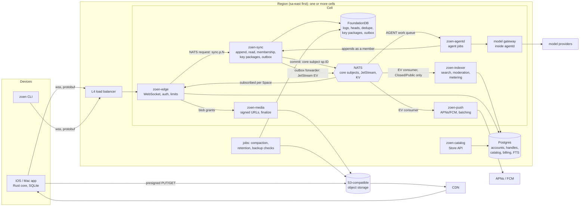

# Zoen system design

Status: proposed, for review before building past the milestone 1 skeleton.
Scale model and units: [plan-real.md](plan-real.md). Decisions: [adr/](adr/).

How this was produced. The pstack `architect`, `how` and `interrogate` skills expect parallel
subagents on several models. This executor has no subagent tool, so the same steps ran in one
pass: grounding in the code that exists today (`how`), two whole-shape alternatives for each
contested decision (`architect`), and an adversarial review written as questions with answers
at the end (`interrogate`). A multi-model interrogate run is listed under open items.

## Goals and invariants

1. A message sent in-region reaches the recipient's device in under 200 ms at p99.
2. Chat keeps working when agents, search, media processing, push or the catalog are down.
3. No message is lost once the sender sees "sent": it is durable in FoundationDB, replicated
   synchronously across three zones of its region, before the ack. The sender keeps it in its
   outbox until a later head proves the DR region has it too, so a region loss is healed by
   re-publishing (deduped by `client_id`) rather than lost inside the asynchronous RPO window.
4. Every network operation is idempotent within its retry horizon; every consumer tolerates
   redelivery. Clients stop retrying a send after 6 days and dedupe keys live 7, so an
   acknowledged send can never append twice.
5. The server never needs plaintext of an end-to-end encrypted Space (M2 on).
6. Nothing in the hot path writes O(members) rows per message.
7. One well-chosen primitive per need: FoundationDB for the log, NATS (core, JetStream, KV)
   for movement, Postgres for relational data, S3-compatible storage plus a CDN for blobs.

## Picture

## Components

Every box is its own binary from one Cargo workspace and its own Deployment in `infra/k8s`.
A box exists only where its scaling key, failure mode or resource profile differs from its
neighbours; otherwise it is a module inside one.

| component | responsibility | state | scales by | failure mode, blast radius | SLO | 1B sizing |
|---|---|---|---|---|---|---|
| zoen-edge | TLS WebSocket termination, login (challenge, resumption token), per-device rate limits, protobuf framing, per-connection backpressure, subscribes to the Space subjects of its connected devices, presence | stateless (connections in memory) | connections, any node | a node dies: its devices reconnect elsewhere with jittered backoff and resync by cursor; no data lost | 99.99% connect success; p99 frame handling < 2 ms | 160M sockets at 150k per node: about 1,100 nodes, 1,500 with headroom |
| zoen-sync | appends to per-Space logs, reads by cursor, membership rules, idempotency, invites, key packages (M2), outbox forwarding | stateless; FDB holds state; per-Space caches | Space partition (rendezvous over 4,096 partitions) | instance dies: its partition leases expire in 2 s and move; in-flight appends retry idempotently | 99.99% append success; p99 append 25 ms | 700k appends/s peak; measured per-core rate from S8 sets the count (estimate 200 instances of 8 cores) |
| FoundationDB | system of record for logs, heads, dedupe keys, membership index, key packages, outbox, rate counters | stateful | key range (automatic), cells by Space | storage process loss: replicated (triple), no data loss; whole cluster loss: cell down, other cells fine; DR region takes over | 99.99%; p99 commit 15 ms | 20 TB/day of logs, 600 TB hot: about 10 cells of 60 TB, each 70k appends/s |
| NATS (core, JetStream, KV) | online fan-out (core subjects per Space), durable streams for every async consumer, KV for presence and leases | stateful (JetStream), stateless (core) | subject partitions, clusters per cell | node loss: R3 streams keep quorum; core subjects lose in-flight ephemeral frames only (clients resync) | 99.99%; p99 publish to subscriber 2 ms in-cell | 3.5M deliveries/s peak across edges; about 3 clusters of 5 nodes per cell |
| zoen-push | consumes events for offline devices, decides who gets a push, collapses per device and chat, sends to APNs/FCM over HTTP/2, retries, dead letters | stateless; dedupe in JetStream and FDB | device id hash | down: pushes queue in JetStream (24 h retention), chat unaffected | p95 event to APNs accept < 5 s | about 10B pushes/day after collapsing, 350k/s peak: about 100 instances |
| zoen-agentd | agent jobs: model calls through the model gateway, tool calls under Grants, posting results as a member | stateless; job state in JetStream and FDB | job queue depth; GPU or provider quota | down or slow: jobs wait in the work queue, chat unaffected; a crash mid-job resumes from the last checkpoint | p95 job start < 2 s; first token streamed < 1.5 s after start | owner-paid; sized by agent adoption, isolated node pool |
| zoen-media | blob grants (presigned PUT/GET), upload finalization (size and checksum), post-processing for Closed/Public Spaces | stateless | requests | down: no new uploads; viewing cached media via CDN still works; text chat unaffected | p99 grant < 50 ms; finalize < 1 s | 2 uploads per DAU per day: 12k/s average |
| zoen-indexer | search indexing, moderation signals and metering for Closed/Public Spaces (never E2EE), webhooks and MCP callbacks | stateless | stream partition | down: indexing lags, search goes stale, chat unaffected | p95 index lag < 30 s | a fraction of traffic (Closed/Public only) |
| zoen-catalog | Store API: listings, signed manifests, search | stateless; Postgres | requests; CDN does most of it | down: Store tab shows the cached catalog | 99.9%; p99 < 100 ms uncached | mostly CDN hits |
| Postgres | accounts, profiles, handles, catalog, billing, FTS and pgvector for public discovery | stateful | identity hash (Citus or app-level shards) | primary loss: failover to replica in under 60 s; logins and profile edits pause, chat continues (edge caches profiles) | 99.95% | 1B identities, 1.6B devices: about 2 TB plus indexes |
| jobs | log compaction to cold segments in object storage, retention, dedupe-key expiry, key package expiry, FDB backup restore drills | stateless CronJobs | schedule | a missed run is retried next schedule; every job is idempotent | daily completion | proportional to data |

Decisions on separation:
- **No separate fan-out worker for online delivery.** Sync publishes the committed event once
  on the core subject `sp.<space>`; every edge with a member of that Space connected is
  subscribed, and NATS does the fan-out across edges. Cost is O(edges interested), not
  O(members), and there's no extra hop. Offline delivery is pull (cursors), so the only
  per-recipient work is push, which is its own service.
- **Key packages live in sync for now.** Same store, same latency profile, same scaling key
  (device). Key transparency (an AKD log of identity to device keys) is a separate service
  when it lands, because its audit log and verification traffic scale independently.
- **Moderation, search indexing, metering and webhooks share one consumer binary.** They all
  read the same stream of Closed and Public events and can't touch E2EE content. They split
  when one of them needs different hardware.
- **The model gateway is a module inside agentd**, isolated on its own node pool so model
  latency and GPU work never share CPU with the chat path.

## Data placement

FoundationDB keyspace (tuple layer, one directory per cell):

| key | value | written |
|---|---|---|
| `log/{space}/{seq}` | envelope bytes (≤ 100 KB, larger content goes to blobs) | per message |
| `head/{space}` | seq, chain hash, membership version | per message (the only per-Space hot key) |
| `dedupe/{space}/{author}/{client_id}` | seq | per message, expired by a job after 7 days |
| `members/{space}/{identity}` and `spaces_of/{identity}/{space}` | role | per membership change |
| `keypkg/{device}/{id}` | key package | per publish, deleted on claim |
| `outbox/{partition}/{versionstamp}/{index}` | space, seq (the index tells apart the appends one batched transaction shares a versionstamp with) | per message, cleared after forwarding |
| `outbox_tick/{partition}` | counter, atomic add on every append | what the forwarder watches; it also polls every 250 ms, so a missed watch only adds latency |
| `lease/{partition}` | owner, fencing token, expiry | per lease renewal |
| `rl/{account}/{window}` | tokens left | the edge leases 50 tokens per serializable read-modify-write, so overshoot is bounded by one lease per edge; per-device buckets live in edge memory |

Ordering. An append reads `head/{space}`, writes `log/{space}/{seq+1}`, the new head, the
dedupe key and an outbox entry under a versionstamp, in one transaction. FDB's conflict
detection on the head key serializes appends within a Space, so no sequencer service exists.
Sequence numbers stay dense per Space (clients detect gaps, the hash chain needs the
predecessor); the versionstamp orders the outbox across Spaces. Partition ownership in sync
is an affinity for batching and caches, never the ordering authority: two owners racing
produce one FDB conflict and one retry, never a fork. ADR 0008.

Postgres holds what is relational and low-churn. Object storage holds blobs (ADR 0007) and
cold log segments.

## Queues and streams

One primitive: NATS. Core subjects for latency-critical pub/sub, JetStream for anything that
must survive a crash, KV for small shared state with TTL.

| flow | NATS construct | delivery | ordering | failure handling |
|---|---|---|---|---|
| online fan-out | core subject `sp.<space>` | at most once (clients resync by cursor on any gap) | per Space by seq | lost frame: a gap triggers a pull; a lost *last* frame is caught by head reconciliation (`Ready`, every resubscribe, and a 30 s heartbeat carry the heads of the device's open Spaces); the forwarder publishes only from committed outbox entries, so a crash between commit and publish is replayed |
| durable event stream | JetStream `EV_<n>`, 64 stream shards per cell (each its own Raft group), subjects `ev.<partition>.<space>`, R3, 24 h, `discard: new` at a byte cap; on a separate NATS cluster from core fan-out so a full disk never touches chat; replay older than 24 h comes from FDB | at least once, dedupe by `Nats-Msg-Id = space:seq` | per subject | consumers are idempotent by `(space, seq)` |
| push dispatch | consumer on `EV` plus work queue `PUSH` | at least once, idempotency key `(device, space, seq)` | per device | exponential retry, then `PUSH.dlq` after 8 attempts |
| agent jobs | work queue `AGENT` | at least once, ack wait 30 s extended by progress acks | per agent conversation | cancel by KV flag; checkpoint after each tool call; poison job to `AGENT.dlq` after 3 crashes |
| media post-processing | work queue `MEDIA` | at least once by blob hash | none needed | idempotent outputs keyed by hash |
| search, moderation, metering | consumers on `EV` (Closed and Public subjects only) | at least once | per Space | lag alarms; replay from stream or from FDB |
| webhooks and MCP callbacks | work queue `HOOK` | at least once with an idempotency header | per target | per-target circuit breaker, DLQ |
| analytics | stream `AN`, sampled, no content | at least once | none | dropped first under load |
| presence | KV `presence_<cell>`, memory storage, R1, key per foreground device, TTL 90 s, refreshed every 60 s | best effort | n/a | expires on its own; memory storage never touches disk. About 30M foreground devices at peak: 500k refreshes/s across cells |

Outbox from FDB to JetStream. The append transaction writes `outbox/{partition}/{versionstamp}`.
The partition owner's forwarder reads its range in order, publishes each to `EV` with
`Nats-Msg-Id = space:seq` (JetStream drops duplicates inside its window), then clears the
forwarded range in one FDB transaction. A crash between publish and clear republishes, and
the message id drops the copy. Exactly-once is not claimed anywhere; every consumer gets
at-least-once plus an idempotency key. Sync also publishes on the core subject right after
commit, so online delivery doesn't wait for the forwarder.

Backpressure and load shedding:
- Per connection, edge keeps a bounded send queue (256 frames or 1 MB). On overflow it stops
  pushing events for that connection and sends `Resync`; the client pulls with cursors at its
  own pace. A slow phone never slows a Space.
- Clients grant credits for pulled pages; sync serves at most 500 events per page.
- Edge refuses new connections with `Retry-After` plus jitter above 85% CPU or memory.
- Sync sheds by priority: appends and catch-up reads first, profile lookups and search last.
- JetStream consumers have max-ack-pending limits; producers see backpressure as publish
  latency and the stream's limits drop analytics first.

## Caches

| what | where | invalidation | stampede control |
|---|---|---|---|
| session | edge memory per connection; reconnect uses a 24 h resumption token signed by the edge's key (no shared store) | token expiry; device revocation list in NATS KV | none needed |
| presence and typing | NATS core and memory-storage KV (R1) with TTL, never written to disk | TTL 90 s; disconnect deletes | n/a |
| Space membership and role | sync process LRU keyed by `(space, membership_version)` | versioned key: the head carries the version, so a stale entry can't match | singleflight per Space |
| device to Spaces (for edge subscriptions) | edge memory per connection | membership events arrive on the Space subject | loaded once per login |
| routing (partition to sync owner) | every edge and sync, from NATS KV `leases` | KV watch | n/a |
| key packages | not cached (single use) | n/a | n/a |
| profiles and handles | edge LRU, 5 min TTL with jitter | profile-changed events | singleflight per identity |
| Store catalog | CDN plus `ETag`; catalog service LRU | versioned URLs per catalog revision | CDN request collapsing |
| blobs | CDN, immutable by content hash | never invalidated | CDN request collapsing |
| client | SQLite on the device is the cache and the source of truth for the user | events | n/a |

## Hot path latency budget (in-region, p99)

| hop | budget |
|---|---|
| sender device to edge (mobile uplink, one frame on an open socket) | 45 ms |
| edge: decode, verify session, rate limit, NATS request to the partition owner | 3 ms |
| sync: membership from cache, signature verification, FDB commit | 20 ms |
| sync publishes on `sp.<space>`; NATS to the recipient's edge | 3 ms |
| edge to recipient device (downlink) | 45 ms |
| recipient core: verify signature and chain, store, notify the UI | 10 ms |
| total | 126 ms, leaving 74 ms of headroom under 200 ms |

The sender's "sent" tick needs the first three hops plus the return trip: about 115 ms.

## Hot Spaces and celebrity fan-out

| tier | size | delivery | writes |
|---|---|---|---|
| T1 chats | up to 256 members | push every event to every online member | one append per message |
| T2 large groups | up to 1,000 (E2EE cap, D10) or 10,000 (Closed) | push to members who have the Space open; others get a debounced head tick at most every 5 s; push notifications only for mentions and replies, plus a digest | sync batches appends from the partition owner, up to 50 per transaction |
| T3 communities | more than 10,000, Closed or Public | pull only: clients subscribe while viewing; unread counts come from a per-account digest every 30 s; old pages are immutable segments served through the CDN | batched appends; read-heavy traffic served from cached segments by `(space, seq range)` |

## Failure and degradation

- Chat needs edge, sync, FDB and core NATS. Push, agents, search, moderation, media
  processing and the catalog are consumers; their outage queues work and never blocks a send.
- Deadlines ride in every request (protobuf field plus the OTel context): a client send
  carries 10 s, edge gives sync 2 s, sync gives FDB 1.5 s. Expired work is dropped, not done.
- Circuit breakers guard model providers, APNs and FCM, webhooks and object storage.
- Poison messages: a consumer that fails an item three times parks it in the flow's DLQ with
  the error and moves on; a job reports DLQ depth.
- Backfill: every consumer can rebuild from the `EV` stream (7 days) or, beyond that, by
  scanning FDB logs; compacted cold segments in object storage cover the rest.
- Retries everywhere use exponential backoff with full jitter.

## Multi-region

- Each Space has a home region recorded at creation (the creator's region; São Paulo first).
  Its log lives in that region's FDB cells and its partition owner runs there.
- Edges run in every region. A device connects to the nearest edge; appends for a Space homed
  elsewhere travel over the NATS supercluster gateway to the home region (one extra RTT for
  cross-region chats, which are the minority).
- Placement (Space to region and cell) is a small global table in Postgres, cached everywhere
  and versioned.
- DR. FDB runs a multi-region configuration per cell: synchronous log replication to a
  satellite in a second zone (RPO 0 within the region) and asynchronous replication to a
  DR region (RPO under 5 s). Region failover is a promotion runbook: RTO 15 minutes.
  Continuous backups to object storage (RPO minutes) are restored into a scratch cluster
  every day by a job, so a backup that can't restore pages someone.

## How it runs today and how it grows

One binary per box from day one, wired through NATS and FDB, deployed with the same
manifests on a laptop (kind) and in the cloud. A single replica of each is fine locally; the
partition and cell seams mean growth is configuration, not a rewrite.

## Security, devices and versions

Security and privacy are designed in [security.md](security.md): MLS with a post-quantum
hybrid suite plan, device keys wrapped by the Secure Enclave, key transparency, metadata
minimization seams, encrypted push and backups, zero trust between services, and logs without
content or clear identifiers.

Multi-device: every device is an MLS leaf; linking by QR, history transfer device to device
or from the encrypted backup, revocation from any device, passkey recovery.

Versions: `Hello` carries protocol version and capabilities; the edge enforces a minimum
client version; migrations are expand then contract; feature flags and kill switches are
signed entries in NATS KV.

Bad networks: durable outbox, chunked resumable media, adaptive sync in Low Data and Low Power
modes, background catch-up with BGTaskScheduler.

Agents: metered per call into a double-entry ledger with idempotent entries; untrusted
content quarantined; tool calls under Cedar grants and the safety gate; actions are signed
events members can audit.

Cost: [cost-model.md](cost-model.md).

## Interrogation

Questions a skeptic asks, and the answer this design gives.

1. *Why not use the versionstamp as the sequence number and skip reading the head?* Clients
   need dense per-Space numbers to see gaps, and the hash chain needs the predecessor's hash.
   Reading the head costs one conflict range per Space. The cost is that appends within one
   Space serialize; T2 and T3 batching keeps a busy Space at thousands of messages per second.
2. *Isn't `head/{space}` a hot key?* Only per Space, which is the unit that must serialize
   anyway. No key is shared across Spaces.
3. *What if two sync instances both think they own a partition?* Both may append; FDB
   serializes them on the head key, so the log stays linear. The lease only buys batching and
   cache hits. The outbox forwarder checks its fencing token in the clearing transaction, so a
   stale forwarder can't clear entries it didn't publish.
4. *Why NATS over Kafka?* We need pub/sub with millisecond fan-out, durable streams, work
   queues, KV with TTL and request-reply. NATS does all five in one system with a small ops
   footprint; Kafka covers streams only and would add Redis for presence and a broker for
   fan-out.
5. *JetStream durability?* Streams are R3 with file storage. The log of record is FDB; any
   stream can be rebuilt from it, so JetStream loss costs lag, never messages.
6. *Edge memory with 150k connections plus queues?* 30 KB per connection steady state (4.5 GB)
   plus a node-wide 8 GB budget for outbound queues on a 32 GB node, with a 256 KB cap per
   connection. Control frames (`Resync`, `Pong`) bypass the data queue. When the node budget
   is 80% used the slowest connections are closed first with a resume token; clients come
   back through the cursor sync, so shedding costs a reconnect and never a message.
7. *Cross-region DMs?* One extra RTT for the side far from the Space's home. Re-homing a
   Space is a planned operation for later.
8. *Push for E2EE content?* The push carries only `(space, seq)`. The Notification Service
   Extension fetches and decrypts on the device (M5).
9. *What breaks first?* Media egress cost, then edge count. Neither touches correctness.

Open items: a multi-model interrogate run on this document; Enzo's call on cloud vendor and
budget (ADR 0012).
